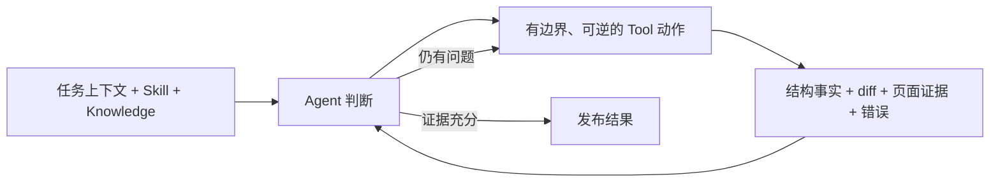
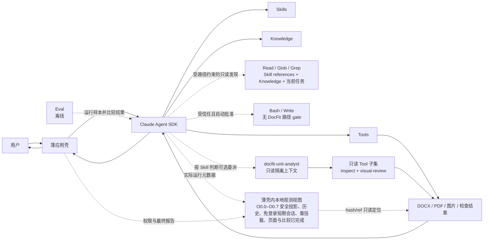
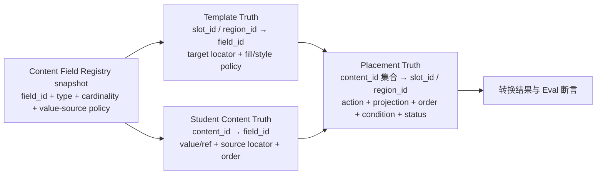

# DocFit 架构总览（01）

> 状态：架构基线
> 日期：2026-08-07
> 核心路线：**Claude Agent SDK runtime + Skill + Knowledge + Tools + Eval + thin app**

本文定义已经批准的目标架构；当前实现状态与里程碑完成判定以 06 为准。当前代码已
接线路径受限的主 Agent Read/Glob/Grep、受信任的 Bash/Write、唯一只读
`docfit-unit-analyst`、两个渐进披露
领域 Skill、最小 Knowledge 选择投影、五个真实 DOCX Tool、OfficeCLI 结构/编辑 adapter、
固定 Docker LibreOffice V2 视觉证据和 `docfit convert`。确定性 core Eval 与独立的
Student Content Extraction Actual–Gold CLI 已落地为开发资产。核心转换不导入或依赖 AppleScript、桌面 GUI、用户电脑或
本地 Word，也不上传 DOCX 到远程视觉转换服务。
本地调试壳可以按平台提供可选适配能力，但缺少该能力不能改变转换或阻塞核心验收；
当前产品开发范围在 M2 链路完成；另行批准的 Registry v0.4、三份 Extraction Gold 与
提取 Eval 入口已经完成，但不代表 Placement/Filling Eval、完整 M3、授权样本资格或外部
人工页面复核完成。

## 1. 核心定位

DocFit 是一个使用 Claude Agent SDK 运行的论文格式处理 Agent。

它的产品价值不在于重新实现 Agent 调度，而在于沉淀五类论文领域资产：

```text
Skill       告诉 Agent 如何处理论文
Knowledge   提供跨学校共享的论文格式概念、方法、原则和处理模式
Tools       可靠地读取、修改、渲染和检查文档
Eval        判断这些资产的组合是否在变好
App         用尽可能薄的方式把它们交给用户
```

最重要的架构决定是：

> Claude Agent SDK 是 DocFit 的运行时边界。DocFit 不在 SDK 之上再建设一套工作流系统。

## 2. 产品原则

### 2.1 Agent-first

不同学生论文和学校模板存在大量长尾差异。Agent 应根据当前文件、Skill 指引、Knowledge 和工具结果动态决定下一步，而不是执行一张预先固化的阶段图。

文档中的“先检查、再修改、最后验证”是领域建议，不是运行时状态机。

### 2.2 Domain assets over framework code

一次真实失败应优先沉淀为：

- Skill 中更清楚的判断规则；
- Knowledge 中更清楚、经过跨任务验证的通用概念、识别方法或处理模式；
- Tool 中更可靠的确定性能力；
- Eval 中一个可重复的失败样本和断言。

除非这些位置都无法表达，不增加新的框架层。

### 2.3 Deterministic operations, adaptive decisions

Agent 负责语义判断，工具负责精确执行：

```text
Agent：这段是一级标题，应该使用学校规则 A
Tool：定位该段，应用规则 A，另存并返回检查结果
```

Agent 不直接拼写 OOXML；工具不自主决定某段是不是标题。

学校模板准备进一步采用按需页/对象合同：一个 snapshot-bound `object_ref` 同时用于结构查看、
视觉定位和直接修改；Agent 可把同一页已经判断清楚的多个对象合并为一次原子 edit，每次 batch
只产生一个不可变新 `document_ref`，并自动返回修改后同页图。已知 `field_id` 可直接使用，只有
含义不确定时才做精确或有界 Registry 查询；Registry 不作为全模板字段清单。Agent 不写
mutation YAML/JSON、不调用 compiler、不管理 attempt 路径；内部版本只用于反馈与恢复，发布
不要求全页覆盖，最终只交付一份 Word。

候选文档的构建方向不是自适应项。干净、可填写的目标模板工作副本固定为候选与最终
DOCX 的主干；只读学生论文固定为内容真值来源。Agent 可以动态决定检查、映射、分批
写入和复核顺序，但不得把学生论文工作副本当作候选主干，也不得以“导入模板前置页”
代替把学生内容放入模板槽位或区域。

### 2.4 Knowledge is a universal domain asset

Knowledge Package 是随产品发布、面向所有学校和任务共享的通用论文格式领域资产。
它提供统一概念、识别方法、解释原则和通用处理模式，帮助 Agent 从当前任务材料
中理解并推导具体规则。学校专属要求、模板、格式参数和任务结论不属于 Knowledge。
Knowledge 可以教 Agent 区分“已观测样式”“目标样式”与“仍缺失的属性”，
但不提供可直接套用的样式值、国家标准数值表或缺省补全表。

### 2.5 Eval is outside the product runtime

Eval 用于开发、回归和版本比较。用户运行一次论文转换时，不需要启动一个评测平台，也不需要生成复杂的 Gold、阶段胶囊或轨迹协议。

### 2.6 Delegation is a Skill decision

局部分析是否值得委派属于领域判断。`docfit-school-extract` 或 `convert-thesis` 根据
实际文档、证据量、专门知识需求、内容风险、可并行性和额外成本决定直接分析、合并
范围或调用 SDK 原生 Subagent。薄应用壳只落实可见工具、上下文隔离和权限白名单，
不识别论文单元，也不把委派变成规则表。

### 2.7 Agent owns the outcome，确定性内核保持薄

DocFit 的核心工程假设是：当主 Agent 获得充分上下文、领域方法、可组合文档能力和
可信反馈时，它能够承担语义理解、任务规划、执行策略、反馈解释、自主重试、自我复核和
完成判断。系统的优化目标不是把这些判断逐步搬进程序，而是降低 Agent 获取事实、采取
动作和验证结果的成本，并提高反馈的及时性、准确性和可行动性。

这不是取消边界，而是把不同责任放在正确层级：

| 层级 | 拥有的责任 | 不拥有的责任 |
| --- | --- | --- |
| 主 Agent | 解释用户目标与当前材料，决定语义、计划、调用顺序、重试、取舍和是否完成 | 直接拼写 OOXML，或绕过明确的产品与安全不变量 |
| Skill / Knowledge | 提供领域方法、完成条件、常见失败模式和经过验证的通用知识 | 把方法固化成必须逐项执行的状态机，或保存当前学校事实 |
| Tools / evidence | 提供可信观察、精确且有边界的修改、结构差异、渲染结果和可追溯证据 | 根据低层代理信号重新解释 Agent 已作出的语义判断 |
| 薄确定性内核 | 保护输入只读、目标绑定、快照前置条件、操作边界、DOCX 完整性、原子发布等客观不变量，并核对显式合同 | 构建第二套规划器、语义检查器、完成裁判或工作流运行时 |
| Eval | 离线复现真实失败、比较版本并检验能力组合是否改进 | 进入一次用户任务的在线控制环，替 Agent 决定下一步 |

正常运行形成开放的证据闭环，而不是预设阶段流水线：



一个运行时检查只有同时满足以下条件，才应成为阻断写入或发布的硬门：

1. 检查的是真实产品不变量或调用方已经明确表达的任务合同，而不是便于实现的代理指标；
2. 检查层拥有完整、同层级的事实，可以客观计算结果，不需要从 run、样式或其他低层
   信号反推 Agent 的语义意图；
3. 它防止的是越界修改、文件损坏、证据失效、不可逆发布，或事后无法可靠补救的问题；
4. 它具有低误报，并能返回定位清楚、可供 Agent 修正或重试的证据。

不满足这些条件的检查，应作为 observation、diff 或 warning 返回 Agent，或者沉淀为
Skill 指引、Knowledge、失败样本与离线 Eval，而不是成为第二个语义决策者。Tool 可以
检查显式操作是否按合同执行，例如“目标段落外不得变化”；但当 Agent 已明确要求清空
一个段落时，Tool 不应再从段落内部 run 的变化反推“Agent 可能只想清空部分 run”，并以
这个猜测否决整段操作。操作范围若可能歧义，应在调用合同中先表达清楚。

因此，新增框架、编译层、检查器、状态协议或恢复机制必须由已经观察到且可重复的失败
证明，并说明为什么现有 Agent 证据闭环、Skill、Knowledge、Tool 原语或 Eval 无法解决。
优先选择可逆动作、当前证据和 Agent 重试；不要为假设中的失败提前建设控制系统。

这一原则可以简写为：

- **Hard-code invariants, not judgments.** 固化不变量，不固化语义判断。
- **Evidence before policy.** 先提供高质量反馈，再考虑增加硬规则。
- **One semantic decision, one owner.** 一个语义决定只有一个最终责任主体。
- **Complexity must be earned.** 复杂度必须由真实、重复发生的问题证明。
- **Reversibility enables autonomy.** 操作越可逆，越可以让 Agent 自主试错和修正。

## 3. 总体架构



运行时只有一条控制关系：应用壳配置并调用 Claude Agent SDK，SDK 驱动 Agent 使用 Skill、Knowledge 与 Tools。

Eval 是同一能力组合的离线消费者，不进入正常用户请求的控制路径。

## 4. 组件边界

### 4.1 Claude Agent SDK

Claude Agent SDK 负责通用 Agent runtime，包括：

- Agent loop 与模型交互；
- 会话上下文；
- 工具发现与调用；
- Skill 装载；
- SDK 原生支持的权限、hooks、流式输出与会话恢复；
- SDK 原生 `Read`、`Glob`、`Grep`，由 DocFit 权限策略限定为项目 Skill references、
  产品 Knowledge Package 和当前任务 input/work/output；
- SDK 原生 `Bash` 与 `Write`，作为主 Agent 受信任、自动批准且无 DocFit 路径 gate 的
  基本能力；
- SDK 原生 `Agent` Tool、Subagent 独立上下文和 `AgentDefinition` 工具限制；
- Agent 需要用户确认时的对话延续。

DocFit 可以配置和使用这些能力，但不复制它们。

如果某项能力必须依赖特定 SDK 版本，应在实现依赖和适配代码中声明，不在领域架构中抽象出第二套通用 runtime。

### 4.2 Skill

Skill 是 DocFit 的主要产品逻辑。它包含：

- 任务适用范围；
- 目标与完成条件；
- 推荐的观察顺序；
- 领域判断原则；
- 何时读取哪类 Knowledge；
- 何时调用哪类 Tool；
- 遇到不确定性时如何继续、回看或询问用户；
- 禁止行为和常见陷阱。

`SKILL.md` 保留目标、边界、判断入口与完成条件；较长的冲突处理、分类、委派任务包、
视觉/验证方法可以放入同目录 `references/`。主文件必须以明确项目相对路径说明何时读取
每一份 reference，不能依赖 Skill 工具自动加载关联文件。

Skill 不是：

- BPMN 或 DAG；
- 阶段状态表；
- 可持久化的工作流实例；
- 一组必须逐项执行的系统任务；
- 学校具体格式数值的存放位置。

批准的目标架构维护两个用户目标型 Skill：

- `docfit-school-extract`：解释当前任务模板、要求与示例，形成带来源引用、只对当前
  任务有效的模板事实、冲突、不确定性和候选参数；
- `convert-thesis`：使用通用 Knowledge 和当前任务证据，把当前论文转换成目标格式。

`docfit-school-extract` 不生成可跨任务复用的学校包，也不把学校事实写入产品
Knowledge。它与 `convert-thesis` 都可以直接分析，或按当前任务需要调用同一个
`docfit-unit-analyst`；两者不定义固定委派顺序。

### 4.3 Knowledge

Knowledge 是产品级通用参考，并按真实消费范围组织成可组合模块，包括：

- 论文文档单元、语义角色和复合对象的统一概念；
- 从模板、文字要求和页面证据识别规则的方法；
- 处理来源冲突、适用条件、歧义和不确定性的解释原则；
- 检查、修改、渲染、视觉复核和验证的通用处理模式；
- 不包含学校值的合成示例和常见 Word 版式陷阱。

样式相关 Knowledge 只解释观测、继承、覆盖、语义绑定、冲突和未决状态。
它不携带字号、字体、行距、边距等目标值，也不向 Agent 暴露供程序补全使用的
国家级标准规则数据。

Knowledge Package 随产品版本发布并保持只读。模块可以围绕 `core`、封面、摘要、
目录、正文、参考文献、附录或以后出现的通用消费场景组织，但这些模块不是论文类型
枚举，也不要求文档具备对应结构。所有任务使用同一份包，不按学校
选择或挂载不同版本。学校名称、要求、模板、参数、固定文案、槽位和人工确认只
存在于当前任务证据与任务产物中；任何学校专属结论都不会因为被 Agent 提取过而
自动升级为长期 Knowledge。

Knowledge 是 DocFit 的资产分类，不是 Claude Agent SDK 中独立的 Knowledge Base
runtime。应用壳把当前产品包交给主 Agent；当前 Skill 决定一次委派需要哪些模块，
主 Agent 将选中模块的内容、ID、版本和 digest 与任务证据一起写入 `Agent` Tool
prompt。当前 SDK 的单次 `Agent` 调用不接收动态 `skills` 参数，因此长期契约不把
这条数据流描述成动态覆盖 `AgentDefinition.skills`。

### 4.4 Tools

Tools 是 Agent 可调用的受控能力。当前只向 Agent 暴露五个稳定 Tool：

- `docx_inspect`：读取结构、有效样式、可见对象和风险；
- `docx_edit`：在工作副本上执行一组受控修改；
- `docx_render`：用固定 Docker LibreOffice 为当前 DOCX 建立内容寻址的 V2 PDF 快照，
  默认返回联系表，缓存命中时复用同一证据；
- `docx_visual_review`：从已有 V2 `render_ref` 按需生成并返回联系表、完整页面、
  对象/文字局部图或前后对比图；
- `docx_validate`：独立检查源文件、最终文件和适用规则。

#### 4.4.1 通用兜底样式的产品合同

论文转换以学校 Word 工作副本作为全局容器。复制学校模板时默认保留其页面、分节、
页眉页脚、页码、主题、编号定义和已有 Word 样式；这些全局事实仍必须经过确定性检查，
不能因文件被复制就自动视为完整。只有学校未提供或验证失败的全局角色，才使用通用
全局兜底。页面设置、页眉页脚和编号定义不属于 Word `basedOn` 样式继承，产品合同
不得把它们与段落/字符样式混为同一继承树。

Content Field Registry 只定义“内容是什么”。每个字段另外拥有一份明确的兜底处理，
并按需要绑定零个、一个或多个可复用展示组件角色。作者姓名等叶子字段通常只绑定一个
角色；摘要、目录、表格等容器字段可以绑定标题、正文、条目、表头、表体或版面等多个
角色；任务配置或权威整页可以分别标记为不写入或整页保留。产品不建立“简单字段/
复杂字段”枚举，组件数量由字段实际展示结构决定。

每个组件角色按完整角色二选一：Agent 识别语义并绑定学校候选，确定性领域层对存在
经验证学校角色的情况原样使用该完整角色；学校缺失时，完整使用随产品稳定版本化且只
允许少量受控参数变化的通用预设角色。两类样式不得在同一角色内部逐属性混合，且必须
在填写学生内容前形成覆盖本次全部字段和组件角色的完整目标模板。

“字段已绑定角色”只证明结构覆盖，不证明样式完整。产品必须按角色类型分别定义完整
属性规范，至少区分段落、字符、标题/目录、表格单元格、图表/公式和页面/分节角色。
一个预设角色只有在继承展开后的全部适用属性均有最终有效值时才算完整：明确为零的值
必须写 `0`，无编号写 `none`，不适用写 `N/A`；空白、未说明的 Word 默认值、模型猜值和
依赖学校 `Normal` 隐式补齐关键属性均视为未决并阻断。机器定义可以通过 `basedOn` 复用，
但产品评审必须展示继承展开后的有效值。

预设属性或明确属性组必须区分正式国家标准、明确标记的国家标准公开稿暂定规则、
高校官方材料形成并经产品批准的通用预设值、DocFit 明示产品决策，以及当前任务显式
要求。学校历史模板观测不能自动晋升为通用值。第一版预设保持稳定，只开放能证明用户
价值且传播影响可控的少量参数；新增字号、行距、边距或编号参数需要单独说明收益、
依赖关系和维护成本。

产品评审面固定提供三种视图：全局兜底样式表；字段到处理方式、组件和角色的映射表；
按角色类型展开全部最终有效属性的样式表。Word `styleId`、OOXML、digest、resolver、
occurrence 和 materialization 属于工程实现或审计附录，不得替代产品层的完整性判断。
字段结构覆盖、属性闭包、来源批准、确定性实现和最终 Word 视觉验收全部通过后，才可
声称通用兜底完成。

三张产品评审表也是通用兜底样式的长期变更界面。以后每次讨论或调整兜底样式，必须同步
更新三张表，说明变更值、来源、用户可见影响、参数边界和当前状态，并重新执行字段覆盖、
角色引用及展开后属性闭包校验；机器 YAML 或工程 diff 不能单独代替产品评审。变更只有在
产品负责人确认后才能成为新的有效产品基线。

目标模板中的每个展示 slot 通过不可变 Style Contract 绑定受管有效属性；样式身份是
`style_contract_id + contract_digest`，不是 `field_id` 或 Word `styleId`。同一字段可以在
不同 slot 使用不同合同。模板发布从最终快照重新捕获并验证代表 occurrence；Placement、
Fill 和 Projection 只传完整引用，最终候选对所有实际 occurrence 显式重放受管属性并
重新解析验证。`word_style_id` 只可作为模板物化提示，不能替代有效属性合同，也不得通过
修改共享命名样式影响其他 occurrence。未被合同拥有的直接格式保持不变；受管属性缺失、
引用陈旧、目标不唯一或回读不一致都必须阻断发布。

Tool 的输入输出应小而清晰，使用 SDK 支持的工具 schema。工具内部可以有复杂 OOXML 代码，但复杂性不扩散到 Agent runtime。

第一版兼容 backend 对 JSON Schema composition 和 SDK in-process MCP
`structuredContent` 的消费并不一致，因此公开 schema 使用扁平对象、枚举和运行时
动作校验，不使用 `oneOf` / `anyOf` / `allOf`；Tool adapter 还把完整结构化结果镜像为
紧凑 JSON text，确保当前 Agent 实际看见对象引用、产物和证据。图片继续作为原生
image content block 返回，SDK transport 缓冲与 Tool 图片预算共同限制单次批量。
这只是既有五 Tool 的传输兼容约束，不是新的公共协议。

`docx_render` 是唯一文档渲染入口。输入只包含 `input_docx` 与可选 `overview`，授权
`task_root` 由应用会话注入；不接受 intent、backend、provider、输出目录或父 render。
缓存身份绑定 DOCX hash、LibreOffice 版本、容器镜像 digest、字体环境 digest、locale
和 PDF 导出参数。渲染只生成 PDF 与索引，页面图片按 Agent 请求派生。

`docx_visual_review` 只消费 V2 `render_ref`。OfficeCLI 只提供绑定当前 DOCX hash 的语义
对象和文字上下文，DocFit 在 LibreOffice PDF 文本坐标索引中重新定位；无法唯一定位时
返回候选完整页面和 warning，绝不伪造精确裁图，也不退回第二视觉路径。普通客户端
Tool 直接返回原生 image content block；视觉 Tool 不通过只支持文本结果的
programmatic tool calling 调用。

正式视觉实现只有 `LibreOfficeRenderer` 和 `OfficeCliAdapter` 两个明确职责的 adapter，
不建设通用 Provider 接口、注册表、运行时选择或故障转移。LibreOffice 是唯一视觉
来源；OfficeCLI 只负责结构读取、编辑、验证和对象定位，不生成页面截图。

五个 Tool 与第一版底层能力的具体映射如下：

| DocFit Tool | 第一版底层来源 | DocFit 契约层增加的职责 |
|---|---|---|
| `docx_inspect` | OfficeCLI 的结构化读取与查询能力 | 事实归一化、文档快照 hash、opaque `object_ref` 与风险摘要 |
| `docx_edit` | OfficeCLI 的确定性编辑与批处理能力 | 引用和前置条件校验、工作副本、all-or-nothing 发布与后置重读 |
| `docx_render` | 固定 Docker LibreOffice 的 DOCX→PDF；Poppler 页数、尺寸和文字 bbox | 生成 `render:v2:`、完整性清单与 PDF 索引；默认联系表，页面不预先全量栅格化 |
| `docx_visual_review` | V2 Evidence Store 与 OfficeCLI 语义锚点 | 按需返回 `visual:v2:` 联系表、页面、局部或对比原生图片；无法映射时返回候选页 |
| `docx_validate` | OfficeCLI OpenXML 检查与 DocFit 独立后置检查 | 从源文件和最终文件重新取证，核对内容、规则、产物和视觉覆盖 |

这是一层面向 Agent 的 DocFit 领域与安全契约，不是通用 Provider 抽象。它不复制
OfficeCLI 的完整 DOM、选择器或命令体系；OfficeCLI 的私有路径和命令只存在于
具体适配代码内，Agent 始终只看到上述五个高层 Tool。

页面图片可以附带同一渲染快照的页码、PDF bbox、`object_ref`、mapping quality 与
变换参数。Agent 用图片判断问题，用语义映射定位可编辑对象；映射缺失或不可靠时必须
显式报告，不能根据像素位置猜测 OOXML 目标。

页面是绑定某次 `render_ref` 的视觉观察窗口，不是 DOCX 中稳定存在的编辑对象。
renderer/font digest、导出配置或文档内容变化后，页码及页面元素映射都可能变化。
Agent 可以按页面组织视觉复核，但必须根据当前文档的 `object_ref`、节引用或文字锚点
选择编辑目标，不能把另一次渲染的页码直接当作 `docx_edit` 定位器。

解析缓存、对象定位、临时文件、批量操作、视觉证据和后置校验都属于这五个 Tool 的内部实现，不是新的架构层。底层可以复用 MCP、CLI、库或本地渲染器，但它们不能拥有第二个 Agent loop；语义决策和下一步选择始终由 Claude Agent SDK 中的 Agent 完成。

### 4.5 Eval

Eval 使用样本、断言和必要的人工参考结果判断能力组合是否可靠。它不拥有在线交付状态，也不控制 Agent 下一步。

模板提取、学生内容提取和最终转换共享一条最小数据连接合同：



`field_id` 只回答双方“语义上是什么”，不回答学生内容物理位置、模板目标物理位置或
本次究竟如何放置。学生侧 locator 必须绑定学生源 DOCX hash；模板侧 locator 必须绑定
模板 DOCX hash；二者都不能跨快照复用。`content_id` 是当前任务内的内容/事实身份，
`slot_id` / `region_id` 是当前模板内的目标身份，placement 是当前任务内的显式连接。
这些 ID 与 Tool 的 opaque `object_ref` 各自负责不同作用域，不能互相替代。
学生侧保存语义值/复杂对象与原始 occurrence，模板侧保存目标显示和填充
合同；日期拆分、复合封面值组装或枚举显示等投影属于 placement 证据，不得
回写或改义 `field_id`。

字段相同只允许产生 placement 候选。只有目标唯一、类型与基数兼容、条件已确定且没有
来源冲突时，候选才可能被确定性采用；任何拆分、组合或格式投影还必须有
明确输入、规则与输出证据，不能猜测缺失值。一对多、多对一、复合槽、连续区域、条件内容、
生成字段、外部资产和重复/冲突事实必须由规则证据或 Human 确认。未解决项保持
`unresolved`，在 Eval 中为 `UNKNOWN` 或明确失败，不能静默选最近位置。

这组数据是当前任务证据和离线 Eval/Gold 的共同词汇，不形成在线 Eval 服务、全局内容
身份平台或封闭论文类型枚举。普通产品运行可以在内存中持有等价事实；只有当任务要求
交付调试证据或 Eval 时才需要物化完整文件。Content Field Registry v0.4 与三份
Extraction Gold 已完成 Human 签署；模板 locator、Placement/Filling Truth 仍必须经过各自
签署、schema/hash 冻结和质量计划，不能由 Extraction PASS 代替。

### 4.6 薄应用壳

应用壳只负责：

- 接收用户输入和文件；
- 提供运行时之外的 `eval-student-content` 研发入口；只在提取完成后读取独立 Gold，输出
  隐私安全报告，不把 oracle 注入 Agent；
- 挂载产品内置 Knowledge、必要 Skill 与 Tools，并把当前任务材料交给 SDK；
- 配置 Claude Agent SDK；
- 配置足以承载受控多页 image content block 的 SDK 消息缓冲，并保持 Tool 自身图片
  数量/字节上限；
- 配置一个通用只读 `docfit-unit-analyst`，并用 SDK 原生 `PreToolUse` 权限钩子只允许
  这个 `subagent_type`；`can_use_tool` 继续承担 `AskUserQuestion` 转发和防御性的未匹配工具默认拒绝；
- 向主 Agent 暴露 `Skill`、`Read`、`Glob`、`Grep`、`Bash`、`Write`、
  `AskUserQuestion`、`Agent` 和五个 DocFit Tool；五个 DocFit Tool 继续直接调用，
  `Bash/Write` 与五个 DocFit Tool 进入自动批准集合，`Read/Glob/Grep` 不进入；
- 对 `Read/Glob/Grep` 先 canonicalize 为真实绝对路径，再只允许项目
  `.claude/skills/**`、产品 Knowledge Package、当前任务 input/work/output；拒绝
  `~/.config/docfit/**`、`.env`、`.git/**`、凭据文件、其他任务/项目外路径与 symlink
  逃逸；
- 不为 `Bash/Write` 安装 DocFit 路径 hook；明确它们可访问该进程本来可访问的路径和
  环境，直接 Read allowlist 不是 sandbox；
- 把用户任务交给 SDK；
- 转发需要用户回答的问题；
- 展示最终回复和产物链接；
- 成功时只根据当前 V2 LibreOffice render、完整页面覆盖与独立最终验证生成完成报告，不把中间 Agent
  warning 或旧 summary 重新发布为当前事实；
- 记录必要的产品级用量与错误；
- 按批准的 O0 目标设计，把 SDK 实际事件、权限判断、Tool 脱敏摘要和本地证据引用投影
  为本地只读运行视图；当前已完成 O0.0–O0.7 的平台骨架、runtime privacy/report v2、
  入队前安全 projector、直接 ID 关联/覆盖/指标投影，以及有界 queue、后台 SQLite writer、
  保留/删除和非阻断降级、免登录 loopback 安全壳、自动短期会话、会话内证据重新挂载，以及运行总览、
  Agent loop/Tool/Subagent/事件详情、调查交接页面与跨运行比较；O0 总门已通过；
- 为每次 SDK 运行提供私有临时 `CLAUDE_CONFIG_DIR`，不配置 transcript mirror，并在正常
  退出/下一次安全 preflight 管理 SDK 原生 transcript 清理；
- 生成带 `run_id/task_ref`、最终文档 hash、观测覆盖与 transcript privacy 摘要的
  conversion report v2，同时保持 v1 报告可读；
- 保证观测写入失败时不改变转换控制流或最终产物。

应用壳不负责：

- 解析论文语义；
- 决定处理阶段；
- 维护工作流状态；
- 为每一步设计内部任务；
- 判断是否委派、拆分论文范围或选择 Knowledge 模块；
- 复制 SDK 会话；
- 判断论文是否符合某校要求；
- 从观测页面启动、重试或调度 Agent、Subagent 或 Tool；
- 保存论文正文、完整页面图片、完整模型历史或隐藏思维链。
- 在 SDK 已提供的主 Agent Bash 之外再实现第二套 shell、脚本 runner 或命令工作流。

命令行、API 或图形界面都只是应用壳的可替换入口，不改变上述边界。

批准的本地运行观测界面是应用壳的一个只读入口，不是面向转换的第二个 GUI、任务
队列或 Agent runtime。它只使用 Claude Agent SDK 已公开的消息流、hooks/telemetry、
五个 Tool 的现有状态与证据字段，以及 `conversion-report.json` 和本地任务目录。
每种来源先经字段 allowlist projector 脱敏，再进入有上限的本地事件通道和只读索引；
原始 prompt、Tool input/response、图片或 Provider error 不能排队后再清洗。Tool 与
Subagent 只通过 SDK 的 `tool_use_id`、`parent_tool_use_id`、`agent_id` 等直接键关联，
本地证据只通过重新验证的 hash/ref 关联，不能按名称或相邻时间推断。运行轨迹只表示
实际观测到的事件；来源、桥接 ID 或证据缺失必须显示 partial/degraded/不可用，不能从
最终文本反推。这里的 metadata-only 只约束 O0 投影；SDK 原生 transcript 由独立临时
config 目录和清理合同管理。CLI 退出后历史证据默认 unmounted，只有用户显式选择目录且
report ID/hash/ref 重验通过才可打开，绝对路径不进入索引。collector、观测存储或页面
故障采用有界非阻断降级，不能改变 Tool、转换终态或产物；任务文件系统本身耗尽仍按
原 App/Tool storage failure 处理。详细设计见
`docfit-local-observability-design.md`。

本地 Web 绑定 loopback 后直接打开，不设置登录页或一次性登录码；首次合法请求自动建立
只存在服务端内存中的短期会话。它仍必须有 Host/Origin/CSRF 校验、无宽松 CORS、除短期
会话安全记账外无管理副作用的 GET，以及 canonical path/symlink 防逃逸。删除历史、重新
挂载和打开本地证据只接受当前会话的同源 POST + CSRF，不是转换控制能力。

核心观测、转换和云端进程只消费平台无关的目录授权 capability 与验证结果，不导入
AppleScript、GUI toolkit 或具体桌面实现。本地调试壳可以在组合根中按需加载 macOS 等
平台适配器，把用户选择的目录作为仅存于内存的 capability 交给证据验证；适配器不可用
时历史证据保持 `unmounted`，运行总览和其他核心观测功能继续可用，也不得退化为浏览器
提交任意绝对路径。平台适配器的真实桌面 smoke 属于可选本地兼容性证据，不是 O0 或
核心转换完成门。

## 5. 一次任务如何运行

应用壳把产品内置通用 Knowledge、用户任务和当前任务文件交给 Claude Agent SDK。
Agent 使用 Knowledge 中的方法解释当前学校材料，以目标模板工作副本为候选主干，
把只读学生论文中的内容按当前任务绑定放入模板槽位或区域，并根据 Skill、任务证据和
Tool 返回的结构化事实与页面图片动态决定行为，必要时回看、修改、重新渲染、视觉
复核、重试或询问用户，最后返回产物和仍需注意的事项。这是一条数据流，不是阶段流程。

当字段/槽合同被物化时，模板解释结果提供 `slot_id/region_id → field_id + target
locator`，学生内容解释结果提供 `content_id → field_id + source locator`，主 Agent
再形成带状态和证据的 placement。学生源中没有目标槽的可见内容仍必须保留为未映射或
显式排除项；模板中的 `generated.*`、任务配置或外部整页资产也不得伪装成学生内容提取
结果。这个分层用于保护内容与评测归因，不要求 Agent 执行固定的三个阶段。

当局部证据量、专门知识或风险使委派有净收益时，主 Agent 可以把明确分析范围、
选中的通用 Knowledge 模块和当前任务证据交给同一个 `docfit-unit-analyst`。该
Subagent 只调用 inspect 与 visual-review 并返回局部结构化分析；缺证据时通过
`evidence_requests` 请求主 Agent 补充。主 Agent 可以直接处理、合并多个范围、
并行或串行委派，也可以补证后再次委派。

局部返回使用 `unit_analysis_v1`：必须显式给出 `status`、`confidence`、`findings`、
`confirmed_rules`、`uncertainties`、`dependencies`、`cross_unit_links`、
`evidence_requests` 和 `proposed_operations`。候选操作不构成写入授权。

一次转换通常形成以下证据闭环：

```text
DOCX
  → docx_inspect（结构事实）
  → docx_render（按 intent 产生新的渲染证据、页面图片、可选元素映射）
  → docx_visual_review（按需读取已有证据并把图片送入当前 Agent 上下文）
  → Agent 判断与 docx_edit
  → 新 render + 按需读取已有图片（修改后视觉验证）
  → docx_validate（独立确定性验证）
```

这不是固定调用顺序。Agent 可以根据风险缩小页面范围或重复其中部分，但涉及分页、溢出、空白页、图表位置、页眉页脚和模板外观的判断，必须有当前文档快照对应的图片证据。页面用于限定观察范围；修改仍以当前快照的对象引用和前置条件为边界。

## 6. 必须保留的不变量

架构可以简单，但以下底线不能被简化掉。

### 6.1 源文件只读

五个 DocFit Tool 与正常转换路线把所有修改写入新的工作文件或最终文件，不覆盖学生原始
DOCX；完成门重新校验源快照 hash，变化时本次转换失败且不发布成功。由于主 Agent 的
Bash/Write 是无 DocFit 路径 gate 的信任能力，这不是对主 Agent 的文件系统 sandbox 保证。

正常转换路线从目标模板快照产生第一个候选工作副本。学生 DOCX 即使被复制到任务 input
目录，也只能作为只读内容来源；该副本不得成为候选或最终 DOCX 的祖先主干。

### 6.2 学生内容不得静默丢失

工具应提供足以比较关键内容对象的分析与验证能力。无法识别或无法安全处理的可见对象必须向 Agent 明示，由 Agent解释、询问或停止。

这里不建设全局 Content Ledger 协议。未来 M3 的 `field_id`、任务内 `content_id`、
模板内 `slot_id/region_id` 和 placement 只服务模板提取、学生内容提取、转换和 Eval 这
几个已知消费者；它们不泛化为跨任务对象身份、事件溯源或所有文件类型共享的血缘平台。
底层 OOXML 定位与快照 ref 继续属于 DOCX Tool 契约。

### 6.3 学校事实只来自当前任务证据

每个学校专属结论必须能指向当前任务中的模板、要求文件、官方示例或用户确认。
没有来源或未经确认的猜测不能伪装成学校要求。任务结束后，这些结论不会自动
写入产品 Knowledge；跨任务复用必须由下一任务重新提供并核对证据。

### 6.4 精确修改只通过 Tool

Skill 可以指导 Agent 做语义选择，但不得指导 Agent 绕过工具直接修改 OOXML。

每个被采用的样式属性都必须能区分其来源：当前任务明确要求、模板观测、
Word 继承后有效值、适用的版本化国家级标准，或未决。继承是源文档观测逻辑，
不是目标样式的默认补全。Agent 不得用 Knowledge、历史任务或常识填充未决属性。

### 6.5 不确定性必须显式呈现

如果 Tool 报告不支持对象、渲染不可信或 Agent 无法确定内容边界，最终回复必须说明影响和建议，不得用“已完成”掩盖未知项。

### 6.6 视觉判断必须绑定证据

Agent 的视觉结论必须引用当前文档 hash、LibreOffice 版本、容器与字体环境 digest、
页码、变换参数和图片 hash。修改前的旧图片不能证明修改后的结果；所有 V2 视觉证据
都明确标记为 `approximate`，不声称与 Microsoft Word 像素一致。

Tool 负责保证图片与文档快照、页面和渲染环境的绑定关系。Agent 负责判断溢出、遮挡、空白页、断页、图表布局、页眉页脚和整体版式。确定性验证与视觉判断必须分别保留，不能互相替代。

页码的作用域是单个 `render_ref`。OfficeCLI 对象通过该快照的 `object_ref`、节引用、
文字锚点和明确的 mapping quality 映射到 LibreOffice PDF，不能把 OfficeCLI 的页码或
HTML 坐标直接当成视觉坐标。文档 hash 变化后，旧 `object_ref` 立即失效；必须重新
inspect 取得新引用，只能通过新旧快照的节、文字锚点或显式内容指纹建立历史
对照。旧页面证据可以作为历史参考，但不能继续定义当前内容位于哪一页。

### 6.7 渲染可信度不得被静默升级

DOCX / OOXML 是内容与结构事实；LibreOffice 页面是可重复、可审计的近似视觉事实。
只有 Agent 已查看必要页面、文档此后未修改且独立验证通过，当前 V2 render 才能证明
这次完成声明的视觉覆盖。renderer、容器、字体、locale、导出配置或文档 hash 变化都
生成新的 render ref。LibreOffice 不可用时视觉链路失败，不回退到 OfficeCLI 截图、
远程服务或其他 renderer。

### 6.8 Subagent 只分析，主 Agent 统一合并与发布

`docfit-unit-analyst` 不拥有 `docx_edit`、`docx_render`、`docx_validate`、
`Agent`、`Skill`、`Read`、`Glob`、`Grep`、`Write`、`Bash` 或 `AskUserQuestion`。它提出 finding、
依赖、证据请求和候选操作，
但不修改或发布文档。主 Agent 统一合并跨范围约束、生成缺失证据、串行调用
`docx_edit` 并在修改后重新取证。Subagent 无写权限是固定边界；主 Agent 的 Bash/Write
是显式信任能力，因此“所有物理写入只能经过 docx_edit”不再是 sandbox 不变量。

### 6.9 主 Agent 直接读取受限，Bash/Write 按信任开放

主 Agent 可以用 `Read/Glob/Grep` 按需读取 Skill references、产品 Knowledge 和当前
任务证据，以支持渐进式披露与自主判断。主 Agent 同时拥有自动批准的 `Bash/Write`，
可用于支持性工作；DocFit 不为它们设置路径或产物类型 gate。五个 DocFit Tool 仍是
DOCX 分析、渲染、修改、验证以及可审计证据的权威路线，但不是阻止主 Agent 直接写文件
的操作系统 sandbox。

应用壳对每次调用解析真实绝对路径并按允许根判断。相对路径以项目 cwd 解析；搜索调用
必须提供显式根，拒绝 `..` 逃逸、敏感路径、其他任务、项目外路径和搜索树中的 symlink。
允许的直接 Read 路径被写回 SDK Tool input；权限事件只记录固定 reason code，不记录
路径或正文。`Bash/Write` 不经过这套 hook，能够读取环境并绕过直接 Read allowlist。
这是“先信任主 Agent”的明确产品决策；系统提示仍要求不打印凭据或文档正文，观测层也
只投影 allowlist 元数据，但这些要求不被描述成强制文件隔离。

`docfit-unit-analyst` 不与主 Agent 等权。它没有 Skill、Read/Glob/Grep/Write、Agent、
AskUserQuestion、render/edit/validate 或 Bash，仍只消费主 Agent 显式放入任务包的范围、
Knowledge 与证据，并只调用 inspect + visual-review。

### 6.10 语义连接、实例身份与物理定位必须分离

共享 `field_id` 不得包含学校 locator、样式值或学生正文；同一字段可以在一个模板中
出现多个槽，也可以由学生源中的多个出现位置共同证明。学生内容真值必须区分一份共享
事实与它在源文档中的多次出现；观察值冲突时保留每个 source occurrence 和冲突状态，
不得先任选一处生成唯一真值。章节、段落、图表等有序局部内容则各自保留
`content_id`、父子关系和顺序，不能因 `field_id` 相同而合并。

模板槽/区域定位只在绑定的模板 hash 内有效；学生 source locator 只在绑定的学生源
hash 内有效；Tool `object_ref` 仍随文档快照变化而失效。placement 必须引用双方逻辑 ID
和各自快照前置条件，真正写入前重新解析当前目标，写入后重新 inspect。任何一侧定位
缺失、重复、越界或 stale 时，本次映射不能自动执行。

## 7. 最小运行产物

一次转换通常返回最终 DOCX、预览、结构化视觉审查结果，以及简短的确定性验证结果和未解决事项。具体目录、文件名和调试产物由应用与 Tool 设计决定，不属于稳定架构。

只有当一个新产物被真实调试或 Eval 反复消费时，才把它提升为稳定接口。

本地观测索引不是转换交付产物，也不是任务目录的副本。删除该索引不能影响转换
产物；本地任务证据删除或 hash 变化后，观测界面只能显示引用失效，不能根据历史摘要
恢复或猜测正文。

## 8. 人工介入与恢复

人工介入使用普通 Agent 对话：

- Agent 说明无法判断的对象；
- 给出证据或页面；
- 提出最小问题；
- 用户回答后继续同一 Claude Agent SDK 会话。

恢复优先使用 SDK 原生会话能力。DocFit 不维护自定义 checkpoint 图，也不在架构文档中规定 SDK 会话的持久化方式。

如果工具调用中途失败：

- Tool 返回明确错误且不覆盖源文件；
- Agent 决定重试、换工具、缩小范围或询问用户；
- 需要跨进程恢复时，使用 SDK 会话能力和已经落盘的工作文件。

## 9. 架构验收问题

每次设计评审只需回答：

1. Claude Agent SDK 是否仍是唯一 Agent runtime？
2. 领域行为是否主要沉淀在 Skill？
3. Knowledge 是否仍完全通用，学校差异是否只来自当前任务证据？
4. 精确操作是否由 Tool 完成？
5. 涉及页面外观的判断是否基于当前文档的图片证据？
6. 视觉审查 Tool 是否只提供证据，而没有启动第二个 Agent？
7. 视觉结果是否只来自固定 LibreOffice 环境，并明确保持 `approximate` fidelity？
8. 质量问题是否能通过 Eval 重现？
9. 应用壳是否仍然不包含领域编排？
10. 新增组件是否解决了已经发生的问题？
11. 委派策略和 Knowledge 选择是否仍在领域 Skill，而不是应用壳或 AgentDefinition？
12. `docfit-unit-analyst` 是否仍只有最小只读 Tool，且 `general-purpose` 与未知
    Subagent 默认拒绝？
13. 本地观测是否仍然只读、无正文、不可控制运行，并在证据失效时明确报告不可用？
14. 主 Agent 的 `Read/Glob/Grep` 是否仍先 realpath、只进入批准根；`Bash/Write` 是否仍
    明确标注为无 DocFit 路径 gate 的信任能力，而没有把直接 Read allowlist 冒充 sandbox？
15. Agent 是否只绑定样式观测而不杜撰缺失值，确定性补全是否保留了属性级来源、
    标准版本/条款、适用性和未决状态？
16. 模板提取与学生内容提取是否引用同一 Registry ID/version/hash，同时保持 `field_id`、任务内
    `content_id`、模板 `slot_id/region_id` 和快照 locator 的作用域分离？
17. placement 是否显式处理多目标、复合、条件、生成、外部和未映射内容，而没有把
    相同 `field_id` 当作自动写入授权？
18. 新增硬门是否保护可客观计算的产品不变量或显式合同，而没有从低层代理信号
    重复解释并否决 Agent 的语义判断？
19. Tool 失败是否向 Agent 返回足以定位、修正和重试的当前证据；同一语义决定是否仍只有
    一个责任主体？

如果第 1、第 6 或第 9 个问题答案是否定的，DocFit 很可能又开始复制 Agent runtime 或变成工作流系统。

## 10. 已定决策

1. 运行时采用 Claude Agent SDK，不自建 Agent runtime。
2. DocFit 的稳定产品资产只有 Skill、Knowledge、Tools、Eval 和薄应用壳。
3. Skill 提供领域指导，不定义固定阶段状态机。
4. Knowledge 是随产品发布、版本化、只读且按需读取的通用领域资产；不保存学校专属事实或任务结论。
5. Tools 封装确定性文档能力和受控视觉证据传递，源文件只读；视觉判断仍由当前 Agent 完成。
6. Eval 在运行时之外执行，以结果断言为主。
7. 人工确认通过正常 Agent 会话完成。
8. SDK 已提供的会话、工具循环、恢复和日志能力不在 DocFit 内重建。
9. 新抽象必须由当前真实需求证明，不为假设中的平台化提前建设。
10. 页面图片是 Agent 判断与验证的一等输入；修改前、布局变化后和最终交付前都必须使用与当前文档绑定的视觉证据。
11. `docx_render` 固定使用 Docker LibreOffice，`docx_visual_review` 只读取 V2 render 并
    按需派生图片；旧 intent 和路径式 render ref 已删除。
12. 对象 bbox 由 OfficeCLI 语义锚点在 LibreOffice PDF 中重新定位；无法唯一映射时返回
    候选完整页，不生成错误裁图。
13. 页码只在单个 render 内有意义；文档或 renderer 环境变化后重新渲染、重新定位。
14. LibreOffice 是唯一视觉来源，OfficeCLI 不截图；不建设 Provider 平台、自动回退或
    兼容层。
15. 用户目标型 Skill 是 `docfit-school-extract` 与 `convert-thesis`；前者只产生
    当前任务证据，不生产学校 Knowledge 包。
16. 两个 Skill 可按当前任务需要调用同一个 SDK 原生 `docfit-unit-analyst`；不维护
    文档单元专家目录或固定委派图。
17. Knowledge Package 是模块化产品资产。当前 Skill 选择模块，主 Agent 通过
    `Agent` prompt 传递选中内容和任务证据；`AgentDefinition` 只落实静态权限与隔离。
18. Subagent 只分析，主 Agent 负责跨单元合并、证据生成、发布与最终验证；五个 Tool
    是证据绑定的权威文档操作面，而主 Agent Bash/Write 是显式信任能力。
19. M2 后本地观测界面属于薄应用壳的只读投影；它展示 SDK 实际轨迹并通过 hash/ref
    定位任务证据，但不保存任务正文、不参与调度，也不提供 exact replay。
20. 主 Agent 直接拥有 `Skill`、路径受限的 `Read/Glob/Grep`、受信任且自动批准的
    `Bash/Write`、`AskUserQuestion`、类型受限的 `Agent` 和五个 DocFit Tool；五个 Tool
    是权威的文档证据面。Subagent 只保留 inspect + visual-review，没有 Bash/Write。
21. 样式经验值不进入 Agent Knowledge。Tool/程序先确定性观测模板；缺失属性只能
    由适用的版本化国家级标准明文补全，并保留属性级来源；无据可依时保持未决。
22. 双侧内容连接以开放、版本化且 hash 绑定的 Content Field Registry 快照为
    语义桥，以任务内 Student Content、模板内 slot/region 和显式 Placement Truth 表达
    来源、目标与动作。Registry 是跨阶段研发语义合同，后三者是当前任务/Eval
    数据；它们都不是新的运行时资产或全局 Ledger。
23. 主 Agent 对语义结果负责；DocFit 通过上下文、Skill、Knowledge、可组合 Tool、可逆
    操作与当前证据支持其执行和自我修正。运行时硬门只保护客观不变量或显式确定性合同，
    不以代理指标重复实现 Agent 的语义判断；语义质量问题优先通过证据反馈、Skill 与
    Knowledge 改进及离线 Eval 解决。
