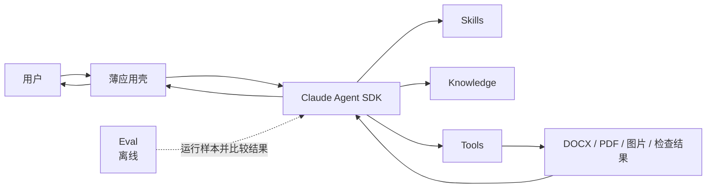

# DocFit 架构总览（01）v1.0

> 状态：架构基线
> 日期：2026-07-30
> 核心路线：**Claude Agent SDK runtime + Skill + Knowledge + Tools + Eval + thin app**

## 1. 核心定位

DocFit 是一个使用 Claude Agent SDK 运行的论文格式处理 Agent。

它的产品价值不在于重新实现 Agent 调度，而在于沉淀五类论文领域资产：

```text
Skill       告诉 Agent 如何处理论文
Knowledge   提供学校要求、模板和领域经验
Tools       可靠地读取、修改、渲染和检查文档
Eval        判断这些资产的组合是否在变好
App         用尽可能薄的方式把它们交给用户
```

最重要的架构决定是：

> Claude Agent SDK 是 DocFit 的运行时边界。DocFit 不在 SDK 之上再建设一套工作流系统。

## 2. 产品原则

### 2.1 Agent-first

不同学生论文和学校模板存在大量长尾差异。Agent 应根据当前文件、Skill 指引、Knowledge 和工具结果动态决定下一步，而不是执行一张预先固化的阶段图。

文档中的“先检查、再修改、最后验证”是领域建议，不是运行时状态机。

### 2.2 Domain assets over framework code

一次真实失败应优先沉淀为：

- Skill 中更清楚的判断规则；
- Knowledge 中更准确的学校事实或示例；
- Tool 中更可靠的确定性能力；
- Eval 中一个可重复的失败样本和断言。

除非这些位置都无法表达，不增加新的框架层。

### 2.3 Deterministic operations, adaptive decisions

Agent 负责语义判断，工具负责精确执行：

```text
Agent：这段是一级标题，应该使用学校规则 A
Tool：定位该段，应用规则 A，另存并返回检查结果
```

Agent 不直接拼写 OOXML；工具不自主决定某段是不是标题。

### 2.4 Knowledge is data, not a service

学校要求、模板和示例是可版本化、可审阅的只读资产。它们不需要成为拥有发布事务、运行状态和生命周期管理的独立服务。

### 2.5 Eval is outside the product runtime

Eval 用于开发、回归和版本比较。用户运行一次论文转换时，不需要启动一个评测平台，也不需要生成复杂的 Gold、阶段胶囊或轨迹协议。

## 3. 总体架构



运行时只有一条控制关系：应用壳配置并调用 Claude Agent SDK，SDK 驱动 Agent 使用 Skill、Knowledge 与 Tools。

Eval 是同一能力组合的离线消费者，不进入正常用户请求的控制路径。

## 4. 组件边界

### 4.1 Claude Agent SDK

Claude Agent SDK 负责通用 Agent runtime，包括：

- Agent loop 与模型交互；
- 会话上下文；
- 工具发现与调用；
- Skill 装载；
- SDK 原生支持的权限、hooks、流式输出与会话恢复；
- Agent 需要用户确认时的对话延续。

DocFit 可以配置和使用这些能力，但不复制它们。

如果某项能力必须依赖特定 SDK 版本，应在实现依赖和适配代码中声明，不在领域架构中抽象出第二套通用 runtime。

### 4.2 Skill

Skill 是 DocFit 的主要产品逻辑。它包含：

- 任务适用范围；
- 目标与完成条件；
- 推荐的观察顺序；
- 领域判断原则；
- 何时读取哪类 Knowledge；
- 何时调用哪类 Tool；
- 遇到不确定性时如何继续、回看或询问用户；
- 禁止行为和常见陷阱。

Skill 不是：

- BPMN 或 DAG；
- 阶段状态表；
- 可持久化的工作流实例；
- 一组必须逐项执行的系统任务；
- 学校具体格式数值的存放位置。

当前计划维护两个顶层 Skill：

- `convert-thesis`：将学生论文转换为指定学校格式；
- `prepare-school-template`：把学校官方材料整理为可复用 Knowledge。

第一阶段只要求 `convert-thesis` 跑通。第二个 Skill 在首个学校 Knowledge 需要重复生产时再完善。

### 4.3 Knowledge

Knowledge 是 Agent 按需读取的领域事实和参考材料，包括：

- 学校官方要求及来源；
- 学校模板；
- 可执行的格式配置；
- 槽位或前置页面说明；
- 已确认的处理示例；
- 通用论文结构知识与常见陷阱。

Knowledge 以文件为主，进入版本控制或受控资产存储。学校包需要版本号和来源说明，但不需要独立的 catalog 服务、发布器或接受状态机。

学校具体要求只能出现在对应 Knowledge 包，不写进通用 Skill。

### 4.4 Tools

Tools 是 Agent 可调用的确定性能力，按用途分为四组：

- `inspect`：读取 DOCX 结构、样式、可见对象和页面信息；
- `edit`：在工作副本上执行受控修改；
- `render`：生成 PDF 和逐页图片；
- `validate`：检查文件可打开、占位符残留、关键内容数量、字体和渲染异常。

Tool 的输入输出应小而清晰，使用 SDK 支持的工具 schema。工具内部可以有复杂 OOXML 代码，但复杂性不扩散到 Agent runtime。

### 4.5 Eval

Eval 包含：

- Tool 单元与契约测试；
- Skill 行为测试；
- 真实或合成论文样本；
- 结果断言；
- 少量人工确认的 Gold 产物；
- 版本间回归比较。

Eval 只回答“这次实现是否比上次更可靠”。它不拥有在线交付状态，也不控制 Agent 下一步。

### 4.6 薄应用壳

应用壳只负责：

- 接收用户输入和文件；
- 选择或挂载必要的 Skill、Knowledge 与 Tools；
- 配置 Claude Agent SDK；
- 把用户任务交给 SDK；
- 转发需要用户回答的问题；
- 展示最终回复和产物链接；
- 记录必要的产品级用量与错误。

应用壳不负责：

- 解析论文语义；
- 决定处理阶段；
- 维护工作流状态；
- 为每一步设计内部任务；
- 复制 SDK 会话；
- 判断论文是否符合某校要求。

CLI、API 或图形界面都只是同一薄壳的不同适配器。

## 5. 一次任务如何运行

典型的论文转换如下：

1. 应用壳把学生 DOCX、目标学校和输出目录交给 Claude Agent SDK。
2. Agent 触发 `convert-thesis` Skill。
3. Agent 按需读取目标学校 Knowledge。
4. Agent 调用分析工具理解源文档。
5. Agent 根据当前证据选择修改工具，必要时渲染并回看。
6. 工具在工作副本上修改并返回高信号结果。
7. Agent 遇到无法可靠判断的内容时直接询问用户。
8. Agent 调用验证工具完成最终检查，返回产物和仍需注意的事项。

这个列表描述常见路径，不构成固定八阶段流程。Agent 可以跳过不适用步骤、重复观察、在修改后回看，或在用户补充信息后继续同一 SDK 会话。

## 6. 必须保留的不变量

架构可以简单，但以下底线不能被简化掉。

### 6.1 源文件只读

所有修改写入新的工作文件或最终文件，不覆盖学生原始 DOCX。

### 6.2 学生内容不得静默丢失

工具应提供足以比较关键内容对象的分析与验证能力。无法识别或无法安全处理的可见对象必须向 Agent 明示，由 Agent解释、询问或停止。

这里不强制全系统共享一套 Content Ledger 协议。对象身份、定位与血缘可以先作为 DOCX 工具内部设计，在确有第二个消费者前不升级为架构组件。

### 6.3 学校事实有来源

每个学校 Knowledge 包必须能说明版本、来源文件和适用范围。没有来源或未经确认的猜测不能伪装成学校要求。

### 6.4 精确修改只通过 Tool

Skill 可以指导 Agent 做语义选择，但不得指导 Agent 绕过工具直接修改 OOXML。

### 6.5 不确定性必须显式呈现

如果 Tool 报告不支持对象、渲染不可信或 Agent 无法确定内容边界，最终回复必须说明影响和建议，不得用“已完成”掩盖未知项。

## 7. 最小运行产物

一次转换只要求保留下列有用产物：

```text
output/
├── final.docx
├── preview.pdf          # 能生成时
├── pages/               # 需要逐页检查时
├── validation.json      # 最终确定性检查摘要
└── run-summary.md       # 可选，人读摘要
```

Tool 调试文件可放在临时目录，失败时按需保留。SDK 原生会话记录和日志按 SDK 能力使用，不再复制为 DocFit 专属事件协议。

只有当一个新产物被真实调试或 Eval 反复消费时，才把它提升为稳定接口。

## 8. 人工介入与恢复

人工介入使用普通 Agent 对话：

- Agent 说明无法判断的对象；
- 给出证据或页面；
- 提出最小问题；
- 用户回答后继续同一 Claude Agent SDK 会话。

恢复优先使用 SDK 原生的 session continuation / resume 能力。DocFit 不维护自定义 checkpoint 图。

如果工具调用中途失败：

- Tool 返回明确错误且不覆盖源文件；
- Agent 决定重试、换工具、缩小范围或询问用户；
- 需要跨进程恢复时，使用 SDK 会话能力和已经落盘的工作文件。

## 9. 架构验收问题

每次设计评审只需回答：

1. Claude Agent SDK 是否仍是唯一 Agent runtime？
2. 领域行为是否主要沉淀在 Skill？
3. 学校差异是否只存在于 Knowledge？
4. 精确操作是否由 Tool 完成？
5. 质量问题是否能通过 Eval 重现？
6. 应用壳是否仍然不包含领域编排？
7. 新增组件是否解决了已经发生的问题？

如果第 1 或第 6 个问题答案是否定的，DocFit 很可能又开始变成工作流系统。

## 10. 已定决策

1. 运行时采用 Claude Agent SDK，不自建 Agent runtime。
2. DocFit 的稳定产品资产只有 Skill、Knowledge、Tools、Eval 和薄应用壳。
3. Skill 提供领域指导，不定义固定阶段状态机。
4. Knowledge 是文件型、版本化、按需读取的资产，不是服务。
5. Tools 封装确定性文档能力，源文件只读。
6. Eval 在运行时之外执行，以结果断言为主。
7. 人工确认通过正常 Agent 会话完成。
8. SDK 已提供的会话、工具循环、恢复和日志能力不在 DocFit 内重建。
9. 新抽象必须由当前真实需求证明，不为假设中的平台化提前建设。
