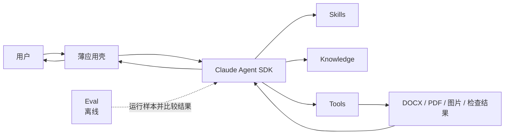

# DocFit 架构总览（01）

> 状态：架构基线
> 日期：2026-07-31
> 核心路线：**Claude Agent SDK runtime + Skill + Knowledge + Tools + Eval + thin app**

## 1. 核心定位

DocFit 是一个使用 Claude Agent SDK 运行的论文格式处理 Agent。

它的产品价值不在于重新实现 Agent 调度，而在于沉淀五类论文领域资产：

```text
Skill       告诉 Agent 如何处理论文
Knowledge   提供学校要求、模板和领域经验
Tools       可靠地读取、修改、渲染和检查文档
Eval        判断这些资产的组合是否在变好
App         用尽可能薄的方式把它们交给用户
```

最重要的架构决定是：

> Claude Agent SDK 是 DocFit 的运行时边界。DocFit 不在 SDK 之上再建设一套工作流系统。

## 2. 产品原则

### 2.1 Agent-first

不同学生论文和学校模板存在大量长尾差异。Agent 应根据当前文件、Skill 指引、Knowledge 和工具结果动态决定下一步，而不是执行一张预先固化的阶段图。

文档中的“先检查、再修改、最后验证”是领域建议，不是运行时状态机。

### 2.2 Domain assets over framework code

一次真实失败应优先沉淀为：

- Skill 中更清楚的判断规则；
- Knowledge 中更准确的学校事实或示例；
- Tool 中更可靠的确定性能力；
- Eval 中一个可重复的失败样本和断言。

除非这些位置都无法表达，不增加新的框架层。

### 2.3 Deterministic operations, adaptive decisions

Agent 负责语义判断，工具负责精确执行：

```text
Agent：这段是一级标题，应该使用学校规则 A
Tool：定位该段，应用规则 A，另存并返回检查结果
```

Agent 不直接拼写 OOXML；工具不自主决定某段是不是标题。

### 2.4 Knowledge is a domain asset

学校要求、模板和示例是随真实任务持续积累的、可版本化、可审阅的领域资产。它们如何持久化和检索属于实现选择，不进入架构核心。

### 2.5 Eval is outside the product runtime

Eval 用于开发、回归和版本比较。用户运行一次论文转换时，不需要启动一个评测平台，也不需要生成复杂的 Gold、阶段胶囊或轨迹协议。

## 3. 总体架构



运行时只有一条控制关系：应用壳配置并调用 Claude Agent SDK，SDK 驱动 Agent 使用 Skill、Knowledge 与 Tools。

Eval 是同一能力组合的离线消费者，不进入正常用户请求的控制路径。

## 4. 组件边界

### 4.1 Claude Agent SDK

Claude Agent SDK 负责通用 Agent runtime，包括：

- Agent loop 与模型交互；
- 会话上下文；
- 工具发现与调用；
- Skill 装载；
- SDK 原生支持的权限、hooks、流式输出与会话恢复；
- Agent 需要用户确认时的对话延续。

DocFit 可以配置和使用这些能力，但不复制它们。

如果某项能力必须依赖特定 SDK 版本，应在实现依赖和适配代码中声明，不在领域架构中抽象出第二套通用 runtime。

### 4.2 Skill

Skill 是 DocFit 的主要产品逻辑。它包含：

- 任务适用范围；
- 目标与完成条件；
- 推荐的观察顺序；
- 领域判断原则；
- 何时读取哪类 Knowledge；
- 何时调用哪类 Tool；
- 遇到不确定性时如何继续、回看或询问用户；
- 禁止行为和常见陷阱。

Skill 不是：

- BPMN 或 DAG；
- 阶段状态表；
- 可持久化的工作流实例；
- 一组必须逐项执行的系统任务；
- 学校具体格式数值的存放位置。

当前只维护两个用户目标型 Skill：

- `convert-thesis`：把当前论文转换成目标学校格式；
- `prepare-school-template`：把学校官方资料整理成可复用 Knowledge。

它们都是 Agent 的领域指引，不互相调用，也不形成上下游流程。

### 4.3 Knowledge

Knowledge 是 Agent 按需读取的领域事实和参考材料，包括：

- 学校官方要求及来源；
- 学校模板；
- 可执行的格式配置；
- 槽位或前置页面说明；
- 已确认的处理示例；
- 通用论文结构知识与常见陷阱。

Knowledge 应保留版本、来源和适用范围。持久化和检索机制属于实现细节，不形成新的 Agent runtime 组件。

学校具体要求只能出现在对应 Knowledge 包，不写进通用 Skill。

### 4.4 Tools

Tools 是 Agent 可调用的受控能力。当前只向 Agent 暴露五个稳定 Tool：

- `docx_inspect`：读取结构、有效样式、可见对象和风险；
- `docx_edit`：在工作副本上执行一组受控修改；
- `docx_render`：按迭代预览或交付复核目的生成 PDF、页面图片和渲染证据；
- `docx_visual_review`：把指定页面、裁剪图或前后对比图作为视觉证据送入当前 Agent 上下文；
- `docx_validate`：独立检查源文件、最终文件和适用规则。

Tool 的输入输出应小而清晰，使用 SDK 支持的工具 schema。工具内部可以有复杂 OOXML 代码，但复杂性不扩散到 Agent runtime。

`docx_render` 负责产生图片，`docx_visual_review` 负责选择、裁剪、对齐、比较并返回图片内容块；当前 Agent 直接观察这些图片并形成视觉判断。`docx_visual_review` 不调用另一个模型，不自行宣布页面合格，也不把图像差异阈值伪装成版式语义。

渲染契约区分两种角色，但不增加 Agent 可见 Tool：

- **迭代渲染**：低延迟、高频，用于修改前观察和修改后的局部复核，可以由经过契约测试的本地或第三方布局引擎提供；
- **交付渲染**：面向最终 Microsoft Word 兼容性复核，只有 Microsoft 官方转换链路或受控 Word 环境生成的结果才能声明为目标应用渲染事实。

首版可以只接入一个迭代渲染 Provider 以尽快跑通，但 Tool 结果必须声明渲染角色、兼容目标和可信度，不得把 LibreOffice、Aspose.Words 或其他近似引擎的结果冒充 Microsoft Word 最终效果。后续接入交付渲染 Provider 时，Skill 和五个 Tool 的公开名称保持不变。

页面图片可以附带同一渲染快照的元素映射：页码、页面坐标系、`object_ref`、元素类型、bbox 和映射可信度。Agent 用图片判断问题，用元素映射把问题定位回可编辑对象；映射缺失或不可靠时必须显式报告，不能根据像素位置猜测 OOXML 目标。

解析缓存、对象定位、临时文件、批量操作、视觉证据和后置校验都属于这五个 Tool 的内部实现，不是新的架构层。底层可以复用 MCP、CLI、库或本地渲染器，但它们不能拥有第二个 Agent loop；语义决策和下一步选择始终由 Claude Agent SDK 中的 Agent 完成。

### 4.5 Eval

Eval 使用样本、断言和必要的人工参考结果判断能力组合是否可靠。它不拥有在线交付状态，也不控制 Agent 下一步。

### 4.6 薄应用壳

应用壳只负责：

- 接收用户输入和文件；
- 选择或挂载必要的 Skill、Knowledge 与 Tools；
- 配置 Claude Agent SDK；
- 把用户任务交给 SDK；
- 转发需要用户回答的问题；
- 展示最终回复和产物链接；
- 记录必要的产品级用量与错误。

应用壳不负责：

- 解析论文语义；
- 决定处理阶段；
- 维护工作流状态；
- 为每一步设计内部任务；
- 复制 SDK 会话；
- 判断论文是否符合某校要求。

命令行、API 或图形界面都只是应用壳的可替换入口，不改变上述边界。

## 5. 一次任务如何运行

应用壳把用户任务和文件交给 Claude Agent SDK。Agent 根据 Skill、Knowledge 和 Tool 返回的结构化事实与页面图片动态决定行为，必要时回看、修改、重新渲染、视觉复核、重试或询问用户，最后返回产物和仍需注意的事项。这是一条数据流，不是阶段流程。

一次转换通常形成以下证据闭环：

```text
DOCX
  → docx_inspect（结构事实）
  → docx_render（迭代或交付渲染、页面图片、可选元素映射）
  → docx_visual_review（图片进入当前 Agent 上下文）
  → Agent 判断与 docx_edit
  → 重新 render + visual_review（修改后视觉验证）
  → docx_validate（独立确定性验证）
```

这不是固定调用顺序。Agent 可以根据风险缩小页面范围或重复其中部分，但涉及分页、溢出、空白页、图表位置、页眉页脚和模板外观的判断，必须有当前文档快照对应的图片证据。

## 6. 必须保留的不变量

架构可以简单，但以下底线不能被简化掉。

### 6.1 源文件只读

所有修改写入新的工作文件或最终文件，不覆盖学生原始 DOCX。

### 6.2 学生内容不得静默丢失

工具应提供足以比较关键内容对象的分析与验证能力。无法识别或无法安全处理的可见对象必须向 Agent 明示，由 Agent解释、询问或停止。

这里不强制全系统共享一套 Content Ledger 协议。对象身份、定位与血缘可以先作为 DOCX 工具内部设计，在确有第二个消费者前不升级为架构组件。

### 6.3 学校事实有来源

每个学校 Knowledge 包必须能说明版本、来源文件和适用范围。没有来源或未经确认的猜测不能伪装成学校要求。

### 6.4 精确修改只通过 Tool

Skill 可以指导 Agent 做语义选择，但不得指导 Agent 绕过工具直接修改 OOXML。

### 6.5 不确定性必须显式呈现

如果 Tool 报告不支持对象、渲染不可信或 Agent 无法确定内容边界，最终回复必须说明影响和建议，不得用“已完成”掩盖未知项。

### 6.6 视觉判断必须绑定证据

Agent 的视觉结论必须引用当前文档 hash、渲染 Provider、版本、字体环境、页码和图片 hash。修改前的旧图片不能证明修改后的结果；近似渲染不能伪装成 Microsoft Word 的最终分页真值。

Tool 负责保证图片与文档快照、页面和渲染环境的绑定关系。Agent 负责判断溢出、遮挡、空白页、断页、图表布局、页眉页脚和整体版式。确定性验证与视觉判断必须分别保留，不能互相替代。

### 6.7 渲染可信度不得被静默升级

DOCX / OOXML 是内容与结构事实；迭代渲染是页面外观的高效近似；目标 Microsoft Word 环境的渲染才是最终 Word 兼容性证据。Provider 切换、字体替代、DPI 或页面尺寸变化都必须形成新的 render ref。

没有交付渲染能力时，系统仍可完成首条开发链路，但最终回复和验证报告必须保留 `verification_gap`，不能声称已通过 Microsoft Word 最终视觉门。

## 7. 最小运行产物

一次转换通常返回最终 DOCX、预览、结构化视觉审查结果，以及简短的确定性验证结果和未解决事项。具体目录、文件名和调试产物由应用与 Tool 设计决定，不属于稳定架构。

只有当一个新产物被真实调试或 Eval 反复消费时，才把它提升为稳定接口。

## 8. 人工介入与恢复

人工介入使用普通 Agent 对话：

- Agent 说明无法判断的对象；
- 给出证据或页面；
- 提出最小问题；
- 用户回答后继续同一 Claude Agent SDK 会话。

恢复优先使用 SDK 原生会话能力。DocFit 不维护自定义 checkpoint 图，也不在架构文档中规定 SDK 会话的持久化方式。

如果工具调用中途失败：

- Tool 返回明确错误且不覆盖源文件；
- Agent 决定重试、换工具、缩小范围或询问用户；
- 需要跨进程恢复时，使用 SDK 会话能力和已经落盘的工作文件。

## 9. 架构验收问题

每次设计评审只需回答：

1. Claude Agent SDK 是否仍是唯一 Agent runtime？
2. 领域行为是否主要沉淀在 Skill？
3. 学校差异是否只存在于 Knowledge？
4. 精确操作是否由 Tool 完成？
5. 涉及页面外观的判断是否基于当前文档的图片证据？
6. 视觉审查 Tool 是否只提供证据，而没有启动第二个 Agent？
7. 渲染结果是否明确区分迭代近似与目标 Word 交付证据？
8. 质量问题是否能通过 Eval 重现？
9. 应用壳是否仍然不包含领域编排？
10. 新增组件是否解决了已经发生的问题？

如果第 1、第 6 或第 9 个问题答案是否定的，DocFit 很可能又开始复制 Agent runtime 或变成工作流系统。

## 10. 已定决策

1. 运行时采用 Claude Agent SDK，不自建 Agent runtime。
2. DocFit 的稳定产品资产只有 Skill、Knowledge、Tools、Eval 和薄应用壳。
3. Skill 提供领域指导，不定义固定阶段状态机。
4. Knowledge 是版本化、可追溯、按需读取的领域资产；其存储和检索方式不进入架构核心。
5. Tools 封装确定性文档能力和受控视觉证据传递，源文件只读；视觉判断仍由当前 Agent 完成。
6. Eval 在运行时之外执行，以结果断言为主。
7. 人工确认通过正常 Agent 会话完成。
8. SDK 已提供的会话、工具循环、恢复和日志能力不在 DocFit 内重建。
9. 新抽象必须由当前真实需求证明，不为假设中的平台化提前建设。
10. 页面图片是 Agent 判断与验证的一等输入；修改前、布局变化后和最终交付前都必须使用与当前文档绑定的视觉证据。
11. 渲染采用同一 `docx_render` 契约下的双角色设计：首版优先跑通迭代渲染，最终 Word 兼容性由目标应用渲染证据兜底。
12. 页面元素 bbox 映射是渲染证据的可选增强产物，不新增 Tool；有映射时帮助 Agent 从视觉问题定位回 opaque `object_ref`。
