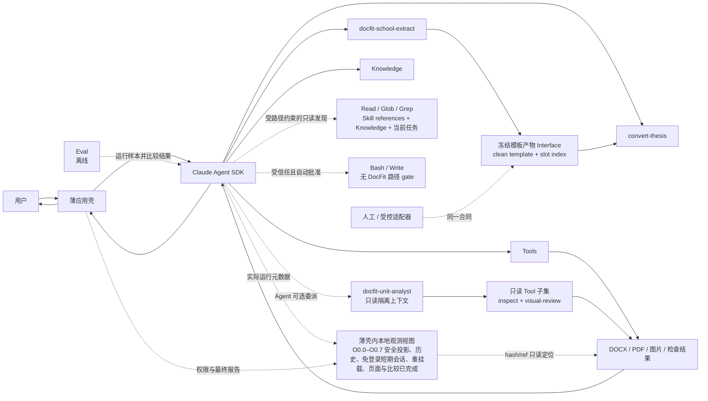

# DocFit 架构总览（01）

> 状态：架构基线
> 日期：2026-08-05
> 核心路线：**Claude Agent SDK runtime + Skill + Knowledge + Tools + Eval + thin app**

本文定义已经批准的目标架构；当前实现状态与里程碑完成判定以 06 为准。当前代码已
接线路径受限的主 Agent Read/Glob/Grep、受信任的 Bash/Write、唯一只读
`docfit-unit-analyst`、两个渐进披露
领域 Skill、最小 Knowledge 选择投影、五个真实 DOCX Tool、固定 OfficeCLI/Adobe PDF
Services 薄适配和 `docfit convert`。M3 的确定性 core Eval
也已落地为可选开发资产。第二个固定后端是 Adobe PDF Services API，不是本地 Word；
核心转换与云端运行不导入或依赖 AppleScript、桌面 GUI、用户电脑或本地 Word。
本地调试壳可以按平台提供可选适配能力，但缺少该能力不能改变转换或阻塞核心验收；
当前产品开发范围在 M2 链路完成。授权/脱敏复杂样本、Gold、M3 Skill/E2E Eval 和外部
人工页面复核属于后续独立质量范围，不由近似渲染或 mock 替代，也不阻塞当前范围完成。
冻结干净模板、槽位索引、固定内容保护和源内容覆盖已经批准为目标架构修订，但尚未
进入当前代码；它们必须按 06 的 M2 后独立候选切片实施和验收，不能反向改写 M2 已完成
事实。

## 1. 核心定位

DocFit 是一个使用 Claude Agent SDK 运行的论文格式处理 Agent。

它的产品价值不在于重新实现 Agent 调度，而在于沉淀五类论文领域资产：

```text
Skill       告诉 Agent 如何处理论文
Knowledge   提供跨学校共享的论文格式概念、方法、原则和处理模式
Tools       可靠地读取、修改、渲染和检查文档
Eval        判断这些资产的组合是否在变好
App         用尽可能薄的方式把它们交给用户
```

最重要的架构决定是：

> Claude Agent SDK 是 DocFit 的运行时边界。DocFit 不在 SDK 之上再建设一套工作流系统。

## 2. 产品原则

### 2.1 Agent-first

不同学生论文和学校模板存在大量长尾差异。Agent 应根据当前文件、Skill 指引、Knowledge 和工具结果动态决定下一步，而不是执行一张预先固化的阶段图。

文档中的“先检查、再修改、最后验证”是领域建议，不是运行时状态机。

### 2.2 Domain assets over framework code

一次真实失败应优先沉淀为：

- Skill 中更清楚的任务规则或特殊论文部件说明；
- Knowledge 中更清楚、经过跨任务验证的通用概念、识别方法或处理模式；
- Tool 中更可靠的确定性能力；
- Eval 中一个可重复的失败样本和断言。

除非这些位置都无法表达，不增加新的框架层。

### 2.3 Deterministic operations, adaptive decisions

Agent 负责理解论文内容并给出转换意图，工具负责精确执行：

```text
Agent：这段是一级标题，应该使用学校规则 A
Tool：定位该段，应用规则 A，另存并返回检查结果
```

Agent 不直接拼写 OOXML；工具不自主决定某段是不是标题。

候选文档的构建方向不是自适应项。干净、可填写的目标模板工作副本固定为候选与最终
DOCX 的主干；只读学生论文固定为内容真值来源。Agent 可以动态决定检查、映射、分批
写入和复核顺序，但不得把学生论文工作副本当作候选主干，也不得以“导入模板前置页”
代替把学生内容放入模板槽位或区域。

目标合同进一步把模板主干冻结成可消费产物：学校提取端发布不可变的干净模板快照，
以及与该快照 hash 绑定的槽位索引；转换端只把它视为输入，不依赖生产它的 Skill 名称
或调用历史。槽位索引描述“哪里可以填、填什么形态、允许多少项、哪里必须人工处理”，
不解释学生论文内容，也不把学校资产升级为跨任务 Knowledge。

### 2.4 Knowledge is a universal domain asset

Knowledge Package 是随产品发布、面向所有学校和任务共享的通用论文格式领域资产。
它提供统一概念、识别方法、解释原则和通用处理模式，帮助 Agent 从当前任务材料
中理解并推导具体规则。学校专属要求、模板、格式参数和任务结论不属于 Knowledge。
Knowledge 可以教 Agent 区分“已观测样式”“目标样式”与“仍缺失的属性”，
但不提供可直接套用的样式值、国家标准数值表或缺省补全表。

### 2.5 Eval is outside the product runtime

Eval 用于开发、回归和版本比较。用户运行一次论文转换时，不需要启动一个评测平台，也不需要生成复杂的 Gold、阶段胶囊或轨迹协议。

### 2.6 Delegation is a Skill decision

局部分析是否值得委派属于领域判断。`docfit-school-extract` 或 `convert-thesis` 根据
实际文档、证据量、专门知识需求、内容风险、可并行性和额外成本决定直接分析、合并
范围或调用 SDK 原生 Subagent。薄应用壳只落实可见工具、上下文隔离和权限白名单，
不识别论文单元，也不把委派变成规则表。

## 3. 总体架构



运行时只有一条控制关系：应用壳配置并调用 Claude Agent SDK，SDK 驱动 Agent 使用 Skill、Knowledge 与 Tools。

Eval 是同一能力组合的离线消费者，不进入正常用户请求的控制路径。

## 4. 组件边界

### 4.1 Claude Agent SDK

Claude Agent SDK 负责通用 Agent runtime，包括：

- Agent loop 与模型交互；
- 会话上下文；
- 工具发现与调用；
- Skill 装载；
- SDK 原生支持的权限、hooks、流式输出与会话恢复；
- SDK 原生 `Read`、`Glob`、`Grep`，由 DocFit 权限策略限定为项目 Skill references、
  产品 Knowledge Package 和当前任务 input/work/output；
- SDK 原生 `Bash` 与 `Write`，作为主 Agent 受信任、自动批准且无 DocFit 路径 gate 的
  基本能力；
- SDK 原生 `Agent` Tool、Subagent 独立上下文和 `AgentDefinition` 工具限制；
- Agent 需要用户确认时的对话延续。

DocFit 可以配置和使用这些能力，但不复制它们。

如果某项能力必须依赖特定 SDK 版本，应在实现依赖和适配代码中声明，不在领域架构中抽象出第二套通用 runtime。

### 4.2 Skill

Skill 是 DocFit 的论文转换任务说明。它包含：

- 任务适用范围；
- 输入与两个稳定交付产物；
- 通用转换规则；
- 目录、封面、声明、页眉页脚等特殊论文部件的 reference 索引；
- 禁止行为和最终回复。

`SKILL.md` 保留任务、输入、两个产物、通用规则和一个明确的 reference 索引入口。
references 按论文部件而不是处理阶段组织；索引再列出真实存在的部件文件。Agent 只读
当前文档实际包含的特殊部件，不要求主文件为每个步骤安排一份 reference。

Tool 名称、用途、参数和错误语义由 Claude Agent SDK 注册信息提供。Skill 不复制 Tool
说明，也不维护一套可能与真实 schema 漂移的 Tool 路由表。

Skill 不是：

- BPMN 或 DAG；
- 阶段状态表；
- 可持久化的工作流实例；
- 一组必须逐项执行的系统任务；
- Tool 或应用壳已经能够强制执行的机器检查清单；
- 学校具体格式数值的存放位置。

Skill 可以简要说明需要完成的任务内容，但不把 Agent 的自然推理拆成判断阶段，也不把
特殊论文部件强行对应到某个处理步骤。确定性的先后依赖、hash、引用失效和失败恢复由
脚本、Tool 或应用壳执行和验证。

批准的目标架构维护两个产物边界清楚的用户目标型 Skill：

- `docfit-school-extract`：清理当前任务模板，只发布冻结干净模板和与其 hash 绑定的槽位
  索引；证据、冲突、未决项和 gap 包含在索引中；它不填学生内容，也不生产跨任务学校包；
- `convert-thesis`：消费符合该 Interface 的冻结模板产物与只读学生论文，把源内容
  放入槽位，只发布最终 DOCX 和 `conversion-report.json`；视觉/验证结果、源内容覆盖和
  未执行项包含在 report 中；它不重新解释学校要求，
  不改写模板固定内容，也不编造学生内容。

`docfit-school-extract` 不生成可跨任务复用的学校包，也不把学校事实写入产品
Knowledge。它与 `convert-thesis` 都可以直接分析，或按当前任务需要调用同一个
`docfit-unit-analyst`；两者通过产物合同而不是 Skill 名称或固定委派顺序耦合。冻结
模板 Interface 可以由该 Skill、人工或其他受控适配器生产，只要通过同一契约门。

Skill 的主要信息按四层披露：L0 `SKILL.md` 保存任务、输入、两个产物与通用规则；L1
同目录 references 按目录、封面、声明、页眉页脚等论文部件保存特殊处理；L2 产品
Knowledge 保存跨学校通用概念；L3 当前任务材料、冻结模板产物和 Tool 证据保存具体
事实。机器可强制的不变量下沉到脚本、Tool、应用壳和测试。

### 4.3 Knowledge

Knowledge 是产品级通用参考，并按真实消费范围组织成可组合模块，包括：

- 论文文档单元、语义角色和复合对象的统一概念；
- 从模板、文字要求和页面证据识别规则的方法；
- 处理来源冲突、适用条件、歧义和不确定性的解释原则；
- 检查、修改、渲染、视觉复核和验证的通用处理模式；
- 不包含学校值的合成示例和常见 Word 版式陷阱。

样式相关 Knowledge 只解释观测、继承、覆盖、语义绑定、冲突和未决状态。
它不携带字号、字体、行距、边距等目标值，也不向 Agent 暴露供程序补全使用的
国家级标准规则数据。

Knowledge Package 随产品版本发布并保持只读。模块可以围绕 `core`、封面、摘要、
目录、正文、参考文献、附录或以后出现的通用消费场景组织，但这些模块不是论文类型
枚举，也不要求文档具备对应结构。所有任务使用同一份包，不按学校
选择或挂载不同版本。学校名称、要求、模板、参数、固定文案、槽位和人工确认只
存在于当前任务证据与任务产物中；任何学校专属结论都不会因为被 Agent 提取过而
自动升级为长期 Knowledge。

Knowledge 是 DocFit 的资产分类，不是 Claude Agent SDK 中独立的 Knowledge Base
runtime。应用壳把当前产品包交给主 Agent；主 Agent 决定一次委派需要哪些模块，并将
选中模块的内容、ID、版本和 digest 与任务证据一起写入 `Agent` Tool
prompt。当前 SDK 的单次 `Agent` 调用不接收动态 `skills` 参数，因此长期契约不把
这条数据流描述成动态覆盖 `AgentDefinition.skills`。

### 4.4 Tools

Tools 是 Agent 可调用的受控能力。当前只向 Agent 暴露五个稳定 Tool：

- `docx_inspect`：读取结构、有效样式、可见对象和风险；
- `docx_edit`：在工作副本上执行一组受控修改；
- `docx_render`：按 Agent 表达的 `render_intent` 在缓存未命中时调用固定渲染后端，
  产生新的 `render_ref`、PDF/页面图片和渲染证据；缓存命中时复用已有证据；
- `docx_visual_review`：只读取已有 `render_ref` 的页面产物，把指定页面、裁剪图、
  contact sheet 或前后对比图送入当前 Agent 上下文；
- `docx_validate`：独立检查源文件、最终文件和适用规则。

目标架构中，模板样式观测和缺失属性的确定性补全仍封装在这五个 Tool 及其
adapter 内部。Tool 负责展开命名样式、直接格式和继承后有效值，并报告覆盖、
缺失与冲突；Agent 只把这些事实绑定到语义对象，不生成缺失样式值。若要补全，
调用方必须给出明确的规则集标识、版本和适用性证据；程序仅对当前任务证据未规定的
属性应用国家级标准明文规则。无规则、不适用或来源冲突时保持未决。该能力的实现
与公开 schema 变更必须按 06 的独立候选切片另行批准，不因本段而视为已实现。

Tool 的输入输出应小而清晰，使用 SDK 支持的工具 schema。工具内部可以有复杂 OOXML 代码，但复杂性不扩散到 Agent runtime。

第一版兼容 backend 对 JSON Schema composition 和 SDK in-process MCP
`structuredContent` 的消费并不一致，因此公开 schema 使用扁平对象、枚举和运行时
动作校验，不使用 `oneOf` / `anyOf` / `allOf`；Tool adapter 还把完整结构化结果镜像为
紧凑 JSON text，确保当前 Agent 实际看见对象引用、产物和证据。图片继续作为原生
image content block 返回，SDK transport 缓冲与 Tool 图片预算共同限制单次批量。
这只是既有五 Tool 的传输兼容约束，不是新的公共协议。

`docx_render` 是渲染证据生产 Tool；每次未命中缓存的调用都通过固定后端产生一个新的
渲染快照。`docx_visual_review` 是已有视觉证据的读取与投递 Tool；它可以选择、裁剪、
拼接、对齐或比较已有页面图片，但不调用任何渲染后端、不产生新的文档渲染，也不
自行宣布页面合格。当前 Agent 直接观察返回的图片并形成视觉判断。

`docx_render` 只接受三个领域意图，不接受后端名：

- `baseline`：由 Adobe PDF Services API 首次建立服务转换分页基线；
- `edit_feedback`：由 OfficeCLI 为当前修改提供低成本反馈，可以按需多次调用；
- `candidate_verification`：由 Adobe PDF Services API 为当前候选文档生成可能结束本轮的
  交付转换证据。它在 Agent 看图前不能被称为 final。

Tool 不维护“第几轮”。它只校验 `document_sha256`、`render_ref`、
`parent_render_ref` 和缓存关系；是否继续修改以及如何理解“本轮”由 Agent 判断。

第一版固定使用 OfficeCLI 与 Adobe PDF Services API 两个具体后端。OfficeCLI 同时负责
`docx_inspect`、`docx_edit`、`docx_validate` 和高频截图；Adobe PDF Services API 只负责
初始转换基线和候选验证 PDF。五个 Tool 内部只做薄适配和固定
路由，Agent、Skill 和应用壳都不接收后端选择权。当前不建设通用 Provider
接口、注册表、运行时选择或故障转移；Adobe 路径失败时也不得把 OfficeCLI 结果
静默升级为 Adobe 交付转换事实。

Adobe baseline/candidate 会把本次任务明确授权的完整 DOCX 上传到外部云服务。Tool
只能上传当前任务根内的授权输入或工作副本，不记录文档正文、凭据或 Provider 原始
错误体；未获外部处理授权的文档不得调用该路由。

五个 Tool 与第一版底层能力的具体映射如下：

| DocFit Tool | 第一版底层来源 | DocFit 契约层增加的职责 |
|---|---|---|
| `docx_inspect` | OfficeCLI 的结构化读取与查询能力 | 事实归一化、文档快照 hash、opaque `object_ref` 与风险摘要 |
| `docx_edit` | OfficeCLI 的确定性编辑与批处理能力 | 引用和前置条件校验、工作副本、all-or-nothing 发布与后置重读 |
| `docx_render` | OfficeCLI 的 `edit_feedback` 高频截图；Adobe PDF Services API 的 `baseline` 与 `candidate_verification` PDF | 根据 `render_intent` 固定路由；缓存未命中时产生新 `render_ref`，命中时复用已有证据，并记录 fidelity、服务管理环境、SDK 版本和 parent evidence |
| `docx_visual_review` | DocFit 对有效 `render_ref` 已有页面产物的本地读取与组织 | 返回页面、裁剪图、contact sheet 或对比图片块；不调用渲染后端、第二个模型或 Agent |
| `docx_validate` | OfficeCLI OpenXML 检查与 DocFit 独立后置检查 | 从源文件和最终文件重新取证，核对内容、规则、产物和视觉覆盖 |

这是一层面向 Agent 的 DocFit 领域与安全契约，不是通用 Provider 抽象。它不复制
OfficeCLI 的完整 DOM、选择器或命令体系；OfficeCLI 的私有路径和命令只存在于
具体适配代码内，Agent 始终只看到上述五个高层 Tool。

页面图片可以附带同一渲染快照的元素映射：页码、页面坐标系、`object_ref`、元素类型、bbox 和映射可信度。Agent 用图片判断问题，用元素映射把问题定位回可编辑对象；映射缺失或不可靠时必须显式报告，不能根据像素位置猜测 OOXML 目标。

页面是绑定某次 `render_ref` 的视觉观察窗口，不是 DOCX 中稳定存在的编辑对象。
Adobe 转换第 N 页与近似 Provider 第 N 页没有天然对应关系；Provider、服务管理环境、
字段状态、转换配置或文档内容变化后，页码及页面元素映射都可能变化。Agent
可以按页面组织视觉复核，但必须根据当前文档的 `object_ref`、节引用或文字锚点
选择编辑目标，不能把另一次渲染的页码直接当作 `docx_edit` 定位器。

解析缓存、对象定位、临时文件、批量操作、视觉证据和后置校验都属于这五个 Tool 的内部实现，不是新的架构层。底层可以复用 MCP、CLI、库或本地渲染器，但它们不能拥有第二个 Agent loop；语义决策和下一步选择始终由 Claude Agent SDK 中的 Agent 完成。

### 4.5 Eval

Eval 使用样本、断言和必要的人工参考结果判断能力组合是否可靠。它不拥有在线交付状态，也不控制 Agent 下一步。

### 4.6 薄应用壳

应用壳只负责：

- 接收用户输入和文件；
- 挂载产品内置 Knowledge、必要 Skill 与 Tools，并把当前任务材料交给 SDK；
- 在冻结模板 Interface 切片实施后，校验产物 shape、合同版本、模板 hash 和授权路径，
  但不解释槽位语义、不要求特定生产者，也不编排两个 Skill；
- 配置 Claude Agent SDK；
- 配置足以承载受控多页 image content block 的 SDK 消息缓冲，并保持 Tool 自身图片
  数量/字节上限；
- 配置一个通用只读 `docfit-unit-analyst`，并用 SDK 原生 `PreToolUse` 权限钩子只允许
  这个 `subagent_type`；`can_use_tool` 继续承担 `AskUserQuestion` 转发和防御性的未匹配工具默认拒绝；
- 向主 Agent 暴露 `Skill`、`Read`、`Glob`、`Grep`、`Bash`、`Write`、
  `AskUserQuestion`、`Agent` 和五个 DocFit Tool；五个 DocFit Tool 继续直接调用，
  `Bash/Write` 与五个 DocFit Tool 进入自动批准集合，`Read/Glob/Grep` 不进入；
- 对 `Read/Glob/Grep` 先 canonicalize 为真实绝对路径，再只允许项目
  `.claude/skills/**`、产品 Knowledge Package、当前任务 input/work/output；拒绝
  `~/.config/docfit/**`、`.env`、`.git/**`、凭据文件、其他任务/项目外路径与 symlink
  逃逸；
- 不为 `Bash/Write` 安装 DocFit 路径 hook；明确它们可访问该进程本来可访问的路径和
  环境，直接 Read allowlist 不是 sandbox；
- 把用户任务交给 SDK；
- 转发需要用户回答的问题；
- 展示最终回复和产物链接；
- 成功时只根据当前 Adobe candidate 与独立最终验证生成完成报告，不把中间 Agent
  warning 或旧 summary 重新发布为当前事实；
- 记录必要的产品级用量与错误；
- 按批准的 O0 目标设计，把 SDK 实际事件、权限判断、Tool 脱敏摘要和本地证据引用投影
  为本地只读运行视图；当前已完成 O0.0–O0.7 的平台骨架、runtime privacy/report v2、
  入队前安全 projector、直接 ID 关联/覆盖/指标投影，以及有界 queue、后台 SQLite writer、
  保留/删除和非阻断降级、免登录 loopback 安全壳、自动短期会话、会话内证据重新挂载，以及运行总览、
  Agent loop/Tool/Subagent/事件详情、调查交接页面与跨运行比较；O0 总门已通过；
- 为每次 SDK 运行提供私有临时 `CLAUDE_CONFIG_DIR`，不配置 transcript mirror，并在正常
  退出/下一次安全 preflight 管理 SDK 原生 transcript 清理；
- 生成带 `run_id/task_ref`、最终文档 hash、观测覆盖与 transcript privacy 摘要的
  conversion report v2，同时保持 v1 报告可读；
- 保证观测写入失败时不改变转换控制流或最终产物。

应用壳不负责：

- 解析论文语义；
- 决定处理阶段；
- 维护工作流状态；
- 为每一步设计内部任务；
- 判断是否委派、拆分论文范围或选择 Knowledge 模块；
- 复制 SDK 会话；
- 判断论文是否符合某校要求；
- 根据生产者 Skill 名、历史调用顺序或隐藏状态决定冻结模板是否可消费；
- 从观测页面启动、重试或调度 Agent、Subagent 或 Tool；
- 保存论文正文、完整页面图片、完整模型历史或隐藏思维链。
- 在 SDK 已提供的主 Agent Bash 之外再实现第二套 shell、脚本 runner 或命令工作流。

命令行、API 或图形界面都只是应用壳的可替换入口，不改变上述边界。

批准的本地运行观测界面是应用壳的一个只读入口，不是面向转换的第二个 GUI、任务
队列或 Agent runtime。它只使用 Claude Agent SDK 已公开的消息流、hooks/telemetry、
五个 Tool 的现有状态与证据字段，以及 `conversion-report.json` 和本地任务目录。
每种来源先经字段 allowlist projector 脱敏，再进入有上限的本地事件通道和只读索引；
原始 prompt、Tool input/response、图片或 Provider error 不能排队后再清洗。Tool 与
Subagent 只通过 SDK 的 `tool_use_id`、`parent_tool_use_id`、`agent_id` 等直接键关联，
本地证据只通过重新验证的 hash/ref 关联，不能按名称或相邻时间推断。运行轨迹只表示
实际观测到的事件；来源、桥接 ID 或证据缺失必须显示 partial/degraded/不可用，不能从
最终文本反推。这里的 metadata-only 只约束 O0 投影；SDK 原生 transcript 由独立临时
config 目录和清理合同管理。CLI 退出后历史证据默认 unmounted，只有用户显式选择目录且
report ID/hash/ref 重验通过才可打开，绝对路径不进入索引。collector、观测存储或页面
故障采用有界非阻断降级，不能改变 Tool、转换终态或产物；任务文件系统本身耗尽仍按
原 App/Tool storage failure 处理。详细设计见
`docfit-local-observability-design.md`。

本地 Web 绑定 loopback 后直接打开，不设置登录页或一次性登录码；首次合法请求自动建立
只存在服务端内存中的短期会话。它仍必须有 Host/Origin/CSRF 校验、无宽松 CORS、除短期
会话安全记账外无管理副作用的 GET，以及 canonical path/symlink 防逃逸。删除历史、重新
挂载和打开本地证据只接受当前会话的同源 POST + CSRF，不是转换控制能力。

核心观测、转换和云端进程只消费平台无关的目录授权 capability 与验证结果，不导入
AppleScript、GUI toolkit 或具体桌面实现。本地调试壳可以在组合根中按需加载 macOS 等
平台适配器，把用户选择的目录作为仅存于内存的 capability 交给证据验证；适配器不可用
时历史证据保持 `unmounted`，运行总览和其他核心观测功能继续可用，也不得退化为浏览器
提交任意绝对路径。平台适配器的真实桌面 smoke 属于可选本地兼容性证据，不是 O0 或
核心转换完成门。

## 5. 一次任务如何运行

应用壳把产品内置通用 Knowledge、用户任务、只读学生论文和通过契约检查的冻结模板
产物交给 Claude Agent SDK。该产物只包含冻结干净模板和槽位索引，证据/未决项是索引
字段；应用壳
只校验 shape、hash 与授权边界，不解释学校语义，也不要求它来自某个特定 Skill。
Agent 使用 Knowledge 中的方法解释当前证据，以冻结模板工作副本为候选主干，
把只读学生论文中的内容按槽位合同放入对应区域，并根据 Skill、任务证据和
Tool 返回的结构化事实与页面图片动态决定行为，必要时回看、修改、重新渲染、视觉
复核、重试或询问用户，最后返回产物和仍需注意的事项。这是一条数据流，不是阶段流程。

当局部证据量、专门知识或风险使委派有净收益时，主 Agent 可以把明确分析范围、
选中的通用 Knowledge 模块和当前任务证据交给同一个 `docfit-unit-analyst`。该
Subagent 只调用 inspect 与 visual-review 并返回局部结构化分析；缺证据时通过
`evidence_requests` 请求主 Agent 补充。主 Agent 可以直接处理、合并多个范围、
并行或串行委派，也可以补证后再次委派。

局部返回使用 `unit_analysis_v1`：必须显式给出 `status`、`confidence`、`findings`、
`confirmed_rules`、`uncertainties`、`dependencies`、`cross_unit_links`、
`evidence_requests` 和 `proposed_operations`。候选操作不构成写入授权。

一次转换通常形成以下证据闭环：

```text
DOCX
  → docx_inspect（结构事实）
  → docx_render（按 intent 产生新的渲染证据、页面图片、可选元素映射）
  → docx_visual_review（按需读取已有证据并把图片送入当前 Agent 上下文）
  → Agent 判断与 docx_edit
  → 新 render + 按需读取已有图片（修改后视觉验证）
  → docx_validate（独立确定性验证）
```

这不是固定调用顺序。Agent 可以根据风险缩小页面范围或重复其中部分，但涉及分页、溢出、空白页、图表位置、页眉页脚和模板外观的判断，必须有当前文档快照对应的图片证据。页面用于限定观察范围；修改仍以当前快照的对象引用和前置条件为边界。

## 6. 必须保留的不变量

架构可以简单，但以下底线不能被简化掉。

### 6.1 源文件只读

五个 DocFit Tool 与正常转换路线把所有修改写入新的工作文件或最终文件，不覆盖学生原始
DOCX；完成门重新校验源快照 hash，变化时本次转换失败且不发布成功。由于主 Agent 的
Bash/Write 是无 DocFit 路径 gate 的信任能力，这不是对主 Agent 的文件系统 sandbox 保证。

正常转换路线从目标模板快照产生第一个候选工作副本。学生 DOCX 即使被复制到任务 input
目录，也只能作为只读内容来源；该副本不得成为候选或最终 DOCX 的祖先主干。

### 6.2 学生内容不得静默丢失

工具应从只读学生快照生成任务级源内容清单，并在完成时核对每一项的 disposition：
已经放置到明确槽位，或具有明确且可审计的不放置原因。缺项、重复放置、原因缺失或
无法识别/无法安全处理的可见对象必须向 Agent 明示，并阻止无条件完成声明。

这里不强制全系统共享一套 Content Ledger 协议。对象身份、定位与血缘可以先作为 DOCX 工具内部设计，在确有第二个消费者前不升级为架构组件。

### 6.3 冻结模板产物必须自洽

冻结模板 Interface 的最小不变量是：模板 DOCX 可独立打开；索引绑定其精确 hash；
每个 `slot_id` 在该快照内唯一定位，并声明期望内容种类与基数；人工区域显式标记；
无法安全表达的区域进入 gap，而不是伪造可自动填充槽位。固定内容与可填区域必须可区分，
转换不得在没有当前证据时修改固定内容。模板快照变化后，旧槽位 locator 全部失效。

这是一项任务级产物合同，不是新的运行时组件、全局 ArtifactRef 或跨任务学校资产。

### 6.4 学校事实只来自当前任务证据

每个学校专属结论必须能指向当前任务中的模板、要求文件、官方示例或用户确认。
没有来源或未经确认的猜测不能伪装成学校要求。任务结束后，这些结论不会自动
写入产品 Knowledge；跨任务复用必须由下一任务重新提供并核对证据。

### 6.5 精确修改只通过 Tool

Skill 可以指导 Agent 做语义选择，但不得指导 Agent 绕过工具直接修改 OOXML。

每个被采用的样式属性都必须能区分其来源：当前任务明确要求、模板观测、
Word 继承后有效值、适用的版本化国家级标准，或未决。继承是源文档观测逻辑，
不是目标样式的默认补全。Agent 不得用 Knowledge、历史任务或常识填充未决属性。

### 6.6 不确定性必须显式呈现

如果 Tool 报告不支持对象、渲染不可信或 Agent 无法确定内容边界，最终回复必须说明影响和建议，不得用“已完成”掩盖未知项。

### 6.7 视觉判断必须绑定证据

Agent 的视觉结论必须引用当前文档 hash、渲染 Provider、版本、可见的环境证据、页码
和图片 hash。修改前的旧图片不能证明修改后的结果；近似渲染不能伪装成 Adobe
PDF Services 的交付转换证据。

Tool 负责保证图片与文档快照、页面和渲染环境的绑定关系。Agent 负责判断溢出、遮挡、空白页、断页、图表布局、页眉页脚和整体版式。确定性验证与视觉判断必须分别保留，不能互相替代。

页码的作用域是单个 `render_ref`。同一文档 hash 的 OfficeCLI 与 Adobe 页面可以
通过该快照的 `object_ref`、节引用、文字锚点和明确的 mapping quality 关联，不能
根据页码相等自动关联。文档 hash 变化后，旧 `object_ref` 立即失效；必须重新
inspect 取得新引用，只能通过新旧快照的节、文字锚点或显式内容指纹建立历史
对照。旧页面证据可以作为历史参考，但不能继续定义当前内容位于哪一页。

### 6.8 渲染可信度不得被静默升级

DOCX / OOXML 是内容与结构事实；`edit_feedback` 是页面外观的高效近似；Adobe PDF
Services 产生的 candidate render 只有在 Agent 已查看必要页面、没有继续修改且验证
通过后，才能作为交付转换证据。实际后端、SDK 版本、转换配置、DPI 或页面尺寸变化
都必须形成新的 render ref。Adobe 未公开其字体库存和替代详情，证据必须如实标记为
`service-managed` / `opaque`，不得伪造本地字体指纹。

Adobe PDF Services API 暂时不可用时，系统仍可运行 OfficeCLI 编辑迭代，但必须保留
`verification_gap`，不能静默回退或通过第一版端到端交付门，也不能声称已取得 Adobe
交付转换证据。

### 6.9 Subagent 只分析，主 Agent 统一合并与发布

`docfit-unit-analyst` 不拥有 `docx_edit`、`docx_render`、`docx_validate`、
`Agent`、`Skill`、`Read`、`Glob`、`Grep`、`Write`、`Bash` 或 `AskUserQuestion`。它提出 finding、
依赖、证据请求和候选操作，
但不修改或发布文档。主 Agent 统一合并跨范围约束、生成缺失证据、串行调用
`docx_edit` 并在修改后重新取证。Subagent 无写权限是固定边界；主 Agent 的 Bash/Write
是显式信任能力，因此“所有物理写入只能经过 docx_edit”不再是 sandbox 不变量。

### 6.10 主 Agent 直接读取受限，Bash/Write 按信任开放

主 Agent 可以用 `Read/Glob/Grep` 按需读取 Skill references、产品 Knowledge 和当前
任务证据，以支持渐进式披露与自主判断。主 Agent 同时拥有自动批准的 `Bash/Write`，
可用于支持性工作；DocFit 不为它们设置路径或产物类型 gate。五个 DocFit Tool 仍是
DOCX 分析、渲染、修改、验证以及可审计证据的权威路线，但不是阻止主 Agent 直接写文件
的操作系统 sandbox。

应用壳对每次调用解析真实绝对路径并按允许根判断。相对路径以项目 cwd 解析；搜索调用
必须提供显式根，拒绝 `..` 逃逸、敏感路径、其他任务、项目外路径和搜索树中的 symlink。
允许的直接 Read 路径被写回 SDK Tool input；权限事件只记录固定 reason code，不记录
路径或正文。`Bash/Write` 不经过这套 hook，能够读取环境并绕过直接 Read allowlist。
这是“先信任主 Agent”的明确产品决策；系统提示仍要求不打印凭据或文档正文，观测层也
只投影 allowlist 元数据，但这些要求不被描述成强制文件隔离。

`docfit-unit-analyst` 不与主 Agent 等权。它没有 Skill、Read/Glob/Grep/Write、Agent、
AskUserQuestion、render/edit/validate 或 Bash，仍只消费主 Agent 显式放入任务包的范围、
Knowledge 与证据，并只调用 inspect + visual-review。

## 7. 最小运行产物

一次学校模板提取只交付冻结干净模板和槽位索引；一次论文转换只交付最终 DOCX 和
`conversion-report.json`。预览、页面图片、结构化视觉审查和确定性验证文件属于工作
目录或 Tool 内部数据，不是额外交付产物。未决项和 gap 写入槽位索引；学生源内容覆盖、
不放置原因和验证摘要写入 conversion report。

只有当一个新产物被真实调试或 Eval 反复消费时，才把它提升为稳定接口。

本地观测索引不是转换交付产物，也不是任务目录的副本。删除该索引不能影响转换
产物；本地任务证据删除或 hash 变化后，观测界面只能显示引用失效，不能根据历史摘要
恢复或猜测正文。

## 8. 人工介入与恢复

人工介入使用普通 Agent 对话：

- Agent 说明无法判断的对象；
- 给出证据或页面；
- 提出最小问题；
- 用户回答后继续同一 Claude Agent SDK 会话。

恢复优先使用 SDK 原生会话能力。DocFit 不维护自定义 checkpoint 图，也不在架构文档中规定 SDK 会话的持久化方式。

如果工具调用中途失败：

- Tool 返回明确错误且不覆盖源文件；
- Agent 决定重试、换工具、缩小范围或询问用户；
- 需要跨进程恢复时，使用 SDK 会话能力和已经落盘的工作文件。

## 9. 架构验收问题

每次设计评审只需回答：

1. Claude Agent SDK 是否仍是唯一 Agent runtime？
2. 领域行为是否主要沉淀在 Skill？
3. Knowledge 是否仍完全通用，学校差异是否只来自当前任务证据？
4. 精确操作是否由 Tool 完成？
5. 涉及页面外观的判断是否基于当前文档的图片证据？
6. 视觉审查 Tool 是否只提供证据，而没有启动第二个 Agent？
7. 渲染结果是否明确区分 OfficeCLI 迭代近似与 Adobe 官方服务交付转换证据？
8. 质量问题是否能通过 Eval 重现？
9. 应用壳是否仍然不包含领域编排？
10. 新增组件是否解决了已经发生的问题？
11. 委派策略和 Knowledge 选择是否仍由主 Agent 决定，而不是应用壳或 AgentDefinition？
12. `docfit-unit-analyst` 是否仍只有最小只读 Tool，且 `general-purpose` 与未知
    Subagent 默认拒绝？
13. 本地观测是否仍然只读、无正文、不可控制运行，并在证据失效时明确报告不可用？
14. 主 Agent 的 `Read/Glob/Grep` 是否仍先 realpath、只进入批准根；`Bash/Write` 是否仍
    明确标注为无 DocFit 路径 gate 的信任能力，而没有把直接 Read allowlist 冒充 sandbox？
15. Agent 是否只绑定样式观测而不杜撰缺失值，确定性补全是否保留了属性级来源、
    标准版本/条款、适用性和未决状态？
16. 转换是否只依赖冻结模板产物合同，而没有依赖生产者 Skill 名、隐藏调用顺序或
    未经 hash 绑定的槽位定位？
17. 删除或不放置学生内容是否比保留它需要更强证据，且源内容覆盖缺口会阻止完成？

如果第 1、第 6 或第 9 个问题答案是否定的，DocFit 很可能又开始复制 Agent runtime 或变成工作流系统。

## 10. 已定决策

1. 运行时采用 Claude Agent SDK，不自建 Agent runtime。
2. DocFit 的稳定产品资产只有 Skill、Knowledge、Tools、Eval 和薄应用壳。
3. Skill 提供领域指导，不定义固定阶段状态机。
4. Knowledge 是随产品发布、版本化、只读且按需读取的通用领域资产；不保存学校专属事实或任务结论。
5. Tools 封装确定性文档能力和受控视觉证据传递，源文件只读；视觉判断仍由当前 Agent 完成。
6. Eval 在运行时之外执行，以结果断言为主。
7. 人工确认通过正常 Agent 会话完成。
8. SDK 已提供的会话、工具循环、恢复和日志能力不在 DocFit 内重建。
9. 新抽象必须由当前真实需求证明，不为假设中的平台化提前建设。
10. 页面图片是 Agent 判断与验证的一等输入；修改前、布局变化后和最终交付前都必须使用与当前文档绑定的视觉证据。
11. 第一版在同一 `docx_render` 契约下固定使用 OfficeCLI 与 Adobe PDF Services API：前者负责
    `edit_feedback`，后者负责 `baseline` 与 `candidate_verification`；
    `docx_visual_review` 只读取这些已有证据。
12. 页面元素 bbox 映射是渲染证据的可选增强产物，不新增 Tool；有映射时帮助 Agent 从视觉问题定位回 opaque `object_ref`。
13. 页码是单个 render 内的视觉证据，不是跨后端稳定身份；同一文档 hash 的高频
    OfficeCLI 预览与 Adobe 交付转换通过当前快照的对象引用和锚点关联。
14. 两个具体后端只在五个 Tool 内做职责固定的薄适配；不建设通用 Provider 平台。只有未来真实接入第三个引擎，并且需要动态选择或故障转移时，才考虑抽取通用 Provider 接口。
15. 用户目标型 Skill 是 `docfit-school-extract` 与 `convert-thesis`；前者只产生冻结干净
    模板和 hash 绑定槽位索引，不生产学校 Knowledge 包；后者只产生最终 DOCX 和
    `conversion-report.json`，并且只消费产物合同，不依赖生产者 Skill 名称。
16. 两个 Skill 可按当前任务需要调用同一个 SDK 原生 `docfit-unit-analyst`；不维护
    文档单元专家目录或固定委派图。
17. Knowledge Package 是模块化产品资产。当前 Skill 选择模块，主 Agent 通过
    `Agent` prompt 传递选中内容和任务证据；`AgentDefinition` 只落实静态权限与隔离。
18. Subagent 只分析，主 Agent 负责跨单元合并、证据生成、发布与最终验证；五个 Tool
    是证据绑定的权威文档操作面，而主 Agent Bash/Write 是显式信任能力。
19. M2 后本地观测界面属于薄应用壳的只读投影；它展示 SDK 实际轨迹并通过 hash/ref
    定位任务证据，但不保存任务正文、不参与调度，也不提供 exact replay。
20. 主 Agent 直接拥有 `Skill`、路径受限的 `Read/Glob/Grep`、受信任且自动批准的
    `Bash/Write`、`AskUserQuestion`、类型受限的 `Agent` 和五个 DocFit Tool；五个 Tool
    是权威的文档证据面。Subagent 只保留 inspect + visual-review，没有 Bash/Write。
21. 样式经验值不进入 Agent Knowledge。Tool/程序先确定性观测模板；缺失属性只能
    由适用的版本化国家级标准明文补全，并保留属性级来源；无据可依时保持未决。
22. 槽位定位只在冻结模板快照内有效；人工区域和 gap 必须显式，模板变化使旧 locator
    失效，不建设跨任务 ArtifactRef。
23. 转换完成必须闭合学生源内容清单；删除或不放置采用比保留更强的证据门，未知时
    保留、询问或报告，不静默消失。
