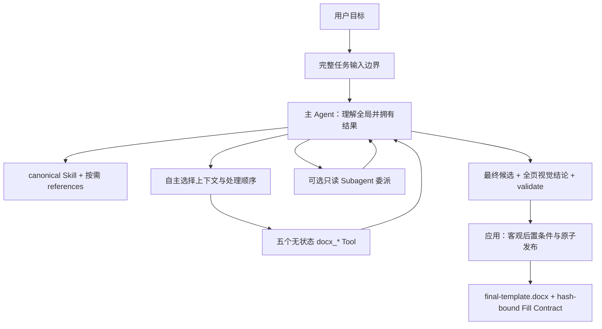
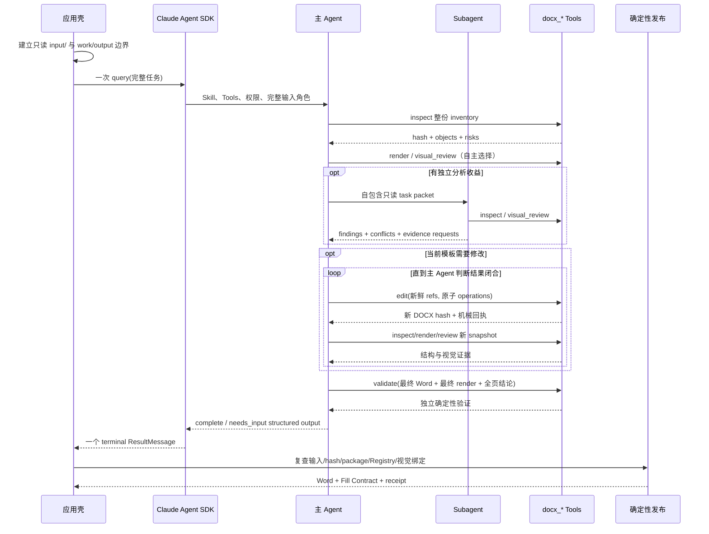

# DocFit Agent-first 模板准备架构

> 状态：当前运行时架构权威
>
> 日期：2026-08-13
>
> 适用范围：`prepare-template` 主 Agent、Skill/reference、五个稳定 Tool、Subagent、任务目录、
> 确定性验证与发布
>
> 不适用范围：Template Extraction Eval/Gold 的评分与维护

## 1. 架构结论

DocFit 模板准备是一项由主 Agent 拥有完整结果的任务，不是应用状态机中的一串 LLM 分类节点。



主 Agent 负责上下文理解、任务分解、Tool 选择、语义判断、重试、复核和完成判断。应用只负责
输入/输出边界、SDK 配置、权限、预算、观测和客观后置条件。Tool 只执行确定性领域操作并返回
机械事实。

## 2. “完整上下文”的精确定义

完整上下文是完整的认知与访问边界，不是一次性把全部 DOCX、XML、Registry 和图片装进 prompt。

主 Agent 在开始时知道：

- 所有输入材料及其角色：学校模板、要求文件、Registry、用户目标；
- 每个输入的只读路径和 hash；
- 可发布结果、任务内中间产物和禁止写入的边界；
- 可以取得整份文档结构 inventory；
- 可以按需查看对象、页面、区域和不同版本的对比；
- 可以随时从局部判断返回全局结构；
- 可以自行选择串行、批量或只读委派。

渐进披露仍然必要，但披露路径由主 Agent 选择。应用不得先替 Agent 选出一个语义 work item，再把
被裁剪的局部视野冒充完整任务。

## 3. 决策权与责任边界

| 层 | 拥有的责任 | 不拥有的责任 |
| --- | --- | --- |
| 主 Agent | 全局目标、语义理解、计划、取证、分解、Tool 组合、重试、冲突合并、完成判断 | 绕过 Tool 直接修改 DOCX；放宽客观安全不变量 |
| Skill/reference | 领域方法、判断框架、反例、委派方法、完成证据 | 固定调度图、运行状态、Tool schema 复制、某学校具体 Truth |
| Subagent | 自包含范围内的只读分析和证据建议 | 隐含继承父上下文、最终写入、跨区合并、宣布全局完成 |
| `docx_*` Tool | snapshot-bound 读取/编辑/渲染/视觉证据/验证 | 工作流状态、下一步、学校语义选择、完成判断 |
| 应用壳 | 任务副本、权限、预算、backend、观测、客观 publication postconditions | 选择语义视野、生成 work item、解释标题/编号、替 Agent 重试 |
| Eval/Gold | 运行后独立评分、回归与人工比较 | 进入运行时 prompt、控制 Tool、修复 Actual |

## 4. 运行时序列



关键约束：一次 SDK `query()` 本身包含完成任务所需的多个 Agent turn 和 Tool loop。应用不把一项
模板任务拆成多个局部 query，也不在 query 之间重绑语义状态。

## 5. 代码结构

```text
src/docfit/
├── app/
│   ├── prepare_template.py     # 单任务输入、一次 SDK query、客观终态检查
│   └── agent.py                # SDK 权限、路径 gate、原生 Subagent 定义
├── tools/
│   ├── __init__.py             # 仅注册五个稳定 MCP Tools
│   ├── schemas.py              # 五 Tool 输入合同
│   ├── service.py              # 无工作流状态的确定性实现
│   └── inspection.py           # snapshot inventory + opaque object refs
├── template/
│   ├── object_mutation.py      # docx_edit 的底层 OOXML 原子机械能力
│   ├── semantic_types.py       # Registry-bound 可承载类型合同
│   └── artifact.py             # 无语义规划的 Fill Contract/发布后置条件
└── visual/
    └── service.py              # content-addressed render/review evidence

.claude/skills/docfit-school-extract/
├── SKILL.md
└── references/
    ├── template-text-classification.md
    ├── body-structure.md
    ├── generated-content-and-toc.md
    ├── collections-and-optional-sections.md
    ├── delegation-strategy.md
    ├── evidence-and-conflicts.md
    └── completion-and-visual-review.md
```

不存在：

- `TemplateWorkspaceService`；
- `template_get_current_work_item` 等 `template_*` Tool；
- template workspace schema；
- 应用维护的 region/work-item/checkpoint 状态图；
- 运行时复制的第二份同名 candidate Skill；
- 为旧任务目录保留的兼容层。

## 6. 五个稳定 Tool

### 6.1 `docx_inspect`

读取 Agent 指定的 DOCX snapshot，返回整份可查询结构、样式、风险和 opaque object refs。ref 包含
document hash、object ID 和 expected fingerprint；应用不选择语义 crop。

### 6.2 `docx_render`

为精确 DOCX 建立 content-addressed LibreOffice visual snapshot，返回 `render:v2:*`、页数、
renderer/font identity 和内部证据路径。

### 6.3 `docx_visual_review`

根据主 Agent 的选择返回 contact sheet、完整页面、对象/文字区域或版本对比。cursor 仅是单次
Tool 结果的机械分页，不是任务流程状态。

### 6.4 `docx_edit`

对 Agent 明确选择的对象执行原子操作；永不覆盖输入。通用编辑与模板领域 action 共用同一 Tool：

- 文本/样式/属性与跨文档内容导入；
- `clear_content` / `remove_object`；
- `materialize_slot` / `materialize_structure`；
- `normalize_effective_format`；
- `refresh_toc`；
- `ensure_page_start`。

模板 action 不拥有 session、cursor、region 或下一步。它只解析当前 snapshot refs、验证 Registry 与
物理承载能力、原子写入新 DOCX、重开并返回机械效果。

### 6.5 `docx_validate`

独立重读 source/final，检查 package、OfficeCLI、输入 hash、残留 placeholder 和最终视觉证据。
当 `required_visual_coverage=all_final_pages` 时，final render 不匹配、页码不完整或 blocking finding
是发布阻断项。

## 7. Skill 与 references

`SKILL.md` 是主 Agent 的领域入口，回答“如何完成一项学校模板整理任务”，不描述应用调用顺序。
正文、目录、集合、证据、委派与视觉复核分别进入短 reference，让 Agent 按当前问题选择读取。

Skill 负责教：

- 如何建立全局结构和视觉认识；
- 如何区分固定内容、说明、示例值、填写位置和生成缓存；
- 什么时候看页面、比较区域或扩大证据；
- 如何选择正文代表结构与 TOC 来源层级；
- 如何处理集合、致谢、附录和条件区域；
- 什么时候委派、task packet 包含什么、如何合并；
- 修改后怎样复核以及什么证据足以完成。

Skill 不负责：

- 枚举固定步骤或学校通用章节清单；
- 复制 Tool JSON schema、错误码和字段校验；
- 要求应用实现相同的语义 gate；
- 维护 session/work-item/cursor/publish 状态。

## 8. Subagent

Subagent 的使用权属于主 Agent。当前默认 `docfit-unit-analyst` 是只读分析者，只能调用
`docx_inspect` 和 `docx_visual_review`，不能 render/edit/validate、再委派或询问用户。

主 Agent 的 task packet 必须自包含：局部目标、全局作用、snapshot/hash、对象/render refs、必要
要求与 Registry、已确认跨区事实、允许 Tool、返回结构、依赖与冲突。主 Agent不通过“多数票”
合并结论，而是回到原始证据裁决，并独占最终修改权。

## 9. 客观不变量与语义判断

### 9.1 代码必须守的客观不变量

- 输入文件不可覆盖且 hash 在运行期间不变；
- object ref 必须绑定当前文档 hash/fingerprint；
- 旧 ref 不能修改新 snapshot；
- 修改必须原子提交，失败不发布部分结果；
- 目标对象必须存在并能物理承载操作；
- Registry field ID 必须存在，结构成员类型必须可承载；
- DOCX package 必须可重开，结构边界不能被机械破坏；
- 最终视觉证据必须绑定精确最终 Word/render 并覆盖全部页面；
- publication 不覆盖已有交付物；
- Word、Fill Contract、validation 和 output hash 必须一致。

### 9.2 代码不得替 Agent 做的语义判断

- 某个具名章节是否只是写作样例；
- 第几章才是通用正文代表；
- 处于文档前半部分是否意味着不能是正文；
- 目录必须包含哪些固定标题；
- `1.1` 在当前学校材料中对应哪个语义字段；
- 一页或一个集合区域应保留几个逻辑接口；
- 某段彩色/括号文字一定是说明或一定是固定内容。

这些结论由主 Agent 使用当前学校材料、Skill 方法、Registry meaning、结构与视觉证据形成。

## 10. 任务目录与恢复

```text
task-root/
├── input/
│   ├── school-template.docx       # read-only
│   ├── school-requirements.*      # optional, read-only
│   └── field-registry.*           # read-only snapshot
├── work/
│   ├── candidate-*.docx           # Agent 选择的不可变中间版本
│   └── .docfit/
│       ├── prepare-template-task.json
│       ├── evidence/
│       ├── template-publication/
│       └── template-agent-execution.json
└── output/
    ├── final-template.docx
    └── fill-contract.json           # 与 Word hash 绑定的正式交付合同
```

恢复只认 `main_agent_full_context/v1` 任务 manifest 和最终 execution trace。旧 work-item checkpoint
不迁移；兼容旧状态机会重新引入双重权威和语义状态，因此 clean break 直接拒绝。

## 11. 失败与重试

- Tool `needs_input`：主 Agent 解释机械前提，重新 inspect、换对象、补证据或调整 operation。
- 语义冲突：主 Agent 比较来源/区域，必要时委派第二视角，最后才问用户最小问题。
- 视觉缺陷：主 Agent 修改后生成新 hash，旧 render/全部页结论失效，重新全页复核。
- backend/timeout：应用可以按配置尝试另一个 backend，但不会把同一任务切成应用语义步骤。
- 客观后置条件失败：应用拒绝 publication；不修改 Agent 语义结论，也不偷偷修文档。

## 12. 验收标准

### L0：静态结构

- 源码仅注册五个 `docx_*` Tool；
- 无 `template_*` Tool、Template Workspace、candidate Skill 或 legacy schema；
- prepare prompt/system prompt 不包含应用 work item/crop/cursor 状态协议；
- canonical Skill 有且只有七个当前 references。

### L1：确定性合同

- task snapshot、权限和旧 checkpoint 拒绝；
- stale ref、source overwrite、越权路径、混合冲突 batch 被拒绝；
- `materialize_slot/structure`、TOC、删除、分页等 action 原子写入并重读；
- structured visual review 与 final render/hash/全部页绑定。

### L2：Agent 集成

- 一次 SDK query、一个主 Agent，五个 Tool 均可用且由 Agent 按任务选择；
- `application_semantic_work_items == 0`；
- 主 Agent 可选调用只读 Subagent，应用不预先分区；
- terminal structured output 由主 Agent 选择 final candidate 并声明完成/缺证据。

### L3：真实产品证据

- 小模板真实 provider E2E；
- NJAU 等大模板对比 wall time、turn/tool 数、成功率与最终质量；
- 精确 final Word 的 LibreOffice 全页证据与 Microsoft Word 原生更新/重开审计；
- Eval/Gold 独立评分，不与运行时实现互证。

## 13. 官方 SDK 依据

本架构遵循 Claude Agent SDK native-first：

- [Agent SDK overview](https://code.claude.com/docs/en/agent-sdk/overview)：SDK 提供完整 Agent loop、
  context management、Tool、Subagent、permission、session 和 Skill。
- [Agent loop](https://code.claude.com/docs/en/agent-sdk/agent-loop)：Claude 自行评估、请求 Tool、接收
  Tool 结果并重复至完成；turn/budget 是运行上限。
- [Custom tools](https://code.claude.com/docs/en/agent-sdk/custom-tools)：DocFit 通过 in-process MCP
  注册可组合领域能力。
- [Subagents](https://code.claude.com/docs/en/agent-sdk/subagents)：主 Agent 可按任务创建隔离上下文、
  受限 Tool 的专门 Subagent。
- [Sessions](https://code.claude.com/docs/en/agent-sdk/sessions)：一个 `query()` 已包含完成任务所需的
  多个 turn；多 prompt session 用于真正的后续交互。
- [Permissions](https://code.claude.com/docs/en/agent-sdk/permissions)：hooks、deny/ask/mode/allow 和
  callback 构成原生权限层。

由此得到的约束是：DocFit 只实现论文领域能力与薄适配，不再实现第二套任务规划、session、重试、
Subagent 调度或 workflow runtime。
