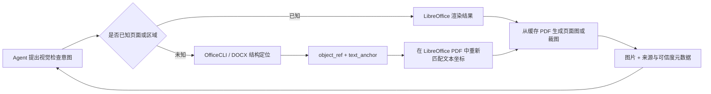

# Agent 按需视觉证据：LibreOffice 渲染与 OfficeCLI 结构定位

> 日期：2026-08-07
> 文档类型：讨论结论与推荐设计
> 状态：方案方向已得到认可，尚未代表代码已经实现
> 边界：本文供人工决策和后续设计使用，不自动替代 `docs/docfit-00-index.md`
> 至 `docs/docfit-06-development-roadmap.md` 的全局架构基线。

## 1. 结论

如果只选一个工具负责生成 Agent 要看的图片，推荐使用 **LibreOffice**。

更合理的完整方案不是让 Agent 在 LibreOffice 和 OfficeCLI 之间二选一，而是：

- **LibreOffice 是主视觉渲染器**：负责生成 PDF、页面图和局部截图，回答“实际看起来怎样”。
- **OfficeCLI 是可选的辅助结构定位器**：负责识别 DOCX 中的段落、表格、单元格、文本锚点等，回答“应该找哪个对象”。
- **DocFit 对 Agent 暴露一个统一视觉工具**：Agent 只选择需要整份缩略图、某几页还是某个局部，不选择底层渲染器。
- **最终交付级判断仍以 Microsoft Word 或人工验收为准**：LibreOffice 和 OfficeCLI 都不能被描述为与 Word 完全一致。

一句话概括：**OfficeCLI 告诉 Agent“找谁”，LibreOffice 告诉 Agent“它看起来怎样”。**

## 2. 为什么主渲染器选择 LibreOffice

DocFit 当前的目标，是给 Agent 提供足够可靠的视觉信息，帮助它发现封面、分页、标题、
表格、下划线和版面关系等问题。这里最重要的是视觉画面本身，而不是只获得 DOCX 的内部结构。

LibreOffice 更适合作为默认主渲染器，原因包括：

- 可以稳定地产生完整 PDF，再从同一份 PDF 派生缩略图、整页图和局部裁图。
- 在现有三个学校样本的封面和整体版式观察中，视觉效果总体比 OfficeCLI 的 HTML 渲染更接近 Word。
- 适合放入 Docker，并锁定 LibreOffice 版本、字体集合和导出参数，便于复现。
- 文档只需完整渲染一次；后续查看其他页面或区域可以直接从缓存 PDF 裁取，成本较低。

LibreOffice 的已知限制也必须保留在产品语义中：

- 分页可能与 Word 不同。
- 某些下划线、域、文本框或复杂排版仍可能丢失或发生偏移。
- 它擅长输出页面，但不天然告诉 Agent 页面元素对应 DOCX 中的哪个可编辑对象。

因此，LibreOffice 产出的内容应标记为“近似视觉证据”，不能标记为“Word 等价渲染”。

## 3. 什么是“辅助结构定位”

辅助结构定位不是再次生成一张更准确的页面图，而是从 DOCX 结构中找到视觉问题对应的源对象。

例如，Agent 发现封面上的“指导教师”一栏下划线异常。结构定位器可以返回：

```json
{
  "object_ref": "table-1-cell-12",
  "type": "table_cell",
  "docx_path": "/body/table[1]/tr[6]/tc[2]",
  "text_anchor": "指导教师",
  "approximate_page": 1
}
```

这份结果的价值在于：

- 确认问题属于哪个表格、单元格或段落。
- 为后续修改提供稳定的 `object_ref`。
- 提供文本锚点，帮助在 LibreOffice 生成的 PDF 中重新找到对应区域。
- 避免 Agent 只看到像素问题，却不知道应修改 DOCX 中哪个对象。

OfficeCLI 的 HTML 中通常保留了较丰富的文档语义路径，因此适合承担这一职责。但它不应成为
LibreOffice 画面的坐标真值来源。

## 4. 正确的组合流程



以“检查指导教师下划线”为例：

1. OfficeCLI 或其他 DOCX 解析能力定位到源表格单元格，并给出 `object_ref` 和 `text_anchor`。
2. LibreOffice 将 DOCX 渲染为 PDF。
3. 系统在这份 LibreOffice PDF 的文本层中搜索同一锚点，取得该渲染结果自己的文本边界框。
4. 系统按该边界框扩展一定边距，从 LibreOffice 页面中裁出图片。
5. Agent 同时得到视觉图片和源对象引用，既能判断问题，也能继续执行修改。

### 关键边界

不能把 OfficeCLI 页面里的坐标或页码直接套用到 LibreOffice 页面上。两个渲染器可能具有不同的
分页、字体度量和元素位置。跨渲染器只能传递语义身份，例如 `object_ref` 和 `text_anchor`，然后在
目标渲染结果中重新映射坐标。

如果 Agent 已经知道要看第几页，或者用户已经明确指定区域，则应跳过结构定位，直接从
LibreOffice 渲染结果生成所需页面图或裁图。

## 5. 给 Agent 的统一工具入口

建议保留“渲染”和“取视觉证据”两个层次，但不向 Agent 暴露后端选择权。

### `docx_render`

职责：建立一份可复用的文档渲染结果。

输入可以包含 DOCX 引用和渲染质量参数；输出至少包含：

- `render_ref`
- PDF 引用
- 总页数
- 页面索引
- 联系表或首轮缩略图
- 渲染来源和环境指纹

默认路由到 LibreOffice。OfficeCLI 的结构产物可以作为内部附属索引，但不替代主 PDF。

### `docx_visual_review`

职责：从已有 `render_ref` 中按需取得 Agent 当前真正需要的视觉信息。

建议支持四种模式：

- `contact_sheet`：整份文档的低成本总览，用于发现可疑页面。
- `pages`：请求一个或多个完整页面。
- `crops`：按区域、文本锚点或 `object_ref` 请求局部高清图。
- `compare`：并排或差异化展示两个渲染结果中的对应页面或区域。

Agent 应选择的是**观察粒度**，而不是 `LibreOffice` 或 `OfficeCLI`。这样可以避免业务 Prompt
逐渐依赖后端名称，也便于以后替换渲染器而不改变上层 Agent 契约。

## 6. 推荐的按需取图策略

对同一份 DOCX，推荐采用渐进式观察：

1. LibreOffice 完整渲染一次并缓存 PDF。
2. Agent 首先查看联系表，快速识别疑似异常页面。
3. 只加载相关整页图。
4. 对细节问题再请求局部高分辨率裁图。
5. 修改后只创建新的 `render_ref`，再比较相关页面或区域。

缓存键至少应包含：

- DOCX 内容哈希
- LibreOffice 版本
- 字体环境指纹
- 导出配置

这样既降低重复渲染成本，也避免字体或版本变化后错误复用旧结果。

## 7. LibreOffice 与 OfficeCLI 的优劣势

| 维度 | LibreOffice | OfficeCLI |
| --- | --- | --- |
| 主要定位 | 主视觉渲染器 | 辅助结构定位器 |
| 视觉接近 Word | 当前样本中总体更好，但仍有偏差 | HTML/浏览器渲染偏差通常更明显 |
| 完整 PDF | 原生、稳定 | 通常需要浏览器分页和截图链路 |
| 字体控制 | 可通过 Docker 和字体包锁定 | 同样需要字体，但还受浏览器 CSS 影响 |
| 分页 | 可能与 Word 不同 | 动态 HTML 分页也可能不同 |
| 下划线等复杂格式 | 可能丢失或变化 | 也可能丢失，当前样本中问题更明显 |
| DOCX 对象映射 | 较弱 | 较强，可保留语义路径和数据标记 |
| 按需看图成本 | 首次渲染后裁图便宜 | 多次浏览器布局和截图成本更高 |
| 最适合回答 | “看起来怎样” | “对应哪个源对象” |

如果未来验证发现不需要结构定位，OfficeCLI 可以完全退出视觉链路；如果 LibreOffice 以后被更合适的
渲染器替换，上层统一工具契约也无需改变。这使当前选择保持可逆。

## 8. 当前样本提供的证据

以下数字只说明当前测试文件的表现，不能直接外推到所有学校模板：

| 指标 | Word | OfficeCLI 实际动态结果 | LibreOffice + 字体 |
| --- | ---: | ---: | ---: |
| 三个样本合计页数 | 63 | 66 | 79 |

之前观察到 OfficeCLI 页面数过少，是 DocFit 包装层读取静态 HTML `data-page` 的探测错误，
不是 OfficeCLI 实际只生成了那些页面。修正口径后，OfficeCLI 的总页数在该组样本上比
LibreOffice 更接近 Word，但**页数接近不等于视觉更接近**。

南京农业大学封面下划线的当前观测为：Word 可见 7 组，OfficeCLI 为 0 组，LibreOffice + 字体为
1 组。这个结果说明两个开源渲染器都不能替代 Word 真值，也说明字体补齐无法自动解决所有格式兼容问题。

测试结论应继续按至少三个维度分别记录：

- 页数和分页接近程度
- 整页视觉接近程度
- 关键对象是否存在，以及是否能映射回 DOCX 结构

不能用单一页数指标选定主视觉渲染器。

## 9. 证据与可追溯性要求

每一份送给 Agent 的图片都应附带或可追溯到：

- `render_ref`
- `provider`，例如 `libreoffice`
- `fidelity`，明确标记为近似而非 Word 等价
- 渲染器版本
- 字体环境指纹
- DPI 或缩放参数
- 页码和裁剪区域
- 页面图或图片哈希
- 可选的 `object_ref` 和 `text_anchor`

页码必须属于具体的 `render_ref`。不能把不同 provider 的“第 10 页”默认为同一个逻辑页面。
跨结果比较应先通过文本锚点、内容标识或结构对象建立对应关系。

## 10. 兼容层设计原则

本方案不建议建立学校级补丁。三个学校只是测试用例，不是架构中的特殊分支。

兼容层应保持窄而通用：

- 优先通过受控字体、固定版本和标准导出参数减少环境差异。
- 通过通用检测发现缺失对象、分页漂移、异常空白或文本溢出。
- 只有在多个样本证明某类 Office 特性存在稳定、可识别的兼容问题时，才增加特性级修复。
- 修复必须可以按能力检测启用，并能够关闭和回归测试，避免改善一种文档却破坏另一种文档。
- 不根据学校名称、文件名或模板来源应用补丁。

## 11. Claude Agent SDK 官方依据

该设计遵循 Claude 原生工具调用机制，不另外建设一套 Agent 图片输入运行时：

- Claude 的客户端工具由应用定义输入契约并执行，结果通过 `tool_result` 返回。
- 工具结果可以包含 `text`、`image` 或 `document` 等内容块，所以页面图和裁图可以作为同一次工具
  调用的原生多模态结果交给 Agent。
- Agent 只需要调用领域工具；DocFit 在工具内部负责缓存、渲染、定位和证据元数据。

官方参考：

- [Tool use with Claude](https://platform.claude.com/docs/en/agents-and-tools/tool-use/overview)
- [Handle tool calls](https://platform.claude.com/docs/en/agents-and-tools/tool-use/handle-tool-calls)
- [Tool runner (SDK)](https://platform.claude.com/docs/en/agents-and-tools/tool-use/tool-runner)

这些官方能力约束了当前设计：视觉能力应被包装为清晰的领域工具及多模态 `tool_result`，而不是
在 DocFit 内部重新实现一套与 Claude Agent SDK 重叠的 Agent 循环或消息协议。

## 12. 后续实施顺序建议

本文不授权或记录代码已经完成。若进入实施阶段，建议按以下顺序推进：

1. 固化 LibreOffice Docker、字体集合和渲染环境指纹。
2. 建立 `docx_render` 的 LibreOffice 主渲染与缓存。
3. 建立 `docx_visual_review` 的联系表、页面、裁图和比较能力。
4. 使用 PDF 文本边界框完成 `text_anchor` 到 LibreOffice 页面坐标的映射。
5. 仅在需要从视觉问题回到 DOCX 对象时接入 OfficeCLI 结构索引。
6. 用跨模板用例分别回归分页、视觉和对象映射，避免形成学校补丁。
7. 实施方案获得批准后，再同步修改全局架构基线和工具契约文档。
