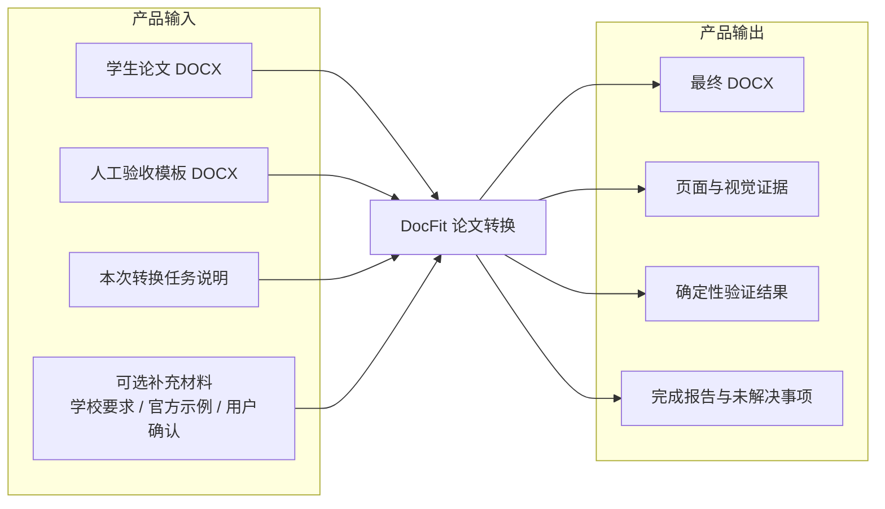
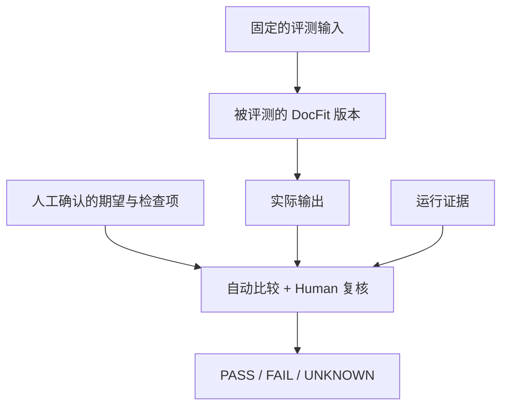
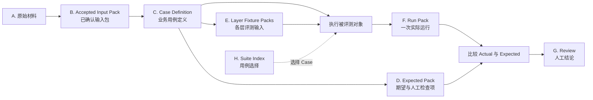
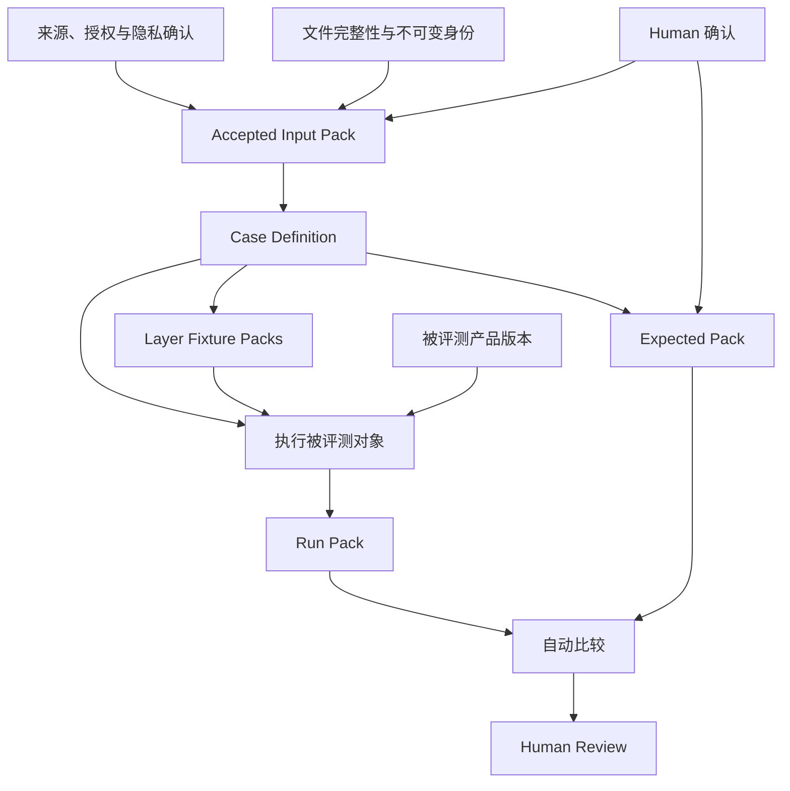
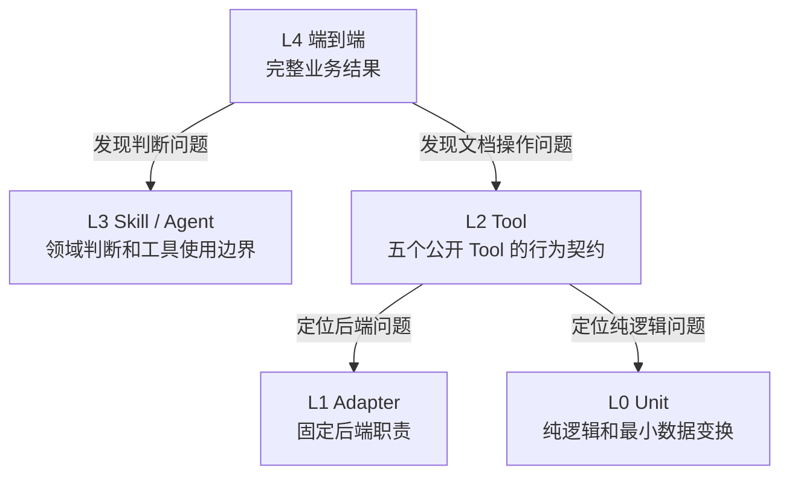
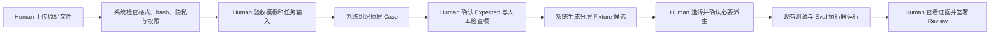

# DocFit Eval 数据体系讨论稿

> 状态：Human 讨论稿，尚未批准，不定义当前架构
> 日期：2026-08-03
> 讨论范围：未来 M3 的 Eval 数据准备与管理
> 当前权威来源：`docs/docfit-00-index.md` 至 `docs/docfit-06-development-roadmap.md`

## 0. 这次讨论按什么顺序进行

这份文档先不讨论代码怎么实现，也不先设计 YAML 字段。我们需要依次确认四件事：

1. **顶层目标**：为什么要建设这套 Eval 数据体系；
2. **文件全景**：完整评测究竟需要哪些文件，这些文件各自依赖什么；
3. **数据 Pipeline**：人工提供的原始文件如何转成端到端、Skill、Tool 等不同层级的评测文件；
4. **管理字段**：文件体系确定后，代码需要哪些身份、版本、路径、血缘和权限字段来管理它们。

这里必须区分两类完全不同的信息：

| 信息 | 回答的问题 | 本文如何处理 |
|---|---|---|
| 评测内容与标准 | 什么结果才算正确 | 先明确它属于哪类文件，不在本轮展开断言字段 |
| 数据管理元数据 | 代码如何找到、校验、派生和运行这些文件 | 在文件体系确定后给出候选字段 |

因此，本文后面的 `id`、`sha256`、`derived_from`、权限和版本等字段，不是论文格式的
评测标准，也不定义标题字号、页边距或页面是否合格。它们只是让代码能够可靠管理数据。

## 1. 顶层目标

### 1.1 我们真正要建设的是什么

我们要建设的不是一个通用测试平台，而是一套适合人工准备、机器加工、分层评测和
持续回归的 **DocFit Eval 数据体系**。

它要让团队能够回答：

1. 一次论文转换评测需要准备哪些原始文件；
2. 这些原始文件是否已经被人工确认，可以进入评测；
3. 一个完整业务案例如何被加工成不同层级的评测输入；
4. 每个层级运行后会产生什么实际结果和证据；
5. 哪些结果可以自动判断，哪些必须由 Human 复核；
6. 一个失败如何沉淀成可重复运行的回归资产。

### 1.2 Human 最终应该获得什么能力

Human 不需要直接维护大量互相独立的测试文件。理想方式是：

```text
人工准备少量完整、可信的原始材料
        ↓
形成一个可理解的顶层业务 Case
        ↓
系统辅助生成不同责任层的评测文件
        ↓
人工只确认来源、期望与高风险结果
        ↓
同一问题可以在不同层级持续回归
```

### 1.3 成功标准

这套设计成功时，应满足：

- Human 能从顶层业务问题理解整个 Case，而不是先理解测试目录；
- 每个评测文件都能说明它来自哪里、服务哪个层级；
- 下层用例可以从顶层 Case 加工得到，但不会偷偷改变原始材料；
- 实际运行结果不会自动变成正确答案；
- 私有论文、学校材料和 Adobe 外部处理授权边界清楚；
- 新增一个案例时，不需要人工重复填写大量相同信息；
- 数据体系属于离线 Eval，不进入正常论文转换的运行路径。

## 2. 先从产品逻辑看评测

Eval 首先是对产品能力的观察。只有先说明产品接收什么、产生什么，才能决定评测需要
保存哪些文件。

### 2.1 论文转换产品的输入与输出



对于主要的论文转换 Eval，最简单的顶层输入建议是：

```text
人工验收好的模板.docx
+ 学生论文.docx
+ 本次任务说明
```

这是比“每次都重新解释原始学校模板和要求”更简单的起点。学校原始要求、旧模板和
官方示例仍然有价值，但它们主要用于：

- 生产或审核这份人工验收模板；
- 专门评测 `docfit-school-extract`；
- 构造模板与文字要求冲突等特殊案例。

因此，“人工验收模板”是转换 Eval 的优先输入，“原始学校材料”是它的上游来源，
两者不应在每个 Case 中被强制重复处理。

### 2.2 Eval 在产品外部做什么



Eval 不控制 Agent 下一步，也不复制产品运行流程。它只在产品外部固定输入、保存输出、
收集证据并判断结果。

## 3. 整个评测需要哪些文件

先讨论文件职责，不先讨论目录和 schema。下面的文件名是便于讨论的逻辑名称，最终
文件名和存储位置可以在这些职责确认后再确定。

### 3.1 文件体系总览



### 3.2 A. 原始材料

原始材料是 Human 收到的上游文件，还不能直接假定为可运行的 Eval 输入。

| 文件 | 是否必需 | 作用 |
|---|---:|---|
| 原始学生论文 DOCX | 转换类必需 | 学生内容真值来源 |
| 原始学校模板 DOCX | 模板准备时需要 | 人工验收模板的来源之一 |
| 学校要求 PDF、DOCX 或文字 | 可选 | 解释模板、处理冲突和确认适用范围 |
| 官方示例 | 可选 | 补充模板或文字要求无法表达的外观事实 |
| Human 准备说明 | 推荐 | 记录材料来源、已知问题和需要确认的事项 |
| 授权或脱敏证明 | 私有真实样本必需 | 决定能否存储、运行和发送到外部服务 |

原始材料是上游证据，不是 Expected，也不是 Gold。

### 3.3 B. Accepted Input Pack：已确认输入包

这是第一个真正可以进入 Eval 的文件组。它是 Human 对原始材料加工、筛选和确认后的
结果。

转换类端到端 Case 的最小输入包：

| 文件 | 是否必需 | 由谁准备 | 说明 |
|---|---:|---|---|
| `student.docx` | 必需 | Human 提供，系统做完整性检查 | 可以是合成、脱敏或明确授权的论文 |
| `template.docx` | 必需 | Human 整理并验收 | 已经可以直接服务论文转换 |
| `task.md` | 必需 | Human 或平台生成后确认 | 描述本次转换目标、适用范围和补充信息 |
| `materials/*` | 可选 | Human 选择 | 仅保留本 Case 真正需要的学校要求或示例 |
| `asset-metadata` | 必需 | 系统生成，Human 确认权限 | 保存身份、hash、来源和使用权限，不保存评测标准 |

关键点是：系统接收的不是一堆无法理解关系的文件，而是一个经过确认的输入包。

### 3.4 C. Case Definition：业务用例定义

Case Definition 说明“我们在评测什么”，它引用 Accepted Input Pack，但不复制论文正文。

它至少说明：

- 业务任务是什么；
- 使用哪一组输入文件；
- 这是模板提取、论文转换还是某个风险复现；
- 这个 Case 重点覆盖哪些风险；
- 它有哪些下层派生 Case；
- 哪些 Suite 可以选择它。

这个文件只组织业务问题和文件关系，不直接保存所有评测断言。

### 3.5 D. Expected Pack：期望与人工检查项

Expected Pack 回答“什么结果才算正确”，它与数据管理元数据分开。

| 文件 | 作用 |
|---|---|
| `facts` | 可以自动核对的内容、结构、格式和安全事实 |
| `manual-checks` | Human 必须查看的页面或风险 |
| `visual-findings` | 可选的人工确认视觉事实 |
| `reference-final.docx` | 可选；只有事实不足以表达时才保存的参考成品 |
| `reference-pages/*` | 可选；确有比较价值的少量参考页面 |

完整参考 DOCX 不是每个 Case 的必需项。优先保存稳定事实，复杂页面或已确认交付基线
才保存参考成品。

Expected 必须经过 Human 确认。系统可以从材料和一次运行中提出候选，但不能把自己的
Actual 自动认定为 Expected。

### 3.6 E. Layer Fixture Packs：各层评测输入

一个顶层 Case 可以派生出多个更小的评测文件组。它们验证的不是同一件事，因此输入
和输出也不同。

| 层级 | 主要输入文件 | 主要实际输出 | 依赖来源 |
|---|---|---|---|
| L4 端到端 | Accepted Input Pack + Case Definition | 最终 DOCX、视觉证据、验证和报告 | 顶层业务 Case |
| L3 Skill / Agent | 任务说明、必要学校材料、受控 Tool 结果 | 可观察行为、结论与未解决事项 | 从顶层 Case 投影，或从真实失败提炼 |
| L2 Tool | 最小 DOCX fixture + Tool 请求 | Tool 结果、修改后文件或明确失败 | 从具体文档操作风险最小化得到 |
| L1 Adapter | 固定输入文件 + 后端职责请求 | 后端产物和可审计证据 | 从 Tool 路由和后端风险得到 |
| L0 Unit | JSON、hash、OOXML 片段或纯值 | 确定性值或 typed failure | 从实现缺陷最小化得到 |

Layer Fixture 不等于多层 Gold。每层只保存该责任边界真正需要的输入和期望，不保存
完整 Agent 轨迹，也不要求下层复现端到端过程。

### 3.7 F. Run Pack：一次实际运行

Run Pack 是某个产品版本对某个 Case revision 的一次实际执行结果。

| 文件组 | 内容 |
|---|---|
| `run-metadata` | 本次运行绑定的 Case、产品版本、输入 hash 和环境信息 |
| `actual/*` | 最终 DOCX、Tool 结果、Agent 结果等被评测输出 |
| `evidence/*` | PDF、页面图片、render ref、validation 等证明材料 |
| `comparison` | 自动比较结果，以及无法自动判断的项目 |
| `report` | 本次运行的 PASS、FAIL 或 UNKNOWN 摘要 |

Run Pack 是运行事实，不是正确答案。重新运行产生新的 Run，不覆盖旧 Run。

### 3.8 G. Human Review

Human Review 只记录 Human 对固定 Run 和固定证据的结论：

- 看了哪个 Run；
- 看了哪些页面或文件；
- 接受、拒绝或无法判断什么；
- 是否允许把某项结论加入新的 Expected revision；
- 审核人、时间和理由。

Review 不直接修改 Actual，也不自动覆盖 Expected。

### 3.9 H. Suite Index

Suite 只是一次要运行哪些 Case 的清单。它不拥有论文、期望或运行产物。

初期可以只讨论：

- 公开、合成、确定性的核心回归；
- 需要真实 OfficeCLI / Adobe 的本地 live 回归；
- 需要受保护真实样本和 Human 复核的私有回归。

## 4. 文件之间首先依赖什么

### 4.1 依赖关系



### 4.2 必须固定的依赖规则

1. 没有来源、权限和 hash 的文件，不能成为 Accepted Asset；
2. Case 只能引用 Accepted Input，不能直接指向一份身份不明的本地文件；
3. Expected 依赖 Case 和 Human 确认，不能只依赖一次 Actual；
4. 下层 Fixture 必须能追溯到顶层 Case、某个真实失败或明确的合成来源；
5. Run 必须绑定 Case revision、输入 hash 和被评测产品版本；
6. Review 必须绑定固定 Run 和固定 Evidence，不能审核一个会继续变化的目录；
7. Actual、Evidence 和 Review 都不会自动进入产品 Knowledge；
8. 允许本地读取文件，不等于允许将完整 DOCX 上传到 Adobe；外部处理权限必须单独确认。

## 5. 原始文件如何转换成评测文件

这里的 Pipeline 是 **离线数据准备流程**，不是 DocFit 产品运行时的工作流。


### 5.1 第一步：Human 准备原始材料

Human 提供学校材料、学生论文和使用授权。这里不要求 Human 先理解测试 schema。

### 5.2 第二步：把原始材料变成 Accepted Input Pack

平台或脚本可以辅助：

- 检查文件能否打开；
- 计算 hash；
- 生成页面预览供 Human 查看；
- 提示隐私、仓库提交和外部处理权限；
- 帮助 Human 把原始模板整理为已验收模板；
- 形成简短、明确的 `task.md`。

Human 负责确认材料含义和授权。系统负责机械检查，但不能替 Human 宣布模板正确。

### 5.3 第三步：形成顶层端到端 Case

系统将 Accepted Input Pack 组织成一个完整业务 Case。Human 确认：

- 这个任务要完成什么；
- 哪些材料适用于当前 Case；
- 主要风险是什么；
- 哪些事实可自动检查；
- 哪些页面必须人工查看。

### 5.4 第四步：为不同责任层加工文件

从顶层 Case 向下加工时，只允许几种清楚的方式：

- **投影**：只选择某一层真正需要的字段和文件；
- **受控快照**：把一次 Tool 结果规范化后作为 Skill Eval 输入；
- **最小复现**：把复杂真实问题重建成最小合成 DOCX 或 OOXML 片段；
- **脱敏派生**：保留结构与版式风险，移除真实学生内容；
- **失败构造**：生成失效引用、错误结果或不完整证据，验证安全行为。

每次加工都要记录来源和方法。系统可以生成候选，Human 不需要逐文件从零填写。

### 5.5 第五步：运行、比较和复核

执行器读取 Case 和对应 Layer Fixture，生成 Run Pack。自动检查先比较稳定事实，Human
再复核自动化覆盖不到的页面。发现问题后，只在发生问题的责任层增加最小回归资产，
不把整次端到端运行复制成多层 Gold。

## 6. 分层关系：顶层 Case 如何向下拆



不是每个端到端 Case 都必须机械地产生 L0–L3 的全部文件。只有某个责任层需要独立
验证或出现过缺陷时，才派生对应 Fixture。

例如，一个“模板前置页嫁接后出现空白页”的顶层 Case，可以拆成：

| 层级 | 独立验证的问题 | 需要加工出的文件 |
|---|---|---|
| L4 | 最终论文是否正确且无意外空白页 | 完整输入包、期望事实、人工页面检查项 |
| L3 | Agent 是否识别风险并查看当前页面证据 | 任务、相关材料、受控 Tool 结果 |
| L2 | 模板导入和渲染 Tool 是否保持结构并返回正确证据 | 最小模板、最小论文、Tool 请求、期望事实 |
| L1 | 固定后端是否产生符合职责的页面证据 | 输入 DOCX、后端职责请求、产物证据要求 |
| L0 | 节属性或关系重映射是否正确 | 最小 OOXML / JSON 输入和确定性期望值 |

## 7. 文件确定之后，再讨论管理字段

### 7.1 字段设计的边界

管理字段只服务以下代码能力：

- 唯一识别文件和 Case；
- 找到实际文件；
- 检查文件有没有变化；
- 知道它从哪里派生；
- 判断是否允许进入 Git、CI 或外部服务；
- 选择要运行的 Case；
- 将 Run 和 Review 绑定到固定版本；
- 防止 Actual 被误当成 Expected。

以下内容不属于这一层字段：

- 标题应该用什么字号；
- 学生正文是否完整；
- 页面是否存在溢出；
- Agent 必须或禁止做什么；
- 哪个结果算 PASS。

这些属于 Expected 和比较逻辑，不属于数据管理 schema。

### 7.2 所有文件对象共有的最小字段

| 字段组 | 候选字段 | 代码用途 |
|---|---|---|
| 身份 | `id`、`kind`、`schema_version` | 找到正确类型和解析方式 |
| 版本 | `revision`、`status` | 防止原地覆盖已验收数据 |
| 位置 | `path` 或受控资源引用 | 找到文件，但不把正文写进 manifest |
| 完整性 | `sha256`、`size`、`media_type` | 检查文件是否变化或损坏 |
| 来源 | `source`、`derived_from`、`derivation_method` | 建立原始材料到派生 Fixture 的血缘 |
| 生命周期 | `created_at`、`accepted_at`、`retired_at` | 区分候选、可运行和退役数据 |

不是每个文件都需要重复全部字段。共同字段可以由所属 Pack 统一保存。

### 7.3 Asset 管理字段

Asset 的字段重点是文件身份和权限：

| 字段组 | 需要表达什么 |
|---|---|
| 来源 | Human 提供、系统合成、脱敏派生或其他文件加工 |
| 可见性 | 公开、内部或私有 |
| 隐私 | 是否含真实学生内容，是否已经脱敏 |
| 存储权限 | 是否允许进入仓库和 CI |
| 外部处理 | 是否允许上传到 Adobe 等外部服务，以及允许的处理方 |
| 验收 | 谁确认它可以作为 Eval 输入、何时确认 |

这里没有任何论文格式正确性字段。

### 7.4 Case 管理字段

Case 的字段重点是组织关系：

| 字段组 | 需要表达什么 |
|---|---|
| 身份 | Case ID、revision 和类型 |
| 任务 | 对应模板提取、论文转换或风险复现 |
| 输入引用 | 使用哪些 Accepted Assets |
| 风险标签 | 用于查找和覆盖统计，不直接决定 PASS |
| 层级 | E2E、Skill、Tool、Adapter 或 Unit |
| 上游关系 | 来自哪个顶层 Case 或失败 |
| 状态 | draft、active 或 retired |

### 7.5 Run 与 Evidence 管理字段

这些字段确保一次结果可以复现和审计：

| 对象 | 关键管理信息 |
|---|---|
| Run | Case revision、产品版本、Knowledge digest、输入 hash、开始/结束时间 |
| Actual | 文件路径、hash、产生它的 Run |
| Evidence | 文档 hash、证据类型、Provider/版本、render ref、页面和图片 hash |
| Comparison | 使用的 Expected revision、比较器版本、无法判断项 |

当前固定后端是 OfficeCLI 1.0.143 与 Adobe PDF Services SDK 4.2.0。这里记录它们是为了
复现证据，不是让 Case 动态选择 Provider。

### 7.6 Human Review 管理字段

Review 只需要：

- Review ID；
- 被审核的 Run ID；
- 被查看的 Evidence refs；
- 审核人和时间；
- `accepted`、`rejected` 或 `unknown`；
- 简短理由；
- 是否建议创建新的 Expected revision。

Review 不应把整段学生正文复制进元数据。

## 8. 逻辑上的文件包装方式

在职责确定后，可以把它们理解成三个相互独立的包。这里仍不是最终仓库目录。

```text
Case Package
├── accepted-inputs/ 或受保护 Asset 引用
├── case-definition
├── expected/
└── layers/
    ├── skill/
    ├── tool/
    ├── adapter/
    └── unit/

Run Package
├── run-metadata
├── actual/
├── evidence/
├── comparison
└── report

Review Package
└── human-review
```

公开合成数据可以和 Case Definition 一起进入 Git；真实学生论文和不可公开模板应放在
仓库外受保护存储；Run 产物放在忽略版本控制的运行目录。物理目录应在逻辑文件职责
确认后再定，避免目录反过来驱动产品模型。

## 9. 人工数据平台应该服务哪一段

人工平台首先服务“原始材料 → Accepted Input Pack → Case / Expected 确认”，其次才是
查看 Run 和签署 Review。



平台不需要先建设第二套 Agent loop 或通用 Eval runner。它的核心价值是让 Human 能够
看懂、确认和管理数据关系。

## 10. 当前最需要 Human 确认的前置决策

这些决策应先于目录、YAML schema 和平台页面设计：

### 决策 1：转换 Eval 的最小顶层输入

是否同意以“人工验收模板 + 学生论文 + 任务说明”作为转换 Eval 的首选输入，原始学校
要求和旧模板只在模板准备、模板提取或冲突案例中提供？

### 决策 2：文件职责是否完整

是否同意用八类文件职责覆盖整个体系：

```text
原始材料
→ Accepted Input Pack
→ Case Definition
→ Expected Pack
→ Layer Fixture Packs
→ Run Pack
→ Human Review
+ Suite Index
```

### 决策 3：下层 Case 是否按需派生

是否同意下层 Skill、Tool、Adapter 和 Unit Fixture 从顶层 Case、真实失败或明确合成
来源按需产生，而不是要求每个端到端 Case 都填满所有层级？

### 决策 4：管理元数据与评测标准是否分离

是否同意把身份、路径、hash、血缘、权限和版本放入管理 manifest；把论文正确性、
Agent 行为和人工页面检查放入独立 Expected 文件？

### 决策 5：参考最终 DOCX 是否可选

是否同意事实断言优先，只有复杂页面或已确认交付基线才保存参考最终 DOCX 或页面？

### 决策 6：人工平台的首要范围

是否同意平台优先解决原始文件准入、模板验收、顶层 Case 组织、Expected 确认和分层
Fixture 派生，运行器与更详细的报告平台留到真实数据规模证明需要之后？

## 11. 确认顺序与下一步

建议 Human 按以下顺序讨论：

1. 先确认第 1 节的目标；
2. 再确认第 3 节的文件职责是否有缺失或重叠；
3. 再确认第 4–6 节的依赖和派生关系；
4. 最后才锁定第 7 节管理字段；
5. 上述内容通过后，再设计物理目录、具体 schema 和人工平台页面。

本讨论稿属于未来 M3 设计输入。M3 当前仍在已完成 M0–M2 范围之外；在新的用户批准
计划和 00–06 协调更新完成前，本文中的文件包、字段和人工平台都不能描述为已实现或
已批准架构。
