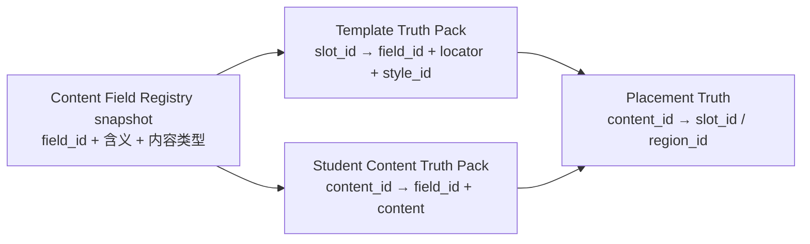
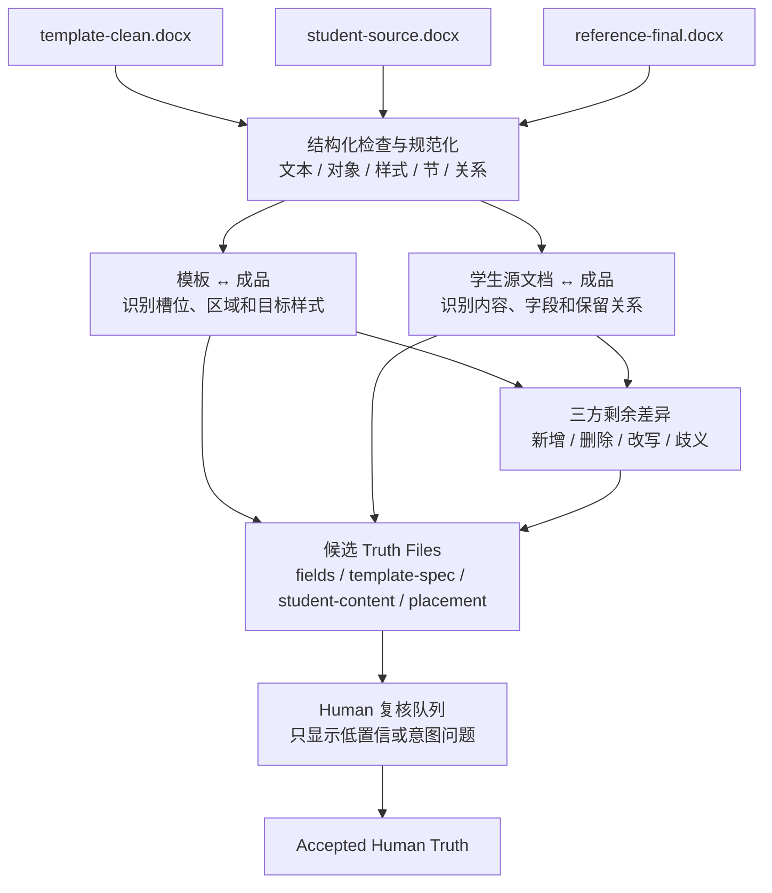
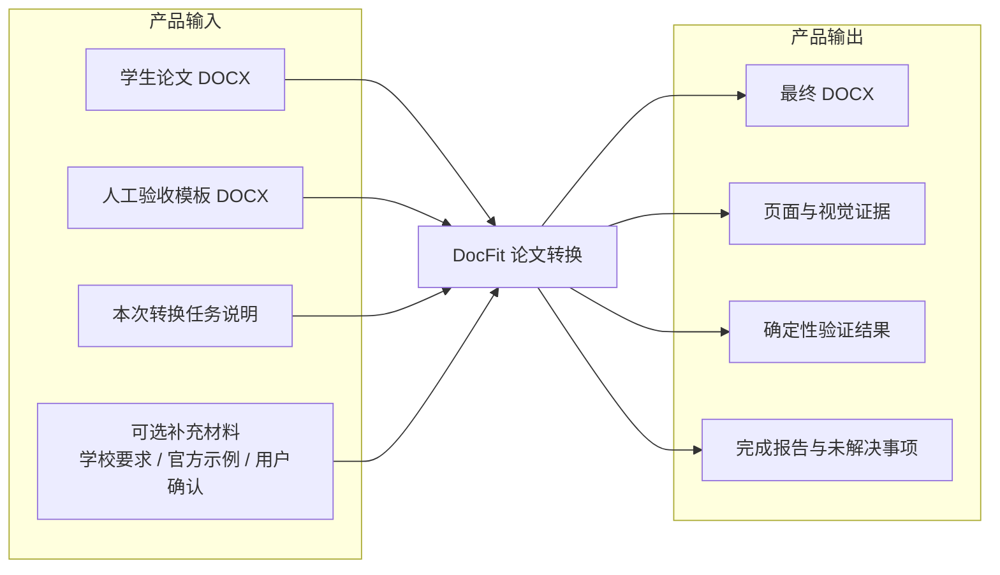
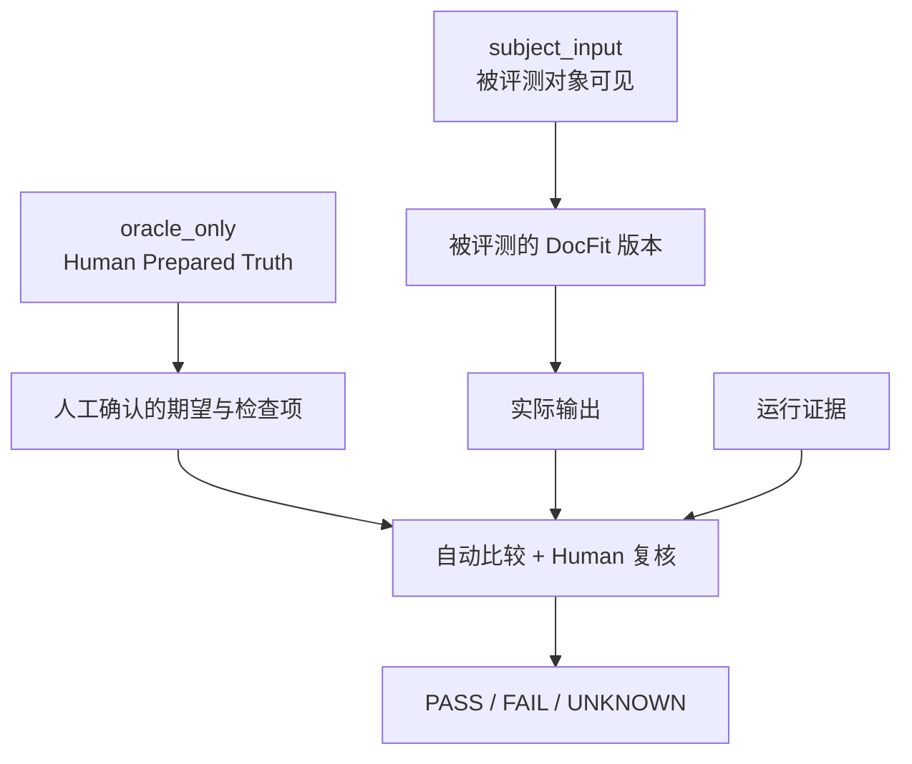
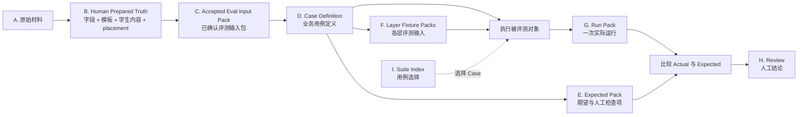
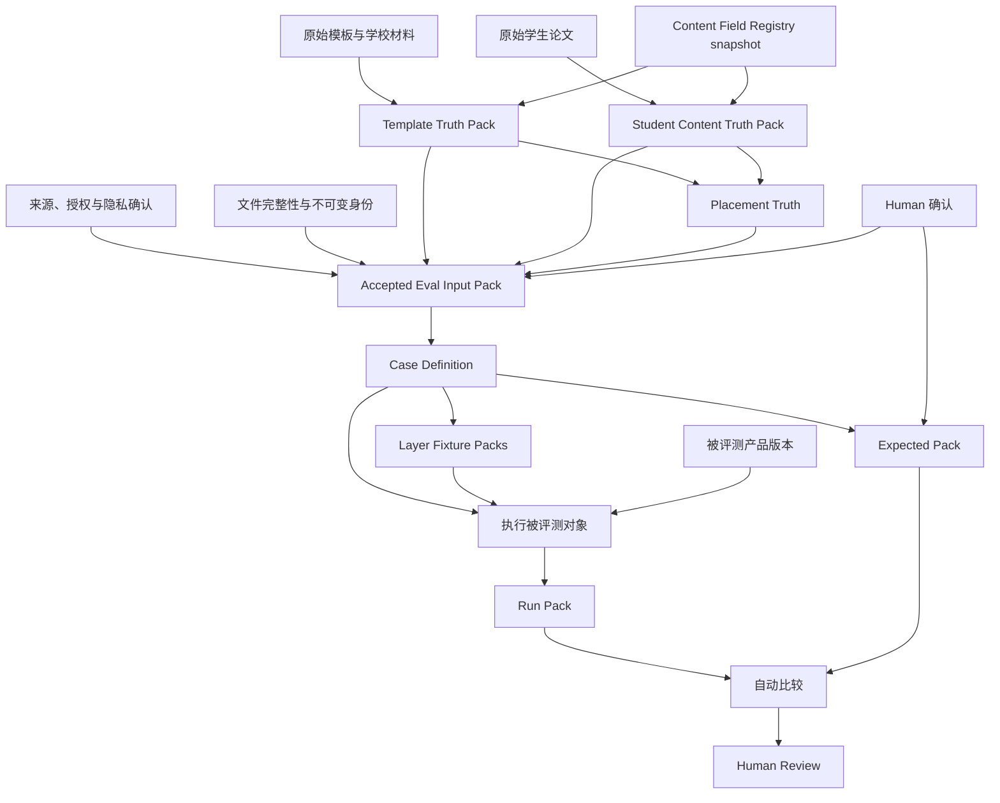
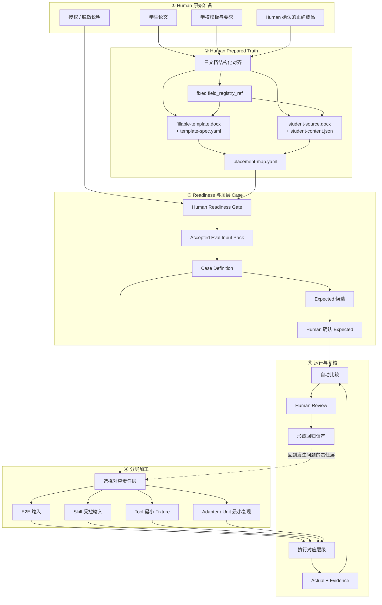
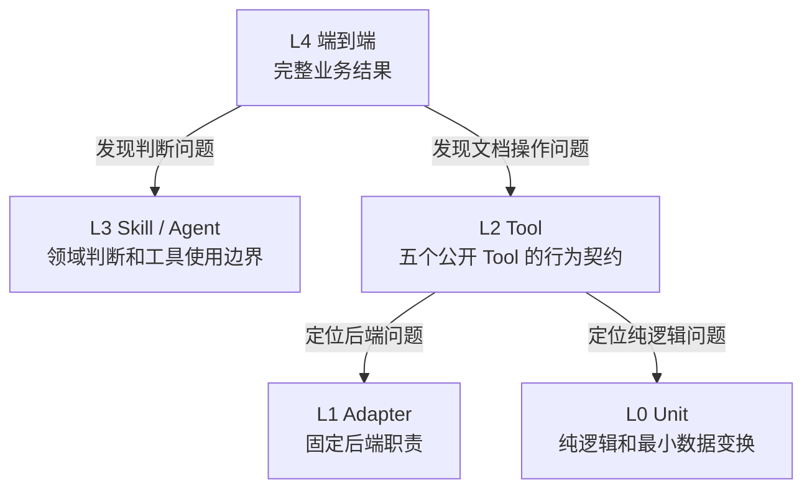
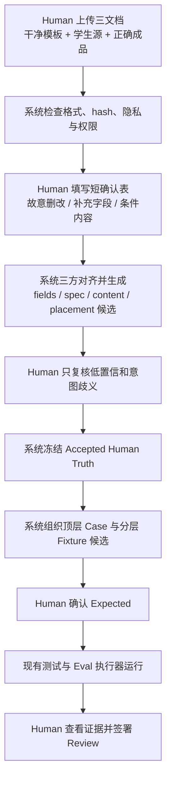

# DocFit Eval 数据体系讨论稿

> 状态：Human 讨论稿，尚未批准，不定义当前架构
> 日期：2026-08-04
> 讨论范围：未来 M3 的 Eval 数据准备与管理
> 当前权威来源：`docs/docfit-00-index.md` 至 `docs/docfit-06-development-roadmap.md`

> 2026-08-06 职责边界更新：本文原称 Content Field Contract 的对象已收窄为
> 独立 Content Field Registry，详细研发权威为
> `docs/plans/docfit-content-field-registry/DESIGN.md` 及其 v0.1 快照。Registry 不再打包进
> Human Truth Package；case 只固定 Registry ID/version/hash。本讨论稿其余未批准内容
> 仍不定义当前架构。

## 0. 这次讨论按什么顺序进行

这份文档先不讨论代码怎么实现。我们需要依次确认五件事：

1. **顶层目标**：为什么要建设这套 Eval 数据体系；
2. **Human 业务真值**：可填写模板、模板规范、学生内容和内容字段如何产出；
3. **文件全景**：完整评测究竟需要哪些文件，这些文件各自依赖什么；
4. **数据 Pipeline**：人工准备的真值文件如何转成端到端、Skill、Tool 等不同层级的评测文件；
5. **管理字段**：文件体系确定后，代码需要哪些身份、版本、路径、血缘和权限字段来管理它们。

这里必须区分三类完全不同的信息：

| 信息 | 回答的问题 | 本文如何处理 |
|---|---|---|
| Human 业务真值 | 模板有哪些槽位和样式，学生内容分别是什么 | 本轮优先定义文件形式和核心字段 |
| Eval 判断标准 | 某次运行满足什么条件才算正确 | 先明确它属于哪类 Expected 文件，不展开通用断言语言 |
| 数据管理元数据 | 代码如何找到、校验、派生和运行这些文件 | 在文件体系确定后给出候选字段 |

模板规范中的槽位、样式和学生内容的 `field_id` 是业务真值；`id`、`sha256`、
`derived_from`、权限和版本则是管理元数据。两者都需要结构化，但用途不同，不能放在
同一个模糊的“Gold 文件”里。

## 1. 顶层目标

### 1.1 我们真正要建设的是什么

我们要建设的不是一个通用测试平台，而是一套适合人工准备、机器加工、分层评测和
持续回归的 **DocFit Eval 数据体系**。

它要让团队能够回答：

1. 一次论文转换评测需要准备哪些原始文件；
2. 这些原始文件是否已经被人工确认，可以进入评测；
3. 一个完整业务案例如何被加工成不同层级的评测输入；
4. 每个层级运行后会产生什么实际结果和证据；
5. 哪些结果可以自动判断，哪些必须由 Human 复核；
6. 一个失败如何沉淀成可重复运行的回归资产。

### 1.2 Human 最终应该获得什么能力

Human 不需要直接维护大量互相独立的测试文件。理想方式是：

```text
人工准备少量完整、可信的原始材料
        ↓
形成一个可理解的顶层业务 Case
        ↓
系统辅助生成不同责任层的评测文件
        ↓
人工只确认来源、期望与高风险结果
        ↓
同一问题可以在不同层级持续回归
```

### 1.3 成功标准

这套设计成功时，应满足：

- Human 能从顶层业务问题理解整个 Case，而不是先理解测试目录；
- 每个评测文件都能说明它来自哪里、服务哪个层级；
- 下层用例可以从顶层 Case 加工得到，但不会偷偷改变原始材料；
- 实际运行结果不会自动变成正确答案；
- 私有论文、学校材料和本地测试授权边界清楚；
- 新增一个案例时，不需要人工重复填写大量相同信息；
- 数据体系属于离线 Eval，不进入正常论文转换的运行路径。

## 2. 所有评测之前：Human Prepared Truth

### 2.1 为什么这一层必须最先定义

Human 首先要准备的不是 Case、Suite 或 Run，而是后续评测共同依赖的业务真值：

```text
Template Truth Pack
  = 可填写模板.docx + 模板槽位/样式规范

Student Content Truth Pack
  = 原学生论文.docx + 人工确认的内容字段映射

Placement Truth
  = 哪个学生内容应该进入哪个模板槽位或内容区域
```

这三项没有准备好时，后续无法可靠生成：

- 模板准备能力的 Expected；
- 学生内容提取能力的 Expected；
- 论文转换端到端 Case；
- 内容保留、槽位填写和样式应用断言；
- Tool 或 Unit 层的最小复现文件。

这里称为 **Human Prepared Truth Pack**，而不是多层阶段 Gold。它描述的是人工确认的
业务事实，不保存 Agent 轨迹、不规定运行阶段，也不自动成为产品 Knowledge。

| 人工准备目标 | 上游材料 | 固定产出 | 后续主要用途 |
|---|---|---|---|
| 内容字段语义 | 固定的跨阶段 Registry 快照 | Registry ID/version/hash 引用 | 连接模板槽位与学生内容 |
| 模板准备 | 原模板、要求、示例与 Human 判断 | `fillable-template.docx` + `template-spec.yaml` | 模板准备 Oracle、转换输入与格式 Oracle |
| 学生内容准备 | `student-source.docx` | `student-content.json` + 按需 `content-assets/*` | 内容提取 Oracle、转换内容保留 Oracle |
| 内容放置确认 | 模板真值 + 学生内容真值 | `placement-map.yaml` | 槽位填写与内容放置 Oracle |

### 2.2 三类真值如何连接

模板槽位和学生内容必须使用同一套 `field_id`。这是整个数据体系最重要的连接键。



例如：

```text
模板槽位：slot.cover.title_zh
  接受字段：thesis.title.zh

学生内容：content.title_zh
  所属字段：thesis.title.zh

自动候选映射：content.title_zh → slot.cover.title_zh
```

字段一致时，系统可以生成映射候选；一对多、多对一、条件槽位或复合结构由 Human
确认。不能仅根据文字相似度静默决定映射。

### 2.3 Content Field Registry：共享内容字段语义

当前形式：固定引用 `docfit.thesis.content_fields@0.1.0` 的内容 hash；case 不拷贝快照。

它定义当前 Case Family 使用的语义字段，不保存具体学生内容，也不保存具体样式。

| 字段 | 必需 | 含义 |
|---|---:|---|
| `field_id` | 是 | 稳定语义标识，例如 `thesis.title.zh` |
| `label` | 是 | 供 Human 阅读的名称，例如“中文论文题目” |
| `meaning` | 是 | 这个字段代表什么，避免仅靠名称猜测 |
| `content_type` | 是 | text、rich_text、image、table、equation、section 等 |
| `cardinality` | 是 | one、optional、many |
| `parent_field_id` | 可选 | 表达章节、图题或复合内容的归属关系 |
| `language` | 可选 | zh、en 或其他适用语言 |
| `notes` | 可选 | 当前 Case 的边界说明 |

这份 Registry 是开放、版本化的跨阶段研发语义合同，不是封闭的全局论文类型枚举，
也不会自动进入产品 Knowledge。学校值和具体学生内容始终不能进入 Registry 或
Knowledge。

如果需要从软件工程角度理解这种“多个环节并行开发，但要共享同一套数据语义”的
问题，参见 [《非研发背景的 DocFit 开发概念说明》](./non-technical-development-guide.md)
第 8–17 节。其中解释了 shared semantic contract、bounded context、projection、
schema evolution、contract test、open-world assumption 与并行开发集成门。

### 2.4 Template Truth Pack：可填写模板真值包

模板准备阶段至少产出两个文件。

#### 文件 1：`fillable-template.docx`

形式：Human 可以直接用 Word 类编辑器打开和填写的 DOCX。

这里的 Word 类编辑器只是 Human 准备文件的工具，不是 DocFit 自动转换或交付验证的
运行依赖。

它负责承载：

- 页面、节、页眉页脚和固定学校内容；
- 已确认的段落、字符、编号和页面样式；
- 等待填入学生内容的槽位；
- 条件区域和最终必须删除的说明文字。

可填写槽位应尽量在 DOCX 中设置稳定的机器定位标记，优先级建议是：

1. content control tag；
2. bookmark；
3. 唯一占位符加上下文锚点。

页码、像素坐标和“第 N 个段落”不能单独作为槽位定位，因为编辑后它们可能变化。

#### 文件 2：`template-spec.yaml`

形式：Human 可审核、代码可读取的结构化规范。它只描述当前模板，不复制整篇 Word
正文。

根级字段：

| 字段 | 必需 | 含义 |
|---|---:|---|
| `template_id` | 是 | 模板身份 |
| `revision` | 是 | Human 每次确认后的版本 |
| `template_sha256` | 是 | 规范绑定的 `fillable-template.docx` |
| `field_registry_ref` | 是 | 固定的 Registry ID/version/hash |
| `slots` | 是 | 可填写槽位列表，可以为空但必须显式存在 |
| `styles` | 是 | 被槽位或区域引用的样式定义 |
| `regions` | 推荐 | 固定、条件、说明或连续正文区域 |
| `review` | 是 | Human 验收人、时间和结论 |

每个 `slot` 建议包含：

| 字段 | 必需 | 含义 |
|---|---:|---|
| `slot_id` | 是 | 模板内部稳定槽位 ID |
| `field_id` | 是 | 允许填入的语义内容字段 |
| `label` | 是 | Human 可读名称 |
| `content_type` | 是 | 与 Registry 快照一致的内容类型 |
| `locator` | 是 | content control、bookmark 或占位符锚点 |
| `required` | 是 | 最终是否必须有内容 |
| `cardinality` | 是 | 一个或多个内容项 |
| `fill_mode` | 是 | 替换占位符、插入到前后、填充区域或保留原位 |
| `style_id` | 是 | 填入后应采用的样式 |
| `condition` | 可选 | 条件槽位何时出现 |
| `placeholder_policy` | 是 | 填写后保留、替换或删除占位内容 |
| `evidence_refs` | 推荐 | 该槽位来自哪份模板、要求或 Human 确认 |

固定封面字段适合用 `slot`；正文、参考文献等连续或重复内容更适合用 `region`。每个
`region` 建议包含：

| 字段 | 必需 | 含义 |
|---|---:|---|
| `region_id` | 是 | 模板内部稳定区域 ID |
| `field_ids` | 是 | 允许进入该区域的一个或多个语义字段 |
| `start_locator`、`end_locator` | 是 | 区域在模板中的稳定边界 |
| `placement_mode` | 是 | append、replace_region 或 retain_in_place |
| `style_map` | 是 | 不同 `field_id` 应使用哪个 `style_id` |
| `repeat_policy` | 是 | 是否允许章节、段落、图表等重复内容 |
| `evidence_refs` | 推荐 | 区域和样式规则的来源 |

`locator` 至少包含：

| 字段 | 含义 |
|---|---|
| `type` | `content_control_tag`、`bookmark` 或 `placeholder_anchor` |
| `value` | DOCX 中实际可解析的标记值 |
| `fallback_anchor` | 可选的人类可读上下文，只用于定位失败时复核 |

每个 `style` 建议包含：

| 字段组 | 典型内容 |
|---|---|
| 身份 | `style_id`、Human 可读名称、适用内容类型 |
| 段落 | 对齐、缩进、段前后、行距、分页控制 |
| 字符 | 字体、字号、粗体、斜体、颜色、语言 |
| 编号 | 编号格式、层级和起始规则 |
| 页面/节 | 纸张、页边距、分节、页眉页脚关系；仅在适用时填写 |
| 来源 | 模板对象、学校要求或 Human 确认的 evidence ref |

样式可以引用 Word 中的命名样式，但规范必须保存最终需要验证的关键有效值，不能只写
“使用 Heading 1”而不说明这个模板中的 Heading 1 应该呈现什么。

一个最小示意如下；示例值只是结构说明，不是任何学校的默认要求：

```yaml
slots:
  - slot_id: slot.cover.title_zh
    field_id: thesis.title.zh
    content_type: text
    locator:
      type: content_control_tag
      value: docfit.cover.title_zh
    required: true
    cardinality: one
    fill_mode: replace
    style_id: style.cover.title_zh
    placeholder_policy: remove_after_fill

styles:
  - style_id: style.cover.title_zh
    applies_to: [thesis.title.zh]
    properties:
      paragraph.alignment: center
      paragraph.space_before_pt: "<human-confirmed>"
      paragraph.space_after_pt: "<human-confirmed>"
      run.font_east_asia: "<human-confirmed>"
      run.font_size_pt: "<human-confirmed>"
      run.bold: "<human-confirmed>"
```

`properties` 只列 Human 已确认、需要后续执行或检查的有效值。某个键缺失表示当前规范
不约束该属性，不能擅自解释成 Word 默认值。

#### 文件 3：`template-preview/*`（可选）

形式：绑定模板 hash 的 PDF 或页面图片，只用于 Human 审核外观。它不是槽位定位依据，
也不能代替 `template-spec.yaml`。

### 2.5 Student Content Truth Pack：学生内容真值包

学生内容准备阶段至少保留原论文和一份结构化内容映射。

#### 文件 1：`student-source.docx`

形式：只读的原学生论文 DOCX，或经过明确授权/脱敏后被冻结的 Eval 版本。它仍是内容
与复杂对象的源文件真值，不能被结构化 JSON 替代。

#### 文件 2：`student-content.json`

形式：Human 确认的结构化内容清单。它只回答两件核心事情：

1. 提取到的内容是什么；
2. 这项内容属于哪个 `field_id`。

根级字段：

| 字段 | 必需 | 含义 |
|---|---:|---|
| `student_document_sha256` | 是 | 绑定的学生论文版本 |
| `field_registry_ref` | 是 | 固定的 Registry ID/version/hash |
| `items` | 是 | Human 确认的内容项 |
| `review` | 是 | Human 验收人、时间和结论 |

每个 `item` 的最小字段：

| 字段 | 必需 | 含义 |
|---|---:|---|
| `content_id` | 是 | 当前学生内容包内的稳定 ID |
| `field_id` | 是 | 该内容所属的语义字段 |
| `content_type` | 是 | text、rich_text、image、table、equation、section 等 |
| `value` 或 `content_ref` | 是 | 简单文本直接保存；复杂对象引用源文件对象或附属资产 |
| `source_locator` | 是 | 内容在 `student-source.docx` 中的可核对位置 |
| `order` | 是 | 同类或同一父项中的顺序 |
| `parent_content_id` | 可选 | 章节、图题、表题等层级归属 |
| `language` | 可选 | 内容语言 |
| `asset_refs` | 可选 | 图片、附件或其他二进制对象引用 |
| `notes` | 可选 | Human 对歧义或边界的说明 |

从业务语义看，真正的核心就是 `field_id` 与 `value/content_ref`；`content_id`、
`source_locator` 和 `order` 是为了让代码能够比较、追溯和处理重复内容而增加的工程字段。

简单文字内容的最小示意：

```json
{
  "content_id": "content.title_zh",
  "field_id": "thesis.title.zh",
  "content_type": "text",
  "value": "<human-confirmed-content>",
  "source_locator": {
    "type": "object_ref",
    "value": "<ref-bound-to-student-document-sha256>"
  },
  "order": 1,
  "language": "zh"
}
```

简单文字可以把规范化文本保存在 `value`；表格、图片、公式、脚注、文本框等对象不能
被粗暴转成纯文本，应保留绑定源 DOCX hash 的 `content_ref`，必要时附结构化摘要或
独立资产 hash。

`source_locator` 可以使用工具为冻结 DOCX 生成的 opaque object ref，或唯一文字锚点与
出现次序。页码只能作为 Human 查看证据，不能单独定义内容身份。

`student-content.json` 包含学生内容，属于受保护业务数据，不是普通 manifest。它继承
`student-source.docx` 的隐私、仓库提交和外部处理限制，不能因为转换成 JSON 就被当成
可公开元数据。

#### 文件 3：`content-assets/*`（按需）

形式：只保存确有独立比较或搬运需要的图片、对象快照或结构片段。每项必须能追溯到
`student-source.docx` 和 `content_id`，不能为了方便把所有 Word 内容无差别拆散。

### 2.6 Placement Truth：内容到模板的目标映射

建议形式：`placement-map.yaml`。

当 `student-content.json` 的 `field_id` 与模板某个 `slot.field_id` 一一对应时，系统可以
自动生成候选。以下情况需要 Human 确认：

- 一个字段对应多个槽位；
- 多个内容项要合并进一个槽位；
- 正文等连续内容不是固定单槽位；
- 条件内容决定槽位是否出现；
- 模板旧内容应保留、替换或删除；
- 某段学生内容应保留原位而只修改样式。

每条映射建议包含：

| 字段 | 必需 | 含义 |
|---|---:|---|
| `content_id` | 是 | 来源学生内容项 |
| `field_id` | 是 | 双方共享的语义字段 |
| `target_slot_id` 或 `target_region_id` | 是 | 模板中的目标 |
| `action` | 是 | fill、append、retain_in_place、exclude 等 |
| `order` | 条件必需 | 多项内容进入同一目标时的顺序 |
| `condition` | 可选 | 条件放置规则 |
| `status` | 是 | generated、human_confirmed 或 unresolved |
| `notes` | 可选 | Human 确认理由或尚未解决的问题 |

`unresolved` 必须保留为未知，不能自动变成通过。

### 2.7 Human Readiness Gate

只有以下条件满足，后续 Eval 文件准备才能开始：

- `fillable-template.docx` 已由 Human 打开并验收；
- 每个可填写槽位都能通过 `locator` 唯一定位；
- 每个槽位都引用存在的 `field_id` 和 `style_id`；
- 关键样式已经保存可检查的有效值；
- `student-content.json` 中每项内容都有 `field_id`、内容值/引用和来源位置；
- 模板与学生内容引用同一 Registry ID/version/hash；
- 所有必要 placement 已确认，歧义项明确标记为 `unresolved`；
- 使用三文档拆解时，`reference-final.docx` 已明确标记为 Human approved，并与当前
  模板 revision、学生源 hash 和短确认表绑定；
- 文件 hash、隐私、存储权限和本地 renderer 使用权限已经确认。

这道门只说明人工数据已经准备完整，不表示任何 DocFit Eval 已经通过。

### 2.8 同一份 Truth 在不同 Eval 中的可见性

Human Truth 不一定都交给被评测对象。Case 必须逐项声明文件绑定角色：

```text
subject_input   被评测对象可以读取
oracle_only     只供比较器和 Human 使用，被评测对象不可读取
```

| 评测目标 | `subject_input` | `oracle_only` |
|---|---|---|
| 模板准备/生成 | 原始模板、学校要求、任务说明 | `fillable-template.docx`、`template-spec.yaml` |
| 学生内容提取 | `student-source.docx`、任务说明 | `student-content.json`、必要 `content-assets/*` |
| 最终论文转换 | `fillable-template.docx`、`student-source.docx`、任务说明和允许的补充材料 | `template-spec.yaml`、`student-content.json`、`placement-map.yaml`、Expected |
| 受控辅助转换 | Case 明确允许的规范或映射也可以作为输入 | 仍需保留独立 Expected 和未公开答案 |

默认使用最小 `subject_input`。只有 Case 明确要验证“给定结构化规范后的执行能力”时，
才把某份 Truth 文件暴露给产品。否则 Oracle 泄漏会让评测失去意义。

### 2.9 已有正确成品时：三文档自动拆解

如果 Human 已经准备好干净模板，并且把学生内容整理成了人工确认正确的最终论文，
不需要再从零手写前面的 YAML/JSON。最合适的输入是三份彼此对应的 DOCX：

| 文件 | 必需 | Human 需要保证什么 |
|---|---:|---|
| `template-clean.docx` | 是 | 干净、可填写，且与正确成品使用同一模板 revision |
| `student-source.docx` | 是 | 未被覆盖的学生原论文或冻结的脱敏/授权版本 |
| `reference-final.docx` | 是 | Human 已确认内容、放置和样式均正确的参考成品 |
| `human-confirmation` | 是 | 一张短表，只说明代码无法从文件差异推断的意图 |

其中 `reference-final.docx` 是这条数据准备路径的强参考。它通过 Human 验收后，可以
成为对应 Case 的可选参考成品；比较时仍优先提取稳定事实，不做整份 DOCX 字节比较。

#### 2.9.1 代码如何拆解



代码拆解分为六步：

1. **冻结身份**：计算三份文件 hash，确认模板和成品对应同一模板 revision，源文件只读；
2. **结构化提取**：读取段落、逻辑文本、样式、表格、图片、公式、节、页眉页脚、
   content control、bookmark 和 package relationships；
3. **模板对成品**：比较 `template-clean` 与 `reference-final`，识别固定学校内容、被替换
   占位符、可填写槽位、连续内容区域和最终有效样式；
4. **学生论文对成品**：比较 `student-source` 与 `reference-final`，用规范化文本、对象
   指纹、顺序和父子关系找出学生内容在成品中的对应位置；
5. **三方归因**：区分内容来自模板、学生论文、Human 补充输入，还是无法解释的差异；
6. **生成候选**：引用固定 Registry 并产出模板规范、学生内容清单、placement 和 Expected
   facts，再把歧义项交给 Human 确认。

#### 2.9.2 两组差异分别产生什么

| 对照 | 代码可以生成的候选 |
|---|---|
| 干净模板 ↔ 正确成品 | `slot`、`region`、locator、固定/条件/说明内容分类、`style_id` 和有效样式值 |
| 原学生论文 ↔ 正确成品 | `content_id`、`field_id`、内容值/对象引用、来源定位、顺序和内容保留事实 |
| 模板 + 学生论文 ↔ 正确成品 | `placement-map`、来源归因、故意删除/新增/改写候选和无法解释项 |

候选输出建议使用 `.candidate` 状态：

```text
content-fields.candidate.yaml
template-spec.candidate.yaml
student-content.candidate.json
placement-map.candidate.yaml
expected-facts.candidate.yaml
human-review-queue.json
```

Human 确认后才生成 accepted revision。代码不能因为 `reference-final.docx` 是 Human
提供的，就自动认为每个推断出来的字段名、槽位边界和删除原因都正确。

#### 2.9.3 代码能够可靠拆出的内容

- 模板与成品中完全相同的固定内容；
- 唯一占位符被哪段内容替换；
- 规范化后相同的学生文字在成品中的位置；
- Word 命名样式、直接格式和最终有效格式值；
- 表格、图片和其他对象的类型、顺序、关系与可比较指纹；
- 节、页眉页脚、页面设置和编号关系；
- 原论文存在但成品缺失的内容候选；
- 成品存在但模板和原论文都没有的新增内容候选。

#### 2.9.4 代码不能仅凭三份 DOCX 确定的意图

| 歧义 | 为什么需要 Human |
|---|---|
| 某段内容被删除 | 无法判断是正确清理、故意省略还是人工失误 |
| 某段内容被改写 | 无法判断是否允许改变学生原文 |
| 成品新增了姓名、日期等信息 | 无法判断来自用户补充、学校固定内容还是人工临时填写 |
| 模板说明文字消失 | 无法自动确认它本来就应该删除 |
| 一个字段进入多个位置 | 无法仅靠相似度确定一对多 placement 是否正确 |
| 同一内容在多处重复 | 无法判断是学校要求、交叉引用还是误复制 |
| 条件页面或可选章节 | 无法从单个样本推导完整出现条件 |
| 页面外观是否真正正确 | 仍需 Human 查看参考成品和关键页面 |

这类问题进入 `human-review-queue.json`，不阻塞代码先完成其他高置信拆解。

#### 2.9.5 Human 最少需要补什么

Human 不需要预先创建 content control、bookmark、`field_id` 或 YAML。第一批数据只需要
补一张简短确认表，平台可以用普通表单收集：

| 确认项 | 必需 | 示例含义 |
|---|---:|---|
| `reference_final_approved` | 是 | 这份成品可以作为人工正确参照 |
| `content_change_policy` | 是 | 学生文字必须原样保留，还是允许已列明的改写 |
| `intentional_omissions` | 有则填写 | 哪些学生内容是故意不进入成品的 |
| `intentional_rewrites` | 有则填写 | 哪些内容被人工改写，以及原因 |
| `supplemental_fields` | 有则填写 | 姓名、学号、日期等不在原论文中的补充内容 |
| `conditional_sections` | 有则填写 | 哪些页面或章节只有特定条件下出现 |
| `known_ambiguities` | 有则填写 | Human 已知但暂时无法确定的地方 |
| 数据授权 | 是 | 存储、CI、脱敏和本地 Docker renderer 使用权限 |

如果 Human 愿意多做一步，给模板槽位增加 content control tag、bookmark 或唯一占位符，
会显著提高自动定位可靠性；但这应该是推荐增强，不是第一批数据的强制前提。系统可以
先根据三文档差异生成 locator 候选，再由 Human 在审核界面确认。

#### 2.9.6 缺少某份文件会怎样

| 已提供文件 | 能做什么 | 不能可靠做什么 |
|---|---|---|
| 模板 + 学生源 + 正确成品 | 完整三方拆解，Human 只处理意图歧义 | 仍不能自动替 Human 判断视觉正确性 |
| 模板 + 正确成品 | 推断槽位和样式候选 | 无法可靠区分学生内容与人工新增内容 |
| 学生源 + 正确成品 | 推断内容保留和样式变化 | 无法可靠区分学校固定内容与填入内容 |
| 模板 + 学生源，没有正确成品 | 可以运行产品并生成 Actual | 无法从输入本身产生人工正确的 placement 和最终样式 Oracle |

因此，如果你已经有人工整理正确的最终论文，最有价值的事情是保留它与对应的干净
模板、原学生论文三者，不要只交付最终文件。

## 3. 先从产品逻辑看评测

Eval 首先是对产品能力的观察。只有先说明产品接收什么、产生什么，才能决定评测需要
保存哪些文件。

### 3.1 论文转换产品的输入与输出



对于主要的论文转换 Eval，最简单的顶层输入建议是：

```text
人工验收好的模板.docx
+ 学生论文.docx
+ 本次任务说明
```

这是比“每次都重新解释原始学校模板和要求”更简单的起点。学校原始要求、旧模板和
官方示例仍然有价值，但它们主要用于：

- 生产或审核这份人工验收模板；
- 专门评测 `docfit-school-extract`；
- 构造模板与文字要求冲突等特殊案例。

因此，“人工验收模板”是转换 Eval 的优先输入，“原始学校材料”是它的上游来源，
两者不应在每个 Case 中被强制重复处理。

### 3.2 Eval 在产品外部做什么



Eval 不控制 Agent 下一步，也不复制产品运行流程。它只在产品外部固定输入、保存输出、
收集证据并判断结果。

## 4. 整个评测需要哪些文件

先讨论文件职责，不先讨论目录和 schema。下面的文件名是便于讨论的逻辑名称，最终
文件名和存储位置可以在这些职责确认后再确定。

### 4.1 文件体系总览



### 4.2 A. 原始材料

原始材料是 Human 收到的上游文件，还不能直接假定为可运行的 Eval 输入。

| 文件 | 是否必需 | 作用 |
|---|---:|---|
| 原始学生论文 DOCX | 转换类必需 | 学生内容真值来源 |
| 原始学校模板 DOCX | 模板准备时需要 | 人工验收模板的来源之一 |
| Human 确认的正确成品 DOCX | 三文档拆解时必需 | 同时反推模板规范、内容映射和 placement |
| 学校要求 PDF、DOCX 或文字 | 可选 | 解释模板、处理冲突和确认适用范围 |
| 官方示例 | 可选 | 补充模板或文字要求无法表达的外观事实 |
| Human 准备说明 | 推荐 | 记录材料来源、已知问题和需要确认的事项 |
| 授权或脱敏证明 | 私有真实样本必需 | 决定能否存储、运行和发送到外部服务 |

原始材料是上游证据，不是 Expected，也不是 Gold。

### 4.3 B. Human Prepared Truth Pack：人工业务真值

这是所有 Eval 文件之前的核心准备层，具体形式和字段见第 2 节。它至少包含：

| 文件 | 作用 |
|---|---|
| Registry ID/version/hash 引用 | 模板槽位和学生内容共享的语义快照 |
| `fillable-template.docx` | Human 验收的可填写模板 |
| `template-spec.yaml` | 槽位定位、目标字段和样式规范 |
| `student-source.docx` | 只读学生内容源文件 |
| `student-content.json` | 提取内容及其 `field_id` 归属 |
| `placement-map.yaml` | 学生内容到模板槽位/区域的确认映射 |
| `reference-final.docx` | 可选；已有人工正确成品时作为三文档拆解与页面参考 |

这些文件既可以作为前置数据准备能力的 Human Expected，也可以作为后续转换 Eval 的
输入真值。它们不是运行轨迹，也不是每一层各自维护的一套 Gold。

### 4.4 C. Accepted Eval Input Pack：已确认评测输入包

这是 Human Prepared Truth 通过 Readiness Gate 后，为某个具体 Case 组装出的输入包。
它优先引用已确认文件，不要求复制多份相同 DOCX。

转换类端到端 Case 的最小绑定关系：

| 文件 | 是否必需 | Case 绑定角色 | 说明 |
|---|---:|---|---|
| `student-source.docx` 引用 | 必需 | `subject_input` | 可以是合成、脱敏或明确授权的论文 |
| `fillable-template.docx` 引用 | 必需 | `subject_input` | 已经可以直接服务论文转换 |
| `task.md` | 必需 | `subject_input` | 描述本次转换目标、适用范围和补充信息 |
| `materials/*` | 可选 | `subject_input` | 只暴露本 Case 明确允许的学校要求或示例 |
| `student-content.json` 引用 | 必需 | 默认 `oracle_only` | 内容保留与字段归属真值 |
| `template-spec.yaml` 引用 | 必需 | 默认 `oracle_only` | 槽位、定位和样式真值 |
| `field_registry_ref` | 必需 | 通常 `subject_input` | 双方共享的固定字段语义，不是 case 答案 |
| `placement-map.yaml` 引用 | 转换类必需 | 默认 `oracle_only` | 未解决映射必须显式保留 |
| `reference-final.docx` 引用 | 可选 | `oracle_only` | 已有人工正确成品时用于事实提取和人工页面参照 |
| `asset-metadata` | 必需 | Eval 系统使用 | 保存身份、hash、来源和使用权限，不提供给被评测对象 |

关键点是：系统接收的不是一堆无法理解关系的文件，而是一个经过确认的输入包。

### 4.5 D. Case Definition：业务用例定义

Case Definition 说明“我们在评测什么”，它引用 Accepted Eval Input Pack，但不复制论文正文。

它至少说明：

- 业务任务是什么；
- 使用哪一组输入文件；
- 这是模板提取、论文转换还是某个风险复现；
- 这个 Case 重点覆盖哪些风险；
- 它有哪些下层派生 Case；
- 哪些 Suite 可以选择它。

这个文件只组织业务问题和文件关系，不直接保存所有评测断言。

### 4.6 E. Expected Pack：期望与人工检查项

Expected Pack 回答“什么结果才算正确”，它与数据管理元数据分开。

| 文件 | 作用 |
|---|---|
| `facts` | 可以自动核对的内容、结构、格式和安全事实 |
| `manual-checks` | Human 必须查看的页面或风险 |
| `visual-findings` | 可选的人工确认视觉事实 |
| `reference-final.docx` | 可选；只有事实不足以表达时才保存的参考成品 |
| `reference-pages/*` | 可选；确有比较价值的少量参考页面 |

完整参考 DOCX 不是每个 Case 的必需项。优先保存稳定事实，复杂页面或已确认交付基线
才保存参考成品。

Expected 必须经过 Human 确认。系统可以从材料和一次运行中提出候选，但不能把自己的
Actual 自动认定为 Expected。

### 4.7 F. Layer Fixture Packs：各层评测输入

一个顶层 Case 可以派生出多个更小的评测文件组。它们验证的不是同一件事，因此输入
和输出也不同。

| 层级 | 主要输入文件 | 主要实际输出 | 依赖来源 |
|---|---|---|---|
| L4 端到端 | Accepted Eval Input Pack 中的 `subject_input` + Case Definition | 最终 DOCX、视觉证据、验证和报告 | 顶层业务 Case |
| L3 Skill / Agent | 任务说明、必要学校材料、受控 Tool 结果 | 可观察行为、结论与未解决事项 | 从顶层 Case 投影，或从真实失败提炼 |
| L2 Tool | 最小 DOCX fixture + Tool 请求 | Tool 结果、修改后文件或明确失败 | 从具体文档操作风险最小化得到 |
| L1 Adapter | 固定输入文件 + 后端职责请求 | 后端产物和可审计证据 | 从 Tool 路由和后端风险得到 |
| L0 Unit | JSON、hash、OOXML 片段或纯值 | 确定性值或 typed failure | 从实现缺陷最小化得到 |

Layer Fixture 不等于多层 Gold。每层只保存该责任边界真正需要的输入和期望，不保存
完整 Agent 轨迹，也不要求下层复现端到端过程。

### 4.8 G. Run Pack：一次实际运行

Run Pack 是某个产品版本对某个 Case revision 的一次实际执行结果。

| 文件组 | 内容 |
|---|---|
| `run-metadata` | 本次运行绑定的 Case、产品版本、输入 hash 和环境信息 |
| `actual/*` | 最终 DOCX、Tool 结果、Agent 结果等被评测输出 |
| `evidence/*` | PDF、页面图片、render ref、validation 等证明材料 |
| `comparison` | 自动比较结果，以及无法自动判断的项目 |
| `report` | 本次运行的 PASS、FAIL 或 UNKNOWN 摘要 |

Run Pack 是运行事实，不是正确答案。重新运行产生新的 Run，不覆盖旧 Run。

### 4.9 H. Human Review

Human Review 只记录 Human 对固定 Run 和固定证据的结论：

- 看了哪个 Run；
- 看了哪些页面或文件；
- 接受、拒绝或无法判断什么；
- 是否允许把某项结论加入新的 Expected revision；
- 审核人、时间和理由。

Review 不直接修改 Actual，也不自动覆盖 Expected。

### 4.10 I. Suite Index

Suite 只是一次要运行哪些 Case 的清单。它不拥有论文、期望或运行产物。

初期可以只讨论：

- 公开、合成、确定性的核心回归；
- 需要真实 OfficeCLI / Docker LibreOffice 的本地 live 回归；
- 需要受保护真实样本和 Human 复核的私有回归。

## 5. 文件之间首先依赖什么

### 5.1 依赖关系



### 5.2 必须固定的依赖规则

1. 模板槽位和学生内容必须引用同一 Registry ID/version/hash；
2. `template-spec` 必须绑定固定模板 hash，`student-content` 必须绑定固定论文 hash；
3. 没有来源、权限和 hash 的文件，不能进入 Accepted Eval Input Pack；
4. Case 只能引用 Accepted Eval Input，不能直接指向一份身份不明的本地文件；
5. Expected 依赖 Case 和 Human 确认，不能只依赖一次 Actual；
6. 下层 Fixture 必须能追溯到顶层 Case、某个真实失败或明确的合成来源；
7. Run 必须绑定 Case revision、输入 hash 和被评测产品版本；
8. Review 必须绑定固定 Run 和固定 Evidence，不能审核一个会继续变化的目录；
9. Actual、Evidence 和 Review 都不会自动进入产品 Knowledge；
10. 当前视觉链路只在本地禁网容器处理 DOCX；若未来新增任何外部处理，必须重新批准
    数据授权与产品边界。

## 6. 原始文件如何转换成评测文件

这里的 Pipeline 是 **离线数据准备流程**，不是 DocFit 产品运行时的工作流。



### 6.1 第一步：Human 准备原始材料

Human 提供学校材料、学生论文和使用授权。这里不要求 Human 先理解测试 schema。
如果已经有人工确认正确的最终论文，应同时提供；这是减少人工字段标注最有价值的
第四项材料。

### 6.2 第二步：把原始材料变成 Human Prepared Truth Pack

平台或脚本可以辅助：

- 检查文件能否打开；
- 计算 hash；
- 生成页面预览供 Human 查看；
- 提示隐私、仓库提交和外部处理权限；
- 对干净模板、学生源论文和正确成品做三文档结构化对齐；
- 帮助 Human 为当前 case 选定固定 Registry，并把新概念保留为未注册审查项；
- 帮助 Human 把原始模板整理为 `fillable-template.docx`，并生成待审核的
  `template-spec.yaml` 槽位和样式候选；
- 从学生论文生成 `student-content.json` 候选，让 Human 只需确认内容和字段归属；
- 根据双方 `field_id` 生成 `placement-map.yaml` 候选，并突出歧义项。

Human 负责确认字段含义、模板槽位、样式、学生内容归属、placement 和授权。系统负责
机械检查和候选生成，但不能替 Human 宣布模板或内容映射正确。

### 6.3 第三步：形成顶层端到端 Case

Human Prepared Truth 通过 Readiness Gate 后，系统将 Accepted Eval Input Pack 组织成
一个完整业务 Case，并形成简短、明确的 `task.md`。Human 确认：

- 这个任务要完成什么；
- 哪些材料适用于当前 Case；
- 主要风险是什么；
- 哪些事实可自动检查；
- 哪些页面必须人工查看。

### 6.4 第四步：为不同责任层加工文件

从顶层 Case 向下加工时，只允许几种清楚的方式：

- **投影**：只选择某一层真正需要的字段和文件；
- **受控快照**：把一次 Tool 结果规范化后作为 Skill Eval 输入；
- **最小复现**：把复杂真实问题重建成最小合成 DOCX 或 OOXML 片段；
- **脱敏派生**：保留结构与版式风险，移除真实学生内容；
- **失败构造**：生成失效引用、错误结果或不完整证据，验证安全行为。

每次加工都要记录来源和方法。系统可以生成候选，Human 不需要逐文件从零填写。

### 6.5 第五步：运行、比较和复核

执行器读取 Case 和对应 Layer Fixture，生成 Run Pack。自动检查先比较稳定事实，Human
再复核自动化覆盖不到的页面。发现问题后，只在发生问题的责任层增加最小回归资产，
不把整次端到端运行复制成多层 Gold。

## 7. 分层关系：顶层 Case 如何向下拆



不是每个端到端 Case 都必须机械地产生 L0–L3 的全部文件。只有某个责任层需要独立
验证或出现过缺陷时，才派生对应 Fixture。

例如，一个“学生正文填入模板正文区域后出现空白页”的顶层 Case，可以拆成：

| 层级 | 独立验证的问题 | 需要加工出的文件 |
|---|---|---|
| L4 | 最终论文是否正确且无意外空白页 | 完整输入包、期望事实、人工页面检查项 |
| L3 | Agent 是否识别风险并查看当前页面证据 | 任务、相关材料、受控 Tool 结果 |
| L2 | 模板导入和渲染 Tool 是否保持结构并返回正确证据 | 最小模板、最小论文、Tool 请求、期望事实 |
| L1 | 固定后端是否产生符合职责的页面证据 | 输入 DOCX、后端职责请求、产物证据要求 |
| L0 | 节属性或关系重映射是否正确 | 最小 OOXML / JSON 输入和确定性期望值 |

## 8. 文件确定之后，再讨论管理字段

### 8.1 字段设计的边界

管理字段只服务以下代码能力：

- 唯一识别文件和 Case；
- 找到实际文件；
- 检查文件有没有变化；
- 知道它从哪里派生；
- 判断是否允许进入 Git、CI 或外部服务；
- 选择要运行的 Case；
- 将 Run 和 Review 绑定到固定版本；
- 防止 Actual 被误当成 Expected。

以下内容不属于这一层字段：

- 标题应该用什么字号；
- 学生正文是否完整；
- 页面是否存在溢出；
- Agent 必须或禁止做什么；
- 哪个结果算 PASS。

这些属于 Expected 和比较逻辑，不属于数据管理 schema。

### 8.2 所有文件对象共有的最小字段

| 字段组 | 候选字段 | 代码用途 |
|---|---|---|
| 身份 | `id`、`kind`、`schema_version` | 找到正确类型和解析方式 |
| 版本 | `revision`、`status` | 防止原地覆盖已验收数据 |
| 位置 | `path` 或受控资源引用 | 找到文件，但不把正文写进 manifest |
| 完整性 | `sha256`、`size`、`media_type` | 检查文件是否变化或损坏 |
| 来源 | `source`、`derived_from`、`derivation_method` | 建立原始材料到派生 Fixture 的血缘 |
| 生命周期 | `created_at`、`accepted_at`、`retired_at` | 区分候选、可运行和退役数据 |

不是每个文件都需要重复全部字段。共同字段可以由所属 Pack 统一保存。

### 8.3 Asset 管理字段

Asset 的字段重点是文件身份和权限：

| 字段组 | 需要表达什么 |
|---|---|
| 来源 | Human 提供、系统合成、脱敏派生或其他文件加工 |
| 可见性 | 公开、内部或私有 |
| 隐私 | 是否含真实学生内容，是否已经脱敏 |
| 存储权限 | 是否允许进入仓库和 CI |
| renderer 使用 | 是否允许在本地禁网 Docker LibreOffice 中处理，以及对应测试环境 |
| 验收 | 谁确认它可以作为 Eval 输入、何时确认 |

这里没有任何论文格式正确性字段。

### 8.4 Case 管理字段

Case 的字段重点是组织关系：

| 字段组 | 需要表达什么 |
|---|---|
| 身份 | Case ID、revision 和类型 |
| 任务 | 对应模板提取、论文转换或风险复现 |
| 输入引用 | 使用哪些 Accepted Assets，以及每项是 `subject_input` 还是 `oracle_only` |
| 风险标签 | 用于查找和覆盖统计，不直接决定 PASS |
| 层级 | E2E、Skill、Tool、Adapter 或 Unit |
| 上游关系 | 来自哪个顶层 Case 或失败 |
| 状态 | draft、active 或 retired |

### 8.5 Run 与 Evidence 管理字段

这些字段确保一次结果可以复现和审计：

| 对象 | 关键管理信息 |
|---|---|
| Run | Case revision、产品版本、Knowledge digest、输入 hash、开始/结束时间 |
| Actual | 文件路径、hash、产生它的 Run |
| Evidence | 文档 hash、证据类型、renderer/container/font identity、render ref、页面和图片 hash |
| Comparison | 使用的 Expected revision、比较器版本、无法判断项 |

当前固定 adapter 是 OfficeCLI 1.0.143 与 Docker LibreOffice 25.2.3.2。这里记录它们是
为了复现证据，不是让 Case 动态选择 Provider。

### 8.6 Human Review 管理字段

Review 只需要：

- Review ID；
- 被审核的 Run ID；
- 被查看的 Evidence refs；
- 审核人和时间；
- `accepted`、`rejected` 或 `unknown`；
- 简短理由；
- 是否建议创建新的 Expected revision。

Review 不应把整段学生正文复制进元数据。

## 9. 逻辑上的文件包装方式

在职责确定后，可以把它们理解成一个外部 Registry 依赖和三类 Truth。这里仍不是最终仓库目录。

```text
Content Field Registry snapshot (external, pinned by ID/version/hash)

Human Truth Package
├── template/
│   ├── fillable-template.docx
│   ├── template-spec.yaml
│   └── template-preview/          # 可选
├── student/
│   ├── student-source.docx
│   ├── student-content.json
│   └── content-assets/            # 按需
└── placement-map.yaml

Case Package
├── accepted-inputs/               # 引用 Human Truth Package
├── case-definition
├── expected/
└── layers/
    ├── skill/
    ├── tool/
    ├── adapter/
    └── unit/

Run Package
├── run-metadata
├── actual/
├── evidence/
├── comparison
└── report

Review Package
└── human-review
```

公开合成数据可以和 Case Definition 一起进入 Git；真实学生论文和不可公开模板应放在
仓库外受保护存储；Run 产物放在忽略版本控制的运行目录。物理目录应在逻辑文件职责
确认后再定，避免目录反过来驱动产品模型。

## 10. 人工数据平台应该服务哪一段

人工平台首先服务“原始材料 → Human Prepared Truth → Accepted Eval Input Pack”，
其次才是 Case / Expected、Run 和 Review。



平台不需要先建设第二套 Agent loop 或通用 Eval runner。它的核心价值是让 Human 能够
看懂、确认和管理数据关系。

## 11. 当前最需要 Human 确认的前置决策

这些决策应先于目录、YAML schema 和平台页面设计：

### 决策 1：三文档是否作为最低人工交接

当 Human 已有正确成品时，是否同意用“干净模板 + 原学生论文 + Human 确认正确成品 +
短确认表”作为首选交接，由系统自动产生 Truth candidates，而不是要求 Human 手写
`field_id`、locator 和 YAML？

### 决策 2：Template Truth 的固定产出

是否同意模板准备必须同时产出 `fillable-template.docx` 和 `template-spec.yaml`，后者
至少定义 `slot_id`、`field_id`、稳定 `locator`、`style_id` 和关键有效样式？

### 决策 3：Student Content Truth 的固定产出

是否同意学生内容准备必须保留 `student-source.docx`，并产出 `student-content.json`；
每项内容至少包含 `content_id`、`field_id`、内容值/引用、来源定位和顺序？

### 决策 4：共享 Content Field Registry

已确定：模板槽位和学生内容共同引用固定的 Registry ID/version/hash，以
`field_id` 作为语义连接键，同时保持字段集合开放，不建立封闭的全局论文类型枚举。

### 决策 5：Placement Truth

是否同意系统根据相同 `field_id` 生成 placement 候选，一对多、多对一、条件和连续正文
等歧义映射必须由 Human 确认，未确认项保持 `unresolved`？

### 决策 6：Truth 的默认可见性

是否同意每个 Case 明确区分 `subject_input` 和 `oracle_only`；模板规范、学生内容真值和
placement 默认不提供给被评测对象，只有受控辅助能力 Eval 才显式开放？

### 决策 7：转换 Eval 的最小顶层输入

是否同意以“人工验收模板 + 学生论文 + 任务说明”作为转换 Eval 的首选输入，原始学校
要求和旧模板只在模板准备、模板提取或冲突案例中提供，同时把 Template Truth、
Student Content Truth 和 Placement Truth 作为内容保留与槽位填写的上游真值？

### 决策 8：文件职责是否完整

是否同意用九类文件职责覆盖整个体系：

```text
原始材料
→ Human Prepared Truth Pack
→ Accepted Eval Input Pack
→ Case Definition
→ Expected Pack
→ Layer Fixture Packs
→ Run Pack
→ Human Review
+ Suite Index
```

### 决策 9：下层 Case 是否按需派生

是否同意下层 Skill、Tool、Adapter 和 Unit Fixture 从顶层 Case、真实失败或明确合成
来源按需产生，而不是要求每个端到端 Case 都填满所有层级？

### 决策 10：业务真值、管理元数据与 Eval 标准是否分离

是否同意把模板槽位/样式和学生内容归属放入 Human Truth；把身份、路径、hash、血缘、
权限和版本放入管理 manifest；把某次运行的通过条件放入独立 Expected 文件？

### 决策 11：参考最终 DOCX 是否可选

是否同意参考最终 DOCX 对普通 Case 仍为可选，但选择“三文档自动拆解”路径时是必需
输入；验收后仍优先提取事实，只有复杂页面或已确认交付基线才长期保存参考页面？

### 决策 12：人工平台的首要范围

是否同意平台优先解决内容字段定义、模板槽位/样式验收、学生内容字段确认、placement
确认、顶层 Case 组织和分层 Fixture 派生，运行器与更详细的报告平台留到真实数据规模
证明需要之后？

## 12. 确认顺序与下一步

建议 Human 按以下顺序讨论：

1. 先确认第 1 节的目标；
2. 再确认第 2 节四类 Human Truth 文件及其核心字段；
3. 再确认第 4 节的文件职责是否有缺失或重叠；
4. 再确认第 5–7 节的依赖和派生关系；
5. 最后锁定第 8 节管理字段；
6. 上述内容通过后，再设计物理目录、可执行 schema 和人工平台页面。

本讨论稿属于未来 M3 设计输入。M3 当前仍在已完成 M0–M2 范围之外；在新的用户批准
计划和 00–06 协调更新完成前，本文中的文件包、字段和人工平台都不能描述为已实现或
已批准架构。
