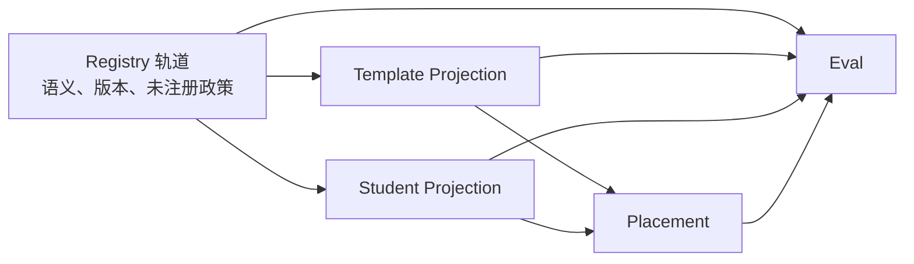

# 非研发背景的 DocFit 开发概念说明

> 状态：面向人阅读的学习说明，非架构规范
> 日期：2026-08-06
> 目的：用普通语言解释 DocFit 讨论中常见的工程术语和开发过程。

## 1. 为什么会有这份说明

在和 AI 讨论开发文档时，经常会遇到“收口”“契约”“假绿”“回归”“门禁”等工程术语。对于没有研发背景的人，这些简称容易让讨论显得很复杂，也容易让人误以为：必须先理解所有软件工程概念，才能判断项目是否可以继续。

实际上，这些词只是工程团队为了缩短沟通使用的简称。判断一个问题时，真正需要关心的是：

1. 用户最终会看到什么问题；
2. 它影响哪个开发阶段；
3. 它是否阻止当前阶段开始；
4. 现在需要修改什么；
5. 开发完成后怎样证明问题已经解决。

## 2. 三个常见关键词

| 术语 | 普通语言解释 | DocFit 中的例子 |
|---|---|---|
| 收口 | 停止继续扩大讨论范围，明确这次做什么、不做什么 | 当前只批准 M0，不顺带开发 M1、M2 |
| 契约 | 两个部分之间约定好的交接规则 | `docx_edit` 接收什么参数、成功后返回什么、失败如何表示 |
| 假绿 | 检查显示成功，但真实结果其实没有成功 | Provider 返回“修改成功”，但生成的 DOCX 打不开，测试却仍显示通过 |

测试或 CI 页面通常用绿色表示通过，因此“假绿”就是“仪表盘说没有问题，实际产品仍有问题”。

## 3. “契约”到底是什么

可以把一个 Tool 想成受控的服务窗口：

```text
Agent 提交申请
    ↓
Tool 检查申请是否完整
    ↓
Tool 执行操作
    ↓
Tool 返回成功、缺少信息或失败
```

所谓契约，就是在操作前说清楚：

- 调用者必须提供什么；
- Tool 保证完成什么；
- Tool 明确不会做什么；
- 失败时如何告诉调用者；
- 怎样证明操作真的成功。

例如，`docx_edit` 的一个简单约定可以是：

```text
输入：原始文件、目标段落、要应用的样式、输出位置
成功：生成新文件，原始文件保持不变
失败：不留下一个可能被误认为成功的输出文件
```

这就是 Tool 契约。它的价值是让 Agent、Tool、测试和开发人员对“什么叫成功”有相同理解。

## 4. 为什么文档总能发现新问题

软件开发无法只靠文档提前消灭所有问题。文档主要解决三件事：

1. 产品到底要做什么；
2. 哪些底线不能破坏；
3. 第一步应该怎样开始和验收。

至于某个字段叫什么、某个第三方工具是否兼容、某种 Word 对象应该怎样复制，很多问题只有实际运行后才能知道。

因此，合理的开发过程不是：

```text
把所有问题讨论完
    ↓
开始写代码
```

而是：

```text
确定产品方向和安全底线
    ↓
开发最小可运行版本
    ↓
用运行结果发现问题
    ↓
补充测试和文档
    ↓
进入下一阶段
```

文档负责避免走错方向，开发负责产生真实证据。两者是循环关系，不是先把文档做到完美再开发。

## 5. DocFit 的开发阶段

### M0：接通开发底座

建立 Python 项目、CLI、测试、Claude Agent SDK 接入和最小权限控制。这个阶段还不处理真实论文。

### M1：让五个文档 Tool 独立工作

先在不依赖 Agent 判断的情况下，证明文档能够被安全检查、修改、渲染、提供图片证据和验证。

### M2：跑通第一条完整链路

把 Agent、Skill、Knowledge 和五个 Tool 连接起来，让一份合成论文通过 CLI 生成最终产物。

### M3：达到可受控试用

增加更多合成样本和经过授权或脱敏的真实样本，验证代表性的内容安全、格式和页面视觉风险。

### M4–M5：扩展跨学校验证和产品能力

用多个学校任务验证并演进去学校化的通用 Knowledge，同时根据真实用户需求增加
发布、API、GUI、多用户或其他产品能力。学校专属事实始终只属于当前任务证据。

后续阶段的问题不应自动阻止当前阶段。例如，模板前置页怎样跨文档合并主要属于 M1，不应阻止 M0 的开发底座开始建设。

## 6. 如何判断一个问题是否真的阻塞开发

每次 AI 提出问题时，可以要求它回答：

```text
用户会看到什么坏结果？
这个问题影响哪个阶段？
不解决它，当前阶段能否安全开始？
现在最小需要修改什么？
用什么测试或实际运行证明它已经解决？
```

只有以下问题通常需要重新打开架构讨论：

- 改变 Claude Agent SDK 是唯一 Agent runtime 的决定；
- 改变 Skill、Knowledge、Tools、Eval 和薄应用壳的职责边界；
- 可能覆盖源文件或静默丢失学生内容；
- 允许未经验证的结果被当作正式交付；
- 造成后续很难撤销的技术方向错误。

属于后续阶段、具体函数、字段名或 Provider 适配方式的问题，应记录到对应阶段，通过实现和测试决定，不应反复阻止当前阶段开工。

## 7. 可以要求 AI 使用的汇报格式

与 AI 继续讨论时，可以直接使用下面的要求：

> 不要只使用“收口、契约、假绿、回归、门禁”等工程术语。每个术语第一次出现时，必须用普通人的语言解释。每个问题必须说明：
>
> 1. 用户实际会看到什么问题；
> 2. 它影响哪个开发阶段；
> 3. 是否阻止当前阶段开始；
> 4. 现在要修改什么；
> 5. 开发完成后怎样证明已经解决。
> 后续阶段的问题不得标记为当前阶段 P1，除非它会造成不可逆的架构错误。

不需要先成为研发人员才能参与产品决策。工程术语只是表达工具，最终仍然应该被翻译成用户影响、开发阶段、修改内容和验证证据。

## 8. 跨模块共享数据：这类问题在软件工程中叫什么

DocFit 的 Content Field Registry 要让模板提取、学生内容提取、Placement、
转换和 Eval 使用同一套字段语义。但这些环节又在并行开发，不能要求其中一个先完全
成熟，其他才开工。

在软件工程中，这不只是“YAML 放在哪里”的问题，而是一组典型的跨模块设计问题：

| 业内术语 | 它问的问题 | DocFit 中的例子 |
|---|---|---|
| Shared semantic contract（共享语义合同） | 多个模块如何对“同一个概念”有相同理解 | `thesis.title.zh` 在模板侧和学生侧表示同一语义 |
| Schema evolution（数据合同演进） | 字段新增、改义或拆分时，旧数据怎样不被静默误解 | Registry ID/version/hash 和新快照 |
| Bounded context（有界上下文） | 每个模块应该拥有哪些概念，不应越界决定什么 | Registry 不拥有 locator；Placement 不改写字段含义 |
| Projection（投影） | 共享语义如何落到某份具体文档 | `slot_id → field_id` 或 `content_id → field_id` |
| Explicit mapping（显式映射） | 来源数据如何进入具体目标，并能被审计 | `content_id → slot_id/region_id` 的 Placement |
| Referential integrity（引用完整性） | 一个引用是否真的指向存在且正确的对象 | template spec 引用的 `field_id` 必须存在于固定 Registry |
| Contract test（契约测试） | 不需要所有模块同时运行，怎样验证交接规则 | 独立检查 ID、hash、locator 和引用闭包 |
| Open-world assumption（开放世界假设） | 系统如何承认“当前字典不完整” | 新内容先作为 `unregistered`，不丢失也不伪造永久 ID |

因此，这类问题可以用一句较专业的话概括：

> 我们在设计一个可版本化的跨模块语义合同，各模块在自己的有界上下文内对它做投影，
> 再通过显式映射连接，并用契约测试和版本绑定控制并行开发中的漂移。

## 9. “耦合”不是绝对的坏事

工程团队常说“降低耦合”，容易让人以为任何耦合都是错误。实际上，如果多个模块共同完成
一个产品目标，它们必然有某种关系。重点是保留必要的耦合，去掉不必要的耦合。

| 耦合类型 | 是否需要 | 说明 |
|---|---|---|
| 语义耦合 | 需要 | 模板和学生内容必须对 `field_id` 的含义一致 |
| 数据引用耦合 | 需要，但要显式 | Placement 必须引用具体 source 和 target |
| 实现耦合 | 应当避免 | 学生提取不应导入模板提取内部代码才能运行 |
| 时间耦合 | 应当避免 | 不应要求“模板提取必须先完成，学生提取才能开发” |
| 发布耦合 | 研发期应当有界 | Registry 升级时不要迫使所有模块同时无条件跟随“latest” |

DocFit 应当保留语义耦合和显式数据连接，避免实现耦合和时间耦合。这就是
“合同先行，模块并行开发”的核心。

## 10. 共享合同不等于共享数据库

最直觉的做法是让所有环节共用一张表或一个服务。这看似能“保证一致”，但在研发期往往
会带来更大的问题：

- 任何一个模块修改共享表，其他模块的数据就可能被重新解释；
- 很难还原某次 Eval 当时使用的真实字段语义；
- 局部模块的临时需求容易污染全局合同；
- 团队会把“谁能写数据库”错当成“谁有权定义语义”。

当前更合适的方法是 **immutable snapshot（不可变快照）**：

```text
每个消费者固定 Registry ID + version + hash
                ↓
旧产物永远按旧快照解释
                ↓
新字段或新语义进入新快照
                ↓
消费者通过明确变更选择升级
```

这不表示未来永远不能有 Registry 服务。它表示：当前先证明语义合同和消费模式成立，
再决定是否值得承担服务、权限、迁移和运维成本。

## 11. DocFit 中的有界上下文

一个好的边界不是让每个模块彼此不知道，而是让每个模块只决定它有资格决定的事。

| 边界 | 它拥有的决策 | 不应越界的决策 |
|---|---|---|
| Content Field Registry | `field_id`、通用含义、类型、语言政策和版本 | 学校位置、学生值、本次放置方式 |
| Template Projection | `slot_id/region_id`、target locator、required、condition 和样式责任 | 创造或改义通用字段 |
| Student Projection | `content_id`、内容/对象、source locator、顺序和冲突 | 为未知内容自动分配永久 ID |
| Placement | source 到 target 的动作、条件、排序和 projection | 仅凭 `field_id` 同名自动授权写入 |
| Eval | 分层比较 Registry、Template、Student、Placement 和最终文档 | 拥有或反向改写业务合同 |

如果一个模块内部已经有自己的数据结构，不需要为了 Registry 立即重写整个模块。可以在边界上加
一个很薄的转换层，把内部对象转成共享合同要求的投影。这种边界隔离在领域驱动设计中常被称为
**anti-corruption layer（防腐层）**：它防止某个模块的局部模型渗透并污染共享语义。

## 12. 其他环节还在开发时，如何协调

并行开发不要依赖“所有人随时保持完全一致”，而要依赖可检查的交接点。

### 12.1 两条并行轨道



- Registry 轨道负责稳定共享语义，不规定模块执行顺序；
- 各消费模块固定一份 Registry 快照，用合成 fixture 或本地中间产物独立开发；
- Placement 不必等待两侧 Agent 完整实现，可以先使用手工构造的 Template/Student fixture；
- Eval 不必等待端到端产品，可以先验证每层合同和错误归因。

### 12.2 未知字段是缓冲区，不是失败

当其他环节发现 Registry 中没有的概念时，不应立即修改已被引用的快照，也不应把概念硬塞进
最相似的已有字段。模块先保留：

```yaml
field_id: null
classification_status: unregistered
local_field_key: uf-0001
label: 算法清单
meaning: 论文中的算法或伪代码对象
proposed_canonical_id: body.algorithm_listing
source_occurrences:
  - <绑定源文档快照的证据>
```

然后按下面的节奏协调：

```text
消费模块继续开发
        ↓
保留 unregistered 与来源证据
        ↓
定期集中审查字段提议
        ↓
产生新 Registry 快照
        ↓
各消费者显式选择升级
```

这就是一个常见的 **change-management protocol（变更管理协议）**。它用“允许未知、之后集中晋升”
代替“全部停工等字典完整”。

### 12.3 什么时候真的发生冲突

下列情况不是普通的并行开发差异，而是需要回到合同层处理的真正冲突：

- 两个模块对同一 `field_id` 给出不同含义或类型；
- 某模块要求原地改义已被固定引用的字段；
- 消费者无法在不读取另一模块内部状态的情况下理解交接数据；
- 字段相同被当成物理 locator 或自动写入授权；
- 不同文档快照的 locator 被混用，或不记录文档 hash；
- Eval 拥有一份自己的字段副本，导致它与产品消费者使用不同语义。

出现这些问题时，不应在下游加 alias、fallback 或隐式转换来应付，而应回到共享合同、
边界或版本决策层处理。

## 13. 从开发层面如何落地

最稳妥的开发顺序是 **contract first, vertical slice second**：先建立最小合同，再用一个很窄的
纵向案例证明所有环节能连接，不要先对 54 个字段做全量平行实现。

### 13.1 第一步：Registry 纯数据能力

只验证：

- Registry 能加载；
- ID 唯一且命名合法；
- 类型、父子关系和语言规则自洽；
- 消费者引用的 ID 存在；
- Registry ID/version/hash 绑定正确。

这一层不需要 DOCX、Agent 或 Placement。

### 13.2 第二步：两侧独立投影

Template Projection 先证明：

- `slot_id/region_id → field_id`；
- target locator 绑定模板 hash；
- 槽的 required、condition 和样式责任不混入 Registry。

Student Projection 独立证明：

- `content_id → field_id/unregistered`；
- source locator 绑定学生源 hash；
- 重复对象、父子关系、顺序和冲突不被压扁成一个值。

两侧可以各自使用 fixture 开发，不需要互相调用代码。

### 13.3 第三步：显式 Placement

Placement 连接的是具体 `content_id` 和 `slot_id/region_id`，不是两个模糊的字段名。
`field_id` 相同只是候选条件，自动确认还需要：

- 类型和数量兼容；
- 目标唯一；
- condition 已解析；
- 两侧 locator 没有失效；
- 来源值没有未决冲突；
- 不需要无来源的翻译、拆分或组合。

在这一层证明连接正确之前，先不直接修改 DOCX，这能显著降低问题归因成本。

### 13.4 第四步：分层 Eval

Eval 分别回答：

1. Registry 是否自洽；
2. 模板槽是否找对；
3. 学生内容是否识别对；
4. source 是否放进正确 target；
5. 最终 DOCX 的内容、样式和结构是否真的成立。

如果只评最终文档，一次失败可能同时来自字段识别、locator、Placement 或 Word 编辑，
开发人员会很难定位责任层。分层 Eval 的主要价值就是 **failure attribution（失败归因）**。

### 13.5 第一个纵向案例怎样选

不需要等字段大全。一个有代表性的最小案例可以只包含：

- 中文题名：验证简单一对一；
- 英文题名：验证独立语言值；
- 一个重复章节或表格：验证 `content_id` 与顺序；
- 一组中英图题或表题：验证 item-level 语言；
- 一个 Registry 中没有的内容：验证 `unregistered` 通道。

这个案例跑通后，才能有证据判断当前缺的是字段、schema、连接规则还是 DOCX 执行能力。

## 14. 并行开发的最小集成门

每个模块可以独立开发，但在进入跨模块链路前，应通过一组机器可检查的 integration gate：

1. 产物记录 Registry ID/version/hash；
2. 所有正式 `field_id` 存在于所引用的 Registry；
3. 未知内容使用 `unregistered`，没有伪造永久 ID；
4. Template locator 绑定模板 hash；
5. Student locator 绑定学生源 hash；
6. Placement 引用真实存在的 `content_id` 和 `slot_id/region_id`；
7. `field_id` 相同没有被直接当成物理 locator 或无条件写入授权；
8. Registry 升级时，消费者 fixture、hash 和预期产物同步更新。

这类门不要只放在端到端测试里。它们应尽量是快速、确定性的 contract tests，否则每次
只能等整条转换链路跑完后才发现基础引用错误。

## 15. 常见的错误方案

| 错误方案 | 短期看起来的好处 | 长期问题 |
|---|---|---|
| 每个模块复制一份 Registry | 开发快、不用协调 | 同一 `field_id` 会逐渐出现多份含义 |
| 所有模块自动跟随 latest | 省掉升级动作 | 旧数据和 Eval 会被新语义静默重新解释 |
| 遇到未知字段就停止全部开发 | 避免临时决策 | Registry 永远成为项目瓶颈 |
| 遇到未知就创建正式 ID | 当前模块能继续 | 局部猜测会污染全局语义 |
| 只靠 `field_id` 自动放置 | 映射逻辑简单 | 多目标、复合值和条件内容会被错放 |
| 用共享数据库代替所有权设计 | 表面上只有一份数据 | 任何模块都可能实际改变全局合同 |
| 只做端到端测试 | 测的是最终产品 | 失败时无法区分语义、提取、映射还是 Word 执行错误 |

## 16. 产品和工程决策上的权衡

当前推荐的“快照 + 投影 + 显式 Placement + 分层 Eval”不是唯一可能方案，但它适合当前
研发阶段：

| 决策维度 | 当前方案的影响 |
|---|---|
| 用户价值 | 降低内容识别正确但放置错误、或内容被静默丢失的风险 |
| 开发速度 | 模块可以用 fixture 并行开发，不必等整条链路 |
| 维护成本 | 需要维护 schema、版本和契约测试，但不需要立即运维 Registry 服务 |
| 归因成本 | 分层产物会多一些，但能快速判断错在哪一层 |
| 可逆性 | 很高；未来可以更换文件形式或增加服务，只要保持合同语义 |
| 未来选择 | 等稳定消费者和升级频率出现后，再判断是否需要数据库、API 或管理界面 |

这个方案的代价是：每个模块都要认真保存身份、版本、hash 和未解决状态。但这些成本直接换来
可追溯性、并行开发和可归因的质量证据，而不是提前建设一套尚未证明必要的平台。

## 17. 以后遇到类似问题时的判断框架

当你再次遇到“一份数据要给多个环节共用，但大家都还在开发”时，可以按下面的顺序追问：

1. **共享的究竟是语义、数据实例，还是执行流程？** 只共享语义时，不要误建中央工作流或共享运行时。
2. **谁是这份语义的单一所有者？** 没有所有者，就会出现多份相互冲突的真值。
3. **每个消费者是读取合同，还是也能改写合同？** 大多数消费者应只读，通过变更提议反馈新需求。
4. **消费者能否固定一个不会变的版本？** 不能固定，就难以复现历史产物和 Eval。
5. **当前合同不完整时，未知数据去哪里？** 如果答案只有“丢掉”、“猜一个”或“停止全部开发”，合同还缺少 open-world 设计。
6. **引用如何证明没有过期或指错对象？** 需要 ID、版本、hash 或作用域内的不可变身份。
7. **错误时能否判断是合同、投影、映射还是执行问题？** 如果不能，需要拆分产物和分层测试。
8. **每个模块能否用 fixture 独立开发？** 如果必须等所有上下游都运行，说明时间耦合过高。

你也可以要求 AI 或开发团队用下面的格式回答：

> 请分别说明这次改动的语义所有者、消费者、固定版本、未知数据政策、转换边界、可独立验证的
> 契约测试，以及哪些变化需要上游合同决策、哪些只是模块内部实现。
