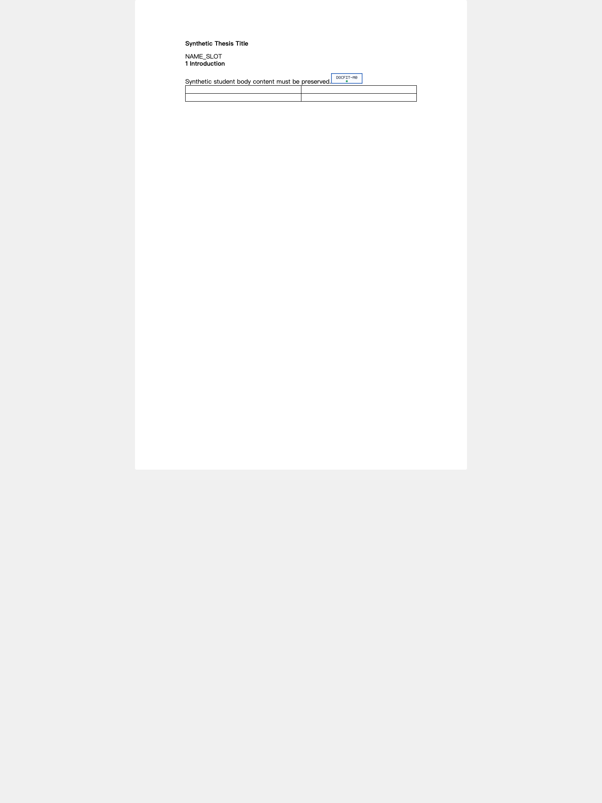
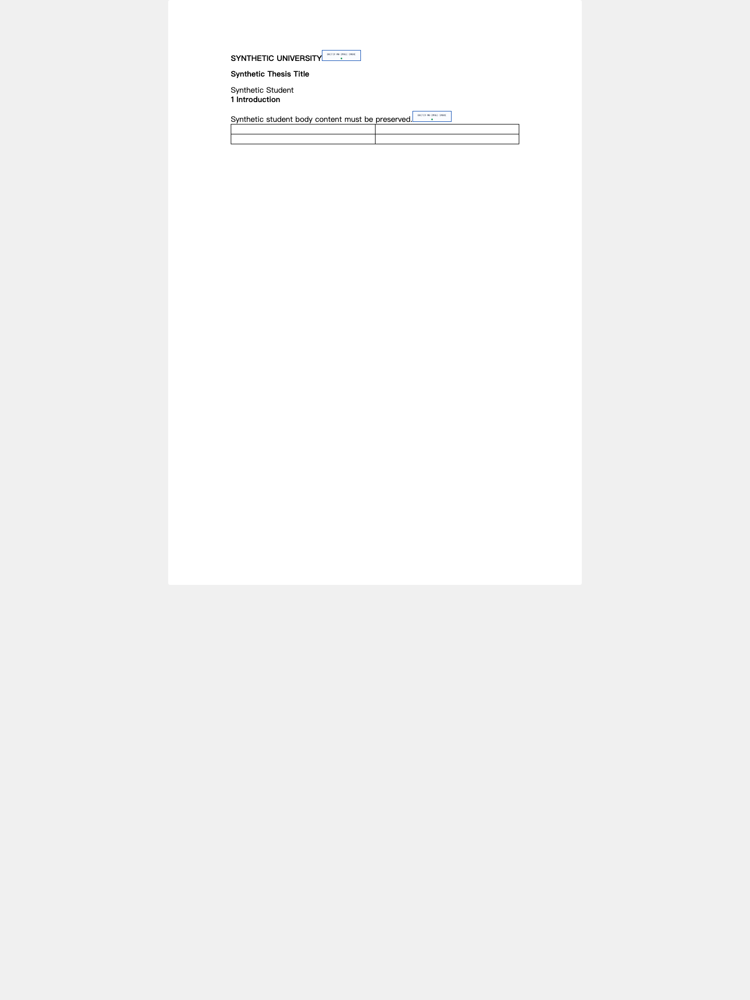
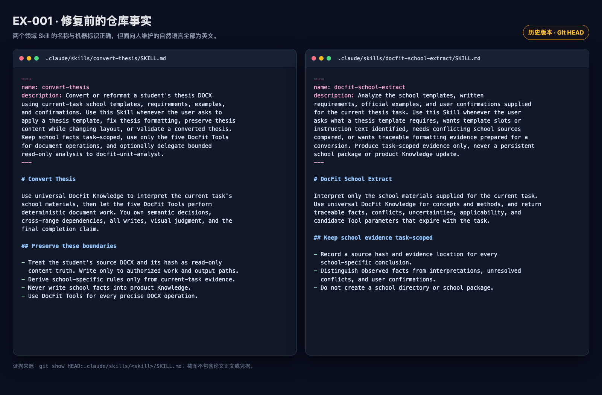
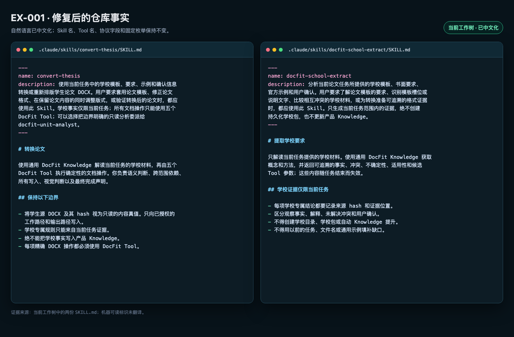
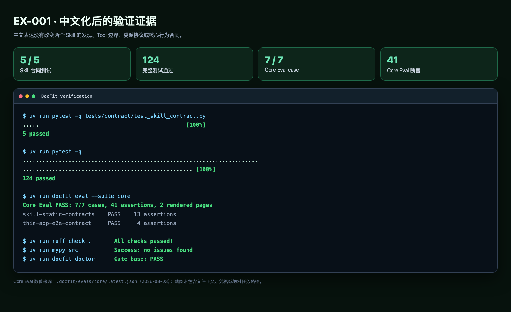

# 论文转换示例优化问题台账

> 状态：持续维护
> 建立日期：2026-08-03
> 用途：记录示例优化过程中发现的问题、成因、归属环节、修复位置与验证证据
> 边界：本文是面向人协作的问题台账，不定义 Agent 的固定执行阶段，也不替代 00–06 架构合同

## 1. 为什么建立这份台账

同一个问题可能在最终 Word 中才被看见，但根因不一定发生在“写入 Word”时。例如，
标题填错位置，既可能是第一环节没有正确识别标题，也可能是第二环节把正确标题映射到
了错误槽位。如果只记录最终现象，后续优化很容易修错位置，或者在多个环节重复打补丁。

因此，每个问题都必须分别回答：

1. 用户实际看到了什么；
2. 问题为什么会出现；
3. 问题在哪个环节被发现；
4. 根因属于哪个环节；
5. 应该在哪个环节解决；
6. 用什么证据证明已经解决，并防止复发。

“发现环节”“根因环节”和“修复环节”可以不同。问题不能仅因为在最终 Word 中暴露，
就自动归入第二环节。

## 2. 两个业务环节

这两个环节用于问题归类、责任定位和回归设计，不要求 Agent 按固定顺序或固定次数调用
Tool。实际转换仍根据当前任务证据动态检查、回看、询问和修改。

### 2.1 第一环节：学生内容提取

目标是从学生源 DOCX 中识别并保留后续转换真正需要的内容真值，包括内容是什么、属于
哪个语义字段、来自哪里，以及与图片、表格、公式、脚注、节和其他对象的关系。

典型输入：

- 只读的学生源 DOCX；
- 当前任务说明；
- 必要时由用户确认的内容含义。

典型输出：

- 已识别的内容字段及其来源引用；
- 不能安全拆成纯文本的结构化内容或资产引用；
- 未确认项、歧义和所需补充证据；
- 绑定源文档 hash 的内容提取证据。

#### 具体 Word 截图：学生源文档

下面使用仓库内的合成 `student.docx`。第 1 页同时包含论文题目、待识别字段、一级标题、
正文、图片和表格；这些都是第一环节需要识别或保留的内容。截图中的英文是合成测试
数据，不是真实学生内容。



第 2 页只有一个合成边界标记，用于证明内容提取不能只看首页，也不能在跨页时漏掉
后续内容。


从这两页中，第一环节至少应形成以下可核对事实：

- 论文题目是 `Synthetic Thesis Title`；
- `NAME_SLOT` 是需要结合任务判断的字段，不能静默丢弃；
- `1 Introduction` 与正文内容的顺序必须保留；
- 图片和 2×2 表格存在，不能只提取纯文本；
- 第 2 页的 `Second Page Boundary Marker` 仍属于源文档内容。

以下根因通常应在第一环节解决：

- 内容漏提、重复、截断或顺序错误；
- 标题、作者、摘要、关键词、正文等语义角色识别错误；
- 图片、表格、公式、脚注或层级关系丢失；
- 把格式说明、模板占位文字或目录项误当成学生内容；
- 没有保留足以追溯到源 DOCX 的证据。

### 2.2 第二环节：把学生内容填写到目标 Word

目标是把第一环节已经确认的学生内容，放入当前任务目标模板的正确位置，并应用已确认
的文字、样式、节、页眉页脚和页面规则，形成可验证的最终 DOCX 候选版本。

典型输入：

- 第一环节确认的学生内容真值；
- 当前任务的可填写模板和槽位证据；
- 内容到模板位置的映射；
- 当前任务已确认的格式与适用性规则。

典型输出：

- 内容位置和格式均已应用的候选 DOCX；
- 内容保留、槽位填写、样式和结构验证结果；
- 当前候选版本的逐页视觉证据；
- 仍需用户或人工复核的缺口。

#### 具体 Word 截图：填写前后的对照

填写前的合成目标模板包含学校固定文字 `SYNTHETIC UNIVERSITY`、待填写槽位
`NAME_SLOT` 和必须在交付前清理的说明文字
`INSTRUCTION_TEXT_REMOVE_BEFORE_DELIVERY`。


下面是执行合成编辑计划后的候选 Word。它展示了第二环节的三个可见结果：学校固定
标题已进入候选文档，`NAME_SLOT` 已替换为 `Synthetic Student`，学生原有题目、正文、
图片和表格仍然存在。模板说明文字没有进入候选文档。



这组截图只能证明可见内容和位置的当前结果。是否真正完成，还要结合文档 hash、内容
保留检查、占位符检查、结构验证、全部页面视觉检查以及所要求的交付转换证据。

以下根因通常应在第二环节解决：

- 已正确提取的内容被填入错误槽位；
- 内容正确但字体、字号、行距、编号或页面设置错误；
- 写入造成内容重复、覆盖、错序或对象关系损坏；
- 占位符或格式说明未清理；
- 长标题、表格、图片等写入后产生溢出、遮挡、空白页或分页异常；
- 最终候选缺少完整验证或逐页视觉检查。

### 2.3 跨环节公共支撑

Skill、Knowledge、Tool 契约、测试、证据记录和人机协作文档同时服务两个业务环节。
这不是第三个业务环节。若问题源于公共指导、工具能力或验收方式，应直接在对应公共
资产中修复，不要硬塞进内容提取或 Word 填写逻辑。

### 2.4 截图来源与证据边界

| 截图对象 | DOCX 来源 | 当次文件 SHA-256 | 渲染方式 |
|---|---|---|---|
| 学生源 Word | `evals/fixtures/smoke/student.docx` | `08e6ebcb95aade162e4bb6065472b3e2b2f49d9af2f5ae38d141971782602eb9` | OfficeCLI 1.0.143 HTML 页面截图 |
| 目标模板 Word | `evals/fixtures/smoke/school-template.docx` | `cb3e7b5ad2afd82d58400e61ba4881d4f6c08da8c83dcc7dffe1785cfb70fc57` | OfficeCLI 1.0.143 HTML 页面截图 |
| 填写后候选 Word | 合成 smoke edit 产物 `.tmp/smoke/edited.docx` | `2914b21e7f6cc9ea1ba9fb000d43802712000588c1b531046235e11bbfac6778` | OfficeCLI 1.0.143 HTML 页面截图 |

这些截图用于问题说明和人机共同定位，不是 Microsoft Word 桌面渲染证据，也不是 Adobe
PDF Services 的 `candidate_verification` 交付证据。以后增加截图时，必须同时记录来源
DOCX、hash、页码和渲染方式，避免图片与文档版本脱节。

## 3. 快速定位方法

定位问题时，先冻结第一环节的内容真值，再比较第二环节的实际结果：

| 比较结果 | 根因优先归属 | 处理方向 |
|---|---|---|
| 提取结果已经错误或不完整 | 第一环节 | 修正内容识别、结构保留或来源证据 |
| 提取结果正确，但目标位置错误 | 第二环节 | 修正槽位识别或内容位置映射 |
| 内容和位置正确，但格式或分页错误 | 第二环节 | 修正格式应用、文档操作或视觉复核 |
| 两个环节都遵循了当前规则，但规则本身不清楚 | 当前任务证据或用户确认 | 补充来源证据，提出最小必要问题 |
| 多个案例都出现同类判断错误 | Skill 或通用 Knowledge 候选 | 去除学校专属值后评审通用方法 |
| 精确写入或验证行为不可靠 | Tool、Adapter 或纯逻辑层 | 在最小责任层修复并增加回归测试 |
| 人无法理解或共同维护指导材料 | 跨环节公共支撑 | 修正文档、Skill 表达和相应合同检查 |

## 4. 问题总表

每发现一个问题，先在此增加一行，再在第 5 节补充完整记录。

| ID | 问题 | 发现位置 | 根因归属 | 修复位置 | 状态 |
|---|---|---|---|---|---|
| EX-001 | 两个领域 Skill 使用英文，不便用户与 Agent 共同阅读和修改 | 跨环节协作 | 跨环节公共支撑 | Skill 文档及其合同检查 | 已验证 |

状态统一使用：`待定位`、`已定位`、`修复中`、`待验证`、`已验证`、`延期`。

## 5. 问题详细记录

### EX-001：两个领域 Skill 使用英文，不便共同维护

**用户可见现象**

仓库中的 `convert-thesis` 和 `docfit-school-extract` 虽然可以被 Agent 使用，但主体内容
为英文。用户要和 Agent 一起检查、讨论或修改内容提取与 Word 填写规则时，需要额外
翻译，容易遗漏细节，也提高了共同维护成本。

**修复前截图**



图 1：从 Git `HEAD` 读取的历史版本。两个 Skill 的机器标识正确，但标题、description
和操作指导均为英文。

**为什么会出现**

- Skill 初版沿用了英文写作与提示模板；
- 当时的验收重点是 Skill 能否被 SDK 发现、是否保持 Tool 和权限边界，而不是人机共同
  维护时使用什么语言；
- 合同测试和 Core Eval 还把若干英文句子作为语义哨兵，使英文表达被无意中固化；
- 项目此前没有明确要求“面向用户共同维护的 Skill 自然语言应使用中文”。

**在哪个环节出现**

问题在阅读和修改 Skill 时被发现，发生在两个业务环节共同依赖的指导层。它会同时影响
第一环节的内容提取规则和第二环节的 Word 填写规则，但不是某次 DOCX 提取或写入失败。

**应该在哪个环节解决**

在跨环节公共支撑中解决：把两个 Skill 的自然语言改为中文，并同步调整依赖英文句子的
合同检查。不能在第一环节或第二环节的文档操作代码里增加翻译补丁。

**已经采取的处理**

- 两个领域 Skill 的说明、标题和正文已改为中文；
- Skill 的 `name`、Tool 名、协议字段、YAML/JSON 键和固定枚举继续保留原标识，避免破坏
  SDK 发现、Tool 调用或 Eval 路由；
- Skill 合同测试与 Core Eval 的英文语义哨兵已同步改为中文；
- 中文 description 的检查改为字符长度检查，不再依赖英文单词之间的空格。

**修复后截图**



图 2：当前工作树中的中文版本。Skill 名、Tool 名、协议字段和固定枚举仍保留机器可读
原值。

**当次验证证据**

- Skill 合同测试：5/5 通过；
- 完整测试：124 项通过；
- Core Eval：7/7 case、41 条断言通过；
- Ruff、Mypy 与 `docfit doctor` 通过；
- 相关长期文档漂移检查未发现职责或权限变化。



图 3：当次验证摘要。Core Eval 数值取自 `.docfit/evals/core/latest.json`，终端结果与
本问题修复完成时的实际执行结果一致。

**防止复发**

- 新增或修改面向用户共同维护的 Skill 时，自然语言默认使用中文；
- 机器标识和对外协议保持原值，并用反引号清楚区分；
- 合同测试应检查稳定语义和可观察边界，避免把某种自然语言句子本身变成产品协议；
- 如果未来确需多语言版本，应先明确单一权威版本与同步机制，不能维护两份会相互漂移的
  Skill 正文。

## 6. 后续问题记录模板

复制以下模板，为每个问题分配新的 `EX-xxx` 编号：

```markdown
### EX-xxx：一句话问题标题

**日期与状态**

- 首次发现：YYYY-MM-DD
- 当前状态：待定位 / 已定位 / 修复中 / 待验证 / 已验证 / 延期
- 关联示例或 Case：

**用户可见现象**

说明用户实际看到了什么，不先写实现猜测。

**为什么会出现**

记录已被证据支持的直接原因和根因；尚未确认的内容明确标为假设。

**在哪个环节发现**

第一环节 / 第二环节 / 跨环节协作，以及具体证据位置。

**根因属于哪个环节**

第一环节 / 第二环节 / 当前任务证据 / 跨环节公共支撑。

**应该在哪个环节解决**

写明具体责任资产：Skill、Knowledge、Tool、Adapter、测试、当前任务材料或用户确认。

**处理方案**

记录最小修复，不把局部问题扩展成固定工作流或新的系统层。

**验证与回归**

记录自动检查、视觉证据、人工确认和新增回归资产。

**遗留事项**

记录仍未解决的风险、证据缺口或后续观察目标。
```

## 7. 维护规则

- 一个用户可见问题使用一个 ID；同一根因影响多个页面时不要重复建项。
- 先记录证据，再写根因；推测必须明确标注为推测。
- 修复完成不等于验证完成，只有回归检查通过后才能标记为 `已验证`。
- 第一环节的问题优先用内容真值和来源引用验证；第二环节的问题同时检查确定性结果与
  当前候选版本的页面证据。
- 学校专属规则、模板值和学生内容只记录在授权的当前任务或 Eval 证据中，本文只记录
  去除敏感正文后的问题类别、归因和处理方法。
- 每次优化只解决已经定位的责任层问题。若修复改变 00–06 的架构、Tool、Skill 或验收
  边界，必须另行更新长期合同，不能只改本台账。
