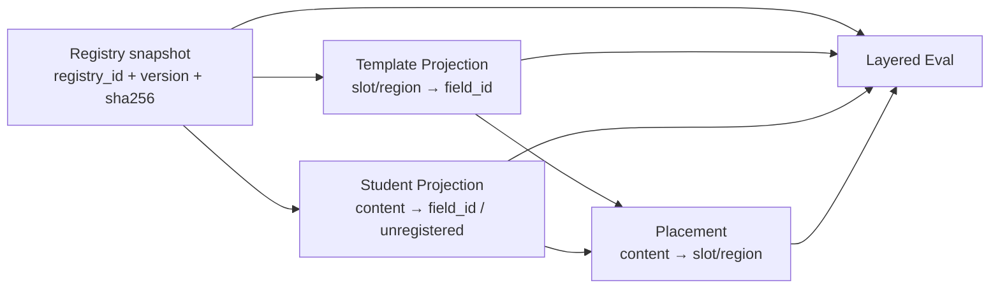

# DocFit Content Field Registry 研发设计

> 状态：Student 002 pilot accepted + Student 001/003 扩样 accepted
> 稳定历史快照：`content-fields-v0.1.yaml`
> Student 002 当前唯一语义快照：`content-fields-v0.3.yaml`
> Student 001/003 当前 accepted 语义快照：`content-fields-v0.4.yaml`
> 新模板与后续内容运行时 clean-break 快照：`content-fields-v0.5.yaml`
> 日期：2026-08-13

## Plan Ledger

- Plan status: ACTIVE
- Session scope: content-field-registry-rd-baseline
- Parent plan: none
- Child plans: none
- Last updated: 2026-08-12
- Current slice: 保持 accepted v0.3 与 Student 002 Gold 不变；Student 001/003 已按同一合同
  完成验收，并由 accepted v0.4 承载扩样发现的多资产语义图、可选源编号题注、结构配对、
  Word 自动列表编号和 final-visible 修订视图合同
- Next action: 以 accepted Extraction Gold 为输入，单独准备 Student 001/003 Filling
- Blocked on: none for Registry/Extraction；Filling 是独立工作包
- Do not touch from this session: 学校提取 v2 设计、产品运行时、公开 Tool/CLI、M3 实施

## 1. 设计决定

DocFit 在研发期维护一份正式、可版本化的 Content Field Registry。它是
模板提取、学生内容投影、placement 和 Eval 之间的共享语义合同，不是某个
Eval case 的内部资产。

当前权威为本目录中的 `DESIGN.md` 和消费者显式绑定的不可变快照。旧 case 继续绑定
`content-fields-v0.1.yaml`；Student 002 pilot 的 Extraction Gold、模板填写契约和
placement 候选统一绑定 `content-fields-v0.3.yaml`，不能混用或跟随“latest”。
本设计只冻结研发期责任、消费者接口、未注册字段策略和版本规则；不决定
未来生产发布位置、加载 API 或运行时服务。

Registry 是开放集（open world）。`v0.1` 是可引用的历史确定快照；`v0.2` 在相同 54 个
canonical ID 上补齐 `value_sources` 与 `student_extraction_policy`，未新增或改义字段。
`v0.3` 保持相同 ID，并明确图表题注的规范值不包含目标模板负责生成的类型标签和编号。
`v0.3` 已于 2026-08-12 通过 Human 签署并作为 Student 002 Accepted Extraction Gold 的
语义基准；该签署不代表字段已穷尽、模板/Filling Gold 已验收或 M3 已通过。
`v0.4` 从 accepted v0.3 派生，仍保留相同 54 个 canonical ID；它由 Student 001/003
扩样触发并于 2026-08-12 通过产品验收，不能反向改写仍绑定 v0.3 的 Student 002。

`v0.5` 从不可变 v0.4 派生，字段职责与数量不变，但以 clean break 将含混的
`body.heading.level1` … `level5` 政名为 `body.heading.outline1` … `outline5`；其产品标签统一为
“章标题、一级节标题、二级节标题、三级节标题、四级节标题”。新模板提取和后续内容运行时只
绑定 v0.5，不提供旧 ID alias。v0.1–v0.4 继续原样保留，仅供已绑定 hash 的 Gold 与审计证据重放。

## 2. 目标与非目标

### 2.1 目标

- 为多个调整中的阶段提供同一版字段语义；
- 分离共享语义、模板目标、学生内容和本次 placement；
- 使未知内容可被保留、评测和后续晋升，而不是静默丢失或临时伪造永久 ID；
- 通过 Registry ID、版本和内容 hash 使每份阶段产物可复现。

### 2.2 非目标

- 不决定未来生产包路径或公开加载接口；
- 不建设 Registry 服务、学校数据库、全局 Content Ledger 或新的 Agent 流程；
- 不保存学校 locator、模板样式、学生具体值、placement 或 Eval 答案；
- 不自动翻译、不自动晋升新字段、不声称 54 个字段已全部验收；
- 不为开发期旧路径保留 alias、双读、fallback 或兼容测试。

## 3. 责任边界

| 对象 | 负责 | 不负责 |
|---|---|---|
| Content Field Registry | `field_id`、可读含义、类型、数量约束、语言政策、值来源、对象关系、生命周期与版本 | 学校位置、具体文档值、本次放置、评分结论 |
| Template Projection | `slot_id/region_id → field_id`、target locator、required、condition、fill/style policy | 创建或改义通用字段 |
| Student Content Projection | `content_id → field_id`、值/对象、source locator、父子和顺序；工作候选中的未注册发现 | 为未知内容自动分配永久 ID，或让未注册发现进入 Gold |
| Placement | 显式连接 source content 与 target slot/region，并保存动作、投影、条件和状态 | 仅凭同名或相似文字自动写入 |
| Eval | 固定 Registry 快照，分层比较 Template、Student、Placement 和最终文档 | 拥有、重写或把 Registry 当作 Gold 答案 |

## 4. 数据耦合，不是执行耦合



四个消费者必须记录同一份引用：

```yaml
field_registry_ref:
  registry_id: docfit.thesis.content_fields
  registry_version: <consumer-bound immutable version>
  sha256: <that snapshot sha256>
```

这个引用只证明语义基线相同。Template 和 Student locator 仍分别绑定各自
文档 hash；placement 仍显式引用 `content_id` 与 `slot_id/region_id`。不允许
把 `field_id` 或 `field_registry_ref` 当作 Tool locator 或执行阶段状态。

Registry 不定义执行顺序。一个任务可以在内存中持有等价事实；只有需要调试、
跨阶段交接或 Eval 时才必须物化完整文件。

## 5. 消费者最小合同

### 5.1 Template Projection

每个 slot/region 保存 `field_id` 或显式的 unregistered 状态、target locator、
模板 hash、槽层 required/condition 与显示/样式策略。跨模板 alignment 是派生审计索引，
不是 Registry 或 locator 权威。

### 5.2 Student Content Projection

Student Content Projection 必须以当前固定 Registry 快照为主语义目录，而不是维护一套
平行字段分类。它对快照中的每个 `field_id` 形成唯一字段级结果，记录 student-extraction
适用性、`present/missing/not_applicable/unresolved/unsupported` 状态和关联的
`content_ids`。每个内容项保存 `content_id`、已注册 `field_id` 或未注册记录、规范值/
原始观测值或复杂对象引用、source locator、父子关系、顺序和冲突状态。

已注册项的 `content_type`、cardinality、语义父字段和字段级 language 以 Registry 为
权威，Projection 只能引用或冗余校验，不能另行定义。`content_id` 是事实/occurrence 的
实例身份，不是第二套字段 ID；同一 `field_id` 下的多个正文、图表、公式和参考文献仍须
保留各自顺序与实例父子关系。可见但未识别的内容在工作候选中进入第 7 节的阻断队列，
不得静默丢失；在 Extraction Gold 候选物化前，通用内容必须先升级 Registry，非通用内容
必须得到显式排除/保留裁决。

只有 Registry 的 value-source/student-extraction policy 声明为学生源可提取的字段，
才能在源中不存在时记为 `missing`。系统生成、任务输入或外部资产字段记为
`not_applicable`。Registry 缺少该政策时，Projection 可以作为候选接受 Human 复核，
但不能自行按字段名称猜测，也不能宣称字段覆盖分母已经闭合。

结构分类还必须优先保留用户原文中显式可见的表达特征。以 Student 002 为基准，带
`（n）`/`(n)` 标记的内容默认投影为 Registry 已有的 `body.numbered_list_item`；文本较短
或语义上像“方法名称”都不足以单独升级为 `body.heading.outline4`。只有层级、排版或完整
上下文提供更强证据时，才能提出例外并接受 Human 裁决。供 Human 判断这类结构歧义的
产品文档必须同时展示所属上级、前一条和后一条可见内容，不能只给孤立原文片段。

### 5.3 Placement

每条映射显式引用 source `content_id` 集合和具体 target `slot_id/region_id`。
两侧已确认为同一 `field_id` 只是确定性候选的必要条件，不是充分条件。
未注册内容与未注册模板槽之间只能使用显式证据/Human 确认的 placement。

### 5.4 Eval

Eval case 必须固定 Registry ID、版本和 hash。旧 case 不自动跟随新 Registry。
Registry 评测检查 ID、类型、关系、来源和版本；Template、Student、Placement 和
最终文档分别归因，不用单一总分掩盖映射错误。

## 6. 字段 ID 命名

正式 ID 形式：

```text
<domain>.<concept>[.<role>][.<qualifier>]
```

必须匹配：

```regex
^[a-z][a-z0-9_]*(\.[a-z][a-z0-9_]*)+$
```

命名规则：

- 使用小写 ASCII 和点分层级，segment 内使用 snake_case；
- 命名语义角色，不命名学校、模板、locator、样式、页码、实例序号或字段值；
- `.zh/.en` 只用于论文题名、摘要、关键词等确属不同逻辑值的字段；
- 章节标题、图题、表题、附录标题等重复内容保留单一语义 ID，语言保存在
  具体 `content_id` 上；
- 正式 ID 一旦被快照引用就不在原 ID 下静默改义。

## 7. 未注册字段

当前 Registry 中不存在的语义不获得伪正式 `field_id`。Template 或 Student
Projection 的发现工作态可以使用：

```yaml
field_id: null
classification_status: unregistered
local_field_key: uf-0001
label: 算法清单
meaning: 论文正文中的算法或伪代码对象
content_type: structured_block
proposed_canonical_id: body.algorithm_listing
source_occurrences:
  - <snapshot-bound source evidence>
```

约束：

- `local_field_key` 匹配 `^uf-[0-9]{4,}$`，只在当前产物包中唯一；
- `proposed_canonical_id` 必须符合正式命名形式，但只是提议，不得用于自动
  placement、字段覆盖率或已注册字段得分；
- 未注册项必须有 label、meaning、类型、来源证据和最终处置；
- 每项最终显式进入 `placed`、`retain`、`exclude`、`manual` 或 `unresolved`；
- 未注册字段只有在 Human 完成重名/重叠检查、通用性判断、类型、语言、来源和
  关系定义后，才可以进入新 Registry 快照。

`unregistered` 是 Registry 升级的阻断信号，不是可长期保存的 Gold 语义。发现可跨学生、
跨学校复用的通用内容时，必须按“升级不可变 Registry → 重跑 Student Projection → 同步
Template Projection/Placement → 校验 hash”的顺序处理；禁止先猜一个临时正式字段再补
Registry。Gold 候选和模板填写映射的验收门均要求 `unregistered_items` 为空。

Registry 与 Extraction Gold 的 Human 签署必须由产品核对文档承载。文档展示字段政策、
样本中的实际内容和可选择结论；YAML 只作为签署结果的机器镜像，不得要求产品负责人直接
阅读 content ID 队列或编辑结构化状态文件。涉及标题、列表、题注边界等依赖结构的判断，
文档还必须给出足以做决定的相邻内容和父级上下文。

## 8. 语言与平行内容

字段层 `language` 仅在该字段的语义本身固定为一种语言时使用。重复结构内容
在每个 Student Content item 上保存 `language: zh|en|mixed|und`。中英平行题注还要保存
`parallel_group_id` 与可选 `translation_of`，且两项共享同一父图/表。

Registry 不从一种语言自动生成另一种语言。如果目标模板要求另一种语言但来源
没有该值，placement 保持 `unresolved` 或请求用户提供。

## 9. 版本与晋升

- 每个 Registry 快照一旦被消费者引用就不在原文件上改义；
- 仅修正拼写、label 或不改语义的说明：patch；
- 新增字段、别名或兼容关系：minor；在 1.0 前新增会改变消费者规范值的语义合同也必须
  新建 minor 快照并同步消费者，禁止原地修改；
- 改义、拆分、合并、不兼容类型/数量变化：使用新 ID 并记录
  `deprecated/replaced_by`，或在必要时升级 major；
- 开发期不保留旧路径 alias 或双读。升级消费者时，它的 fixture、hash 和预期产物
  同步替换；
- 旧 Eval case 继续引用原快照，不在同一 case 中静默跟随新版。

## 10. 快照状态与已知缺口

`v0.1` 保留当前 54 个字段作为研发基线，但以下内容尚未经 Human 冻结：

- `optional` 仍混合表达可选性与数量约束；
- 多数字段尚未补齐 value-source 和 student-extraction policy；
- `body.inline_emphasis` 的含义含有 PKU 特定字符样式；
- `body.table.note` 的含义允许图或表，但当前只有单一表格父字段；
- 复合封面值、日期拆分和目标显示 projection 尚未统一 schema。

这些缺口属于后续字段审查。它们不阻止 `v0.1` 作为相同语义输入的可引用
快照，也不阻止 Student Content 候选使用其 canonical `field_id`；但 value-source 和
student-extraction policy 未闭合时，不能准确建立学生源字段覆盖分母或区分
`missing/not_applicable`，因此阻止将它声称为完整 Registry、Accepted Gold 或生产合同。

`v0.2` 是为 Student 002 pilot 新建的不可变候选 revision。它保留相同 54 个 canonical
field ID，并逐字段增加：

- `value_sources`：区分学生源、任务输入、外部/人工资产和系统生成；
- `student_extraction_policy`：取值固定为 `required|optional|not_applicable`；
- 关键词的 `observed_value`/`normalized_value` 归一化规则。

Student 002 全文审计未发现现有字段无法承载的通用内容，因此本 revision 没有新增字段。
`v0.2` 已能确定性计算该 pilot 的 `missing/not_applicable` 分母，但在 54 字段政策经 Human
签署前仍保持 `candidate_pending_human_signoff`；旧 case 不迁移、不自动跟随。

`v0.3` 是 Student 002 当前绑定的不可变 accepted 快照。它从 v0.2 派生，不新增或改写 `field_id`，
只为 `body.figure.caption` 和 `body.table.caption` 增加以下通用规范化合同：

- `observed_value` 完整保留源文档中的“图/Fig./表/Table + 章序号-顺序号”，用于追溯与配对；
- `normalized_value` 只保存用户题名正文，中英双语表题逐行去除类型标签和编号；
- Placement 优先使用 `normalized_value`，类型标签与编号由目标模板 caption numbering 生成；
- 不允许把源编号直接写入目标后再叠加自动编号。

该规则改变消费者应使用的规范值，因此不原地修改已被 hash 引用的 v0.2，而以 v0.3 和新
hash 同步 Extraction/Placement。v0.3 已于 2026-08-12 与 Student 002 Extraction Gold 一并
通过 Human 签署；旧 case 继续绑定原快照。

`v0.4` 是 Student 001/003 当前绑定的 accepted 不可变快照。扩样没有发现需要新增 canonical
字段的通用内容，但暴露了 v0.3 尚未精确定义的承载边界：

- 一张带共同题注的语义图可以由一个或多个源图片资产组成；只用于并排图片的无文本表格
  是布局容器，不重复提取为 `body.table`；
- 源图题/表题可以只有“图/Fig./表/Table”标签而没有编号；`normalized_value` 去除类型
  标签和可选编号，目标模板仍拥有最终编号；
- 双语题注的绑定首先依据源结构、邻接和版面；源编号仅是追溯证据，编号不一致时保留两边
  原文并进入产品核对，不能按编号强行错配；
- Word 自动编号与显式可见括号编号都可作为 `body.numbered_list_item` 证据，内容项同时
  保存原始文字和编号定义；
- 带修订的源文件按 Word final-visible 视图提取：插入文本进入内容，删除文本只保留覆盖
  审计，批注属于评阅元数据；语义冲突或无法确定的修订必须阻断 Gold。

这些是既有字段的通用内容/来源合同升级，不是学校 locator 或样式规则。v0.4 与
Student 001/003 产品文档已一起通过 Human；Student 002 继续固定绑定 v0.3。

## 11. 实施范围

1. 在本目录固化 `content-fields-v0.1.yaml`；
2. 将 Eval 候选生成器改为只读该快照，不再生成或覆盖字段文件；
3. 替换 template-spec、alignment、manifest、logical-unit case 和 Eval 设计中的所有旧路径；
4. 每个消费者记录 Registry ID、版本和 hash；
5. 删除 Eval 目录中被取代的 `content-fields.yaml`，不留兼容副本；
6. 只更新 00–06 中指向旧临时路径或与本设计直接冲突的声明；生产 cutover
   时再根据当时实现原子同步完整长期合同。

## 12. 验收与停止门

### 12.1 成功条件

- Eval 目录不再拥有或生成 `content-fields.yaml`；
- `content-fields-v0.1.yaml` 能被解析，54 个 `field_id` 唯一并匹配命名规则；
- 所有已知消费者引用同一 `registry_id + registry_version + sha256`；
- 三校 Template Projection 的字段引用是 Registry 子集，alignment 与 spec locator 闭包；
- 旧路径不再被引用，hash bindings 验证通过；
- 文档不声称 Registry 已完整、M3 已恢复或 Gold 已通过。

### 12.2 停止门

以下任一情况必须另行批准：

- 要求决定生产发布位置、加载 API 或持久化服务；
- 要求更改公开 Tool/CLI、Agent runtime 或 M3 范围；
- 要求将任一字段从 candidate 晋升为 Human-accepted 语义；
- 发现 Registry 边界与 00、01 的全局产品不变量冲突。

## 13. 验证计划

- YAML parse、Registry ID/version/hash 引用完整性；
- `field_id` regex、唯一性、父字段/引用闭包；
- 三校 alignment 与 template-spec locator 闭包；
- 候选生成器运行与 `hash-bindings.sha256` 验证；
- 全库旧路径和重复 Registry 搜索；

- `git diff --check`；
- 仅在生成器 Python 受影响时运行定向 Ruff，不为 docs/data-only 变更运行 Adobe 或 live Agent
  smoke。

## 14. Unknown-unknown scout

本计划不另行启动广泛 scout。跳过原因：问题已由实际 54 字段、三校 alignment、
template-spec、Eval 设计和 00–06 交叉审查定位；当前目标是所有权拆分与合同固化，
不是扩大论文字段集。字段语义的未知项通过第 7 节的 unregistered 通道保留。

## 15. G1 研发基线结论

`docfit.thesis.content_fields@0.1.0` 已作为开发期固定快照建立，内容 SHA-256 为
`9779d0272fc395245002184d43e8356b0722a6821e8ca0a36ced0db6d26d522d`。

本切片 PASS 只表示：

- Registry 的职责、非目标、字段命名、未注册内容、语言与版本政策已有研发权威；
- 54 个字段唯一、命名合法且父字段无断链/环；原单段 ID `acknowledgement`
  已规范为 `acknowledgement.body`；
- 论文题名、摘要和关键词等独立中英值继续使用 `.zh/.en`；图题、表题、
  附录标题等重复结构改为 item-level 语言，不拆两套永久 ID；
- Eval 候选生成器只读 Registry，manifest、alignment、logical-unit cases 和三校
  template spec 引用同一 ID/version/hash，旧 Eval 所有文件不再存在。

本节原始 G1 PASS 本身不表示 Human 验收；后续 Student 002 pilot 已于 2026-08-12 对
Registry v0.3 和 Extraction Gold 完成独立产品验收。该验收仍不表示 Registry 已穷尽、
Template/Placement/Filling Gold 已验收、正式生产 schema 已实现或 M3 已恢复。
