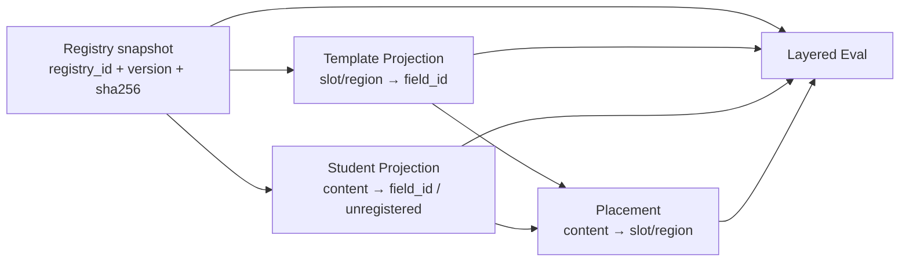

# DocFit Content Field Registry 研发设计

> 状态：研发基线（development baseline）
> 当前字段快照：`content-fields-v0.1.yaml`
> 日期：2026-08-06

## Plan Ledger

- Plan status: DONE
- Session scope: content-field-registry-rd-baseline
- Parent plan: none
- Child plans: none
- Last updated: 2026-08-06
- Current slice: 已建立 Registry 设计权威，将字段快照从 Eval 产物中拆出
- Next action: 暂停；54 字段 Human review 或 Template/Student/Placement 正式 schema 需新的批准计划
- Blocked on: none
- Do not touch from this session: 学校提取 v2 设计、产品运行时、公开 Tool/CLI、M3 实施

## 1. 设计决定

DocFit 在研发期维护一份正式、可版本化的 Content Field Registry。它是
模板提取、学生内容投影、placement 和 Eval 之间的共享语义合同，不是某个
Eval case 的内部资产。

当前权威为本目录中的 `DESIGN.md` 和绑定快照 `content-fields-v0.1.yaml`。
本设计只冻结研发期责任、消费者接口、未注册字段策略和版本规则；不决定
未来生产发布位置、加载 API 或运行时服务。

Registry 是开放集（open world）。`v0.1` 是可引用的确定快照，不代表字段已
穷尽所有论文内容，也不代表 Human Gold 或 M3 已通过。

## 2. 目标与非目标

### 2.1 目标

- 为多个调整中的阶段提供同一版字段语义；
- 分离共享语义、模板目标、学生内容和本次 placement；
- 使未知内容可被保留、评测和后续晋升，而不是静默丢失或临时伪造永久 ID；
- 通过 Registry ID、版本和内容 hash 使每份阶段产物可复现。

### 2.2 非目标

- 不决定未来生产包路径或公开加载接口；
- 不建设 Registry 服务、学校数据库、全局 Content Ledger 或新的 Agent 流程；
- 不保存学校 locator、模板样式、学生具体值、placement 或 Eval 答案；
- 不自动翻译、不自动晋升新字段、不声称 54 个字段已全部验收；
- 不为开发期旧路径保留 alias、双读、fallback 或兼容测试。

## 3. 责任边界

| 对象 | 负责 | 不负责 |
|---|---|---|
| Content Field Registry | `field_id`、可读含义、类型、数量约束、语言政策、值来源、对象关系、生命周期与版本 | 学校位置、具体文档值、本次放置、评分结论 |
| Template Projection | `slot_id/region_id → field_id`、target locator、required、condition、fill/style policy | 创建或改义通用字段 |
| Student Content Projection | `content_id → field_id` 或 unregistered、值/对象、source locator、父子和顺序 | 为未知内容自动分配永久 ID |
| Placement | 显式连接 source content 与 target slot/region，并保存动作、投影、条件和状态 | 仅凭同名或相似文字自动写入 |
| Eval | 固定 Registry 快照，分层比较 Template、Student、Placement 和最终文档 | 拥有、重写或把 Registry 当作 Gold 答案 |

## 4. 数据耦合，不是执行耦合



四个消费者必须记录同一份引用：

```yaml
field_registry_ref:
  registry_id: docfit.thesis.content_fields
  registry_version: 0.1.0
  sha256: <content-fields-v0.1.yaml sha256>
```

这个引用只证明语义基线相同。Template 和 Student locator 仍分别绑定各自
文档 hash；placement 仍显式引用 `content_id` 与 `slot_id/region_id`。不允许
把 `field_id` 或 `field_registry_ref` 当作 Tool locator 或执行阶段状态。

Registry 不定义执行顺序。一个任务可以在内存中持有等价事实；只有需要调试、
跨阶段交接或 Eval 时才必须物化完整文件。

## 5. 消费者最小合同

### 5.1 Template Projection

每个 slot/region 保存 `field_id` 或显式的 unregistered 状态、target locator、
模板 hash、槽层 required/condition 与显示/样式策略。跨模板 alignment 是派生审计索引，
不是 Registry 或 locator 权威。

### 5.2 Student Content Projection

每个内容项保存 `content_id`、已注册 `field_id` 或未注册记录、规范值/原始观测值
或复杂对象引用、source locator、父子关系、顺序和冲突状态。可见但未识别的内容
不得静默丢失。

### 5.3 Placement

每条映射显式引用 source `content_id` 集合和具体 target `slot_id/region_id`。
两侧已确认为同一 `field_id` 只是确定性候选的必要条件，不是充分条件。
未注册内容与未注册模板槽之间只能使用显式证据/Human 确认的 placement。

### 5.4 Eval

Eval case 必须固定 Registry ID、版本和 hash。旧 case 不自动跟随新 Registry。
Registry 评测检查 ID、类型、关系、来源和版本；Template、Student、Placement 和
最终文档分别归因，不用单一总分掩盖映射错误。

## 6. 字段 ID 命名

正式 ID 形式：

```text
<domain>.<concept>[.<role>][.<qualifier>]
```

必须匹配：

```regex
^[a-z][a-z0-9_]*(\.[a-z][a-z0-9_]*)+$
```

命名规则：

- 使用小写 ASCII 和点分层级，segment 内使用 snake_case；
- 命名语义角色，不命名学校、模板、locator、样式、页码、实例序号或字段值；
- `.zh/.en` 只用于论文题名、摘要、关键词等确属不同逻辑值的字段；
- 章节标题、图题、表题、附录标题等重复内容保留单一语义 ID，语言保存在
  具体 `content_id` 上；
- 正式 ID 一旦被快照引用就不在原 ID 下静默改义。

## 7. 未注册字段

当前 Registry 中不存在的语义不获得伪正式 `field_id`。Template 或 Student
Projection 使用：

```yaml
field_id: null
classification_status: unregistered
local_field_key: uf-0001
label: 算法清单
meaning: 论文正文中的算法或伪代码对象
content_type: structured_block
proposed_canonical_id: body.algorithm_listing
source_occurrences:
  - <snapshot-bound source evidence>
```

约束：

- `local_field_key` 匹配 `^uf-[0-9]{4,}$`，只在当前产物包中唯一；
- `proposed_canonical_id` 必须符合正式命名形式，但只是提议，不得用于自动
  placement、字段覆盖率或已注册字段得分；
- 未注册项必须有 label、meaning、类型、来源证据和最终处置；
- 每项最终显式进入 `placed`、`retain`、`exclude`、`manual` 或 `unresolved`；
- 未注册字段只有在 Human 完成重名/重叠检查、通用性判断、类型、语言、来源和
  关系定义后，才可以进入新 Registry 快照。

## 8. 语言与平行内容

字段层 `language` 仅在该字段的语义本身固定为一种语言时使用。重复结构内容
在每个 Student Content item 上保存 `language: zh|en|mixed|und`。中英平行题注还要保存
`parallel_group_id` 与可选 `translation_of`，且两项共享同一父图/表。

Registry 不从一种语言自动生成另一种语言。如果目标模板要求另一种语言但来源
没有该值，placement 保持 `unresolved` 或请求用户提供。

## 9. 版本与晋升

- 每个 Registry 快照一旦被消费者引用就不在原文件上改义；
- 仅修正拼写、label 或不改语义的说明：patch；
- 新增字段、别名或兼容关系：minor；
- 改义、拆分、合并、不兼容类型/数量变化：使用新 ID 并记录
  `deprecated/replaced_by`，或在必要时升级 major；
- 开发期不保留旧路径 alias 或双读。升级消费者时，它的 fixture、hash 和预期产物
  同步替换；
- 旧 Eval case 继续引用原快照，不在同一 case 中静默跟随新版。

## 10. v0.1 已知缺口

`v0.1` 保留当前 54 个字段作为研发基线，但以下内容尚未经 Human 冻结：

- `optional` 仍混合表达可选性与数量约束；
- 多数字段尚未补齐 value-source 和 student-extraction policy；
- `body.inline_emphasis` 的含义含有 PKU 特定字符样式；
- `body.table.note` 的含义允许图或表，但当前只有单一表格父字段；
- 复合封面值、日期拆分和目标显示 projection 尚未统一 schema。

这些缺口属于后续字段审查。它们不阻止 `v0.1` 作为相同语义输入的可引用
快照，但阻止将它声称为完整 Registry、Accepted Gold 或生产合同。

## 11. 实施范围

1. 在本目录固化 `content-fields-v0.1.yaml`；
2. 将 Eval 候选生成器改为只读该快照，不再生成或覆盖字段文件；
3. 替换 template-spec、alignment、manifest、logical-unit case 和 Eval 设计中的所有旧路径；
4. 每个消费者记录 Registry ID、版本和 hash；
5. 删除 Eval 目录中被取代的 `content-fields.yaml`，不留兼容副本；
6. 只更新 00–06 中指向旧临时路径或与本设计直接冲突的声明；生产 cutover
   时再根据当时实现原子同步完整长期合同。

## 12. 验收与停止门

### 12.1 成功条件

- Eval 目录不再拥有或生成 `content-fields.yaml`；
- `content-fields-v0.1.yaml` 能被解析，54 个 `field_id` 唯一并匹配命名规则；
- 所有已知消费者引用同一 `registry_id + registry_version + sha256`；
- 三校 Template Projection 的字段引用是 Registry 子集，alignment 与 spec locator 闭包；
- 旧路径不再被引用，hash bindings 验证通过；
- 文档不声称 Registry 已完整、M3 已恢复或 Gold 已通过。

### 12.2 停止门

以下任一情况必须另行批准：

- 要求决定生产发布位置、加载 API 或持久化服务；
- 要求更改公开 Tool/CLI、Agent runtime 或 M3 范围；
- 要求将任一字段从 candidate 晋升为 Human-accepted 语义；
- 发现 Registry 边界与 00、01 的全局产品不变量冲突。

## 13. 验证计划

- YAML parse、Registry ID/version/hash 引用完整性；
- `field_id` regex、唯一性、父字段/引用闭包；
- 三校 alignment 与 template-spec locator 闭包；
- 候选生成器运行与 `hash-bindings.sha256` 验证；
- 全库旧路径和重复 Registry 搜索；

- `git diff --check`；
- 仅在生成器 Python 受影响时运行定向 Ruff，不为 docs/data-only 变更运行 Adobe 或 live Agent
  smoke。

## 14. Unknown-unknown scout

本计划不另行启动广泛 scout。跳过原因：问题已由实际 54 字段、三校 alignment、
template-spec、Eval 设计和 00–06 交叉审查定位；当前目标是所有权拆分与合同固化，
不是扩大论文字段集。字段语义的未知项通过第 7 节的 unregistered 通道保留。

## 15. G1 研发基线结论

`docfit.thesis.content_fields@0.1.0` 已作为开发期固定快照建立，内容 SHA-256 为
`9779d0272fc395245002184d43e8356b0722a6821e8ca0a36ced0db6d26d522d`。

本切片 PASS 只表示：

- Registry 的职责、非目标、字段命名、未注册内容、语言与版本政策已有研发权威；
- 54 个字段唯一、命名合法且父字段无断链/环；原单段 ID `acknowledgement`
  已规范为 `acknowledgement.body`；
- 论文题名、摘要和关键词等独立中英值继续使用 `.zh/.en`；图题、表题、
  附录标题等重复结构改为 item-level 语言，不拆两套永久 ID；
- Eval 候选生成器只读 Registry，manifest、alignment、logical-unit cases 和三校
  template spec 引用同一 ID/version/hash，旧 Eval 所有文件不再存在。

本 PASS 不表示 54 字段已 Human 验收、Registry 已完整、Template/Student/Placement
正式 schema 已实现、M3 已恢复，或任何 candidate 已是 Gold。
