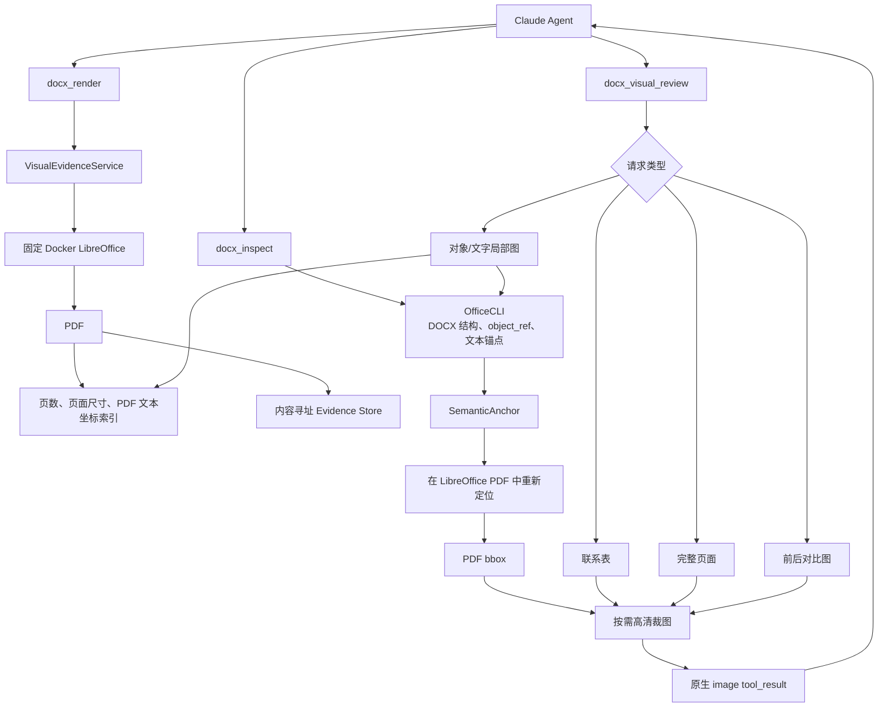

# DocFit LibreOffice 视觉证据架构 V2

> 日期：2026-08-07
> 类型：替换式架构方案
> 状态：已实施并通过确定性与三校真实样本验收
> 迁移策略：研发阶段 clean break，不保留旧契约、旧渲染路径或兼容层

新的架构直接做一次 clean break：删除 Adobe 渲染、删除 OfficeCLI 截图、删除旧的三类
`render_intent`，只保留 LibreOffice 作为唯一视觉渲染器，OfficeCLI 只负责 DOCX 结构和对象定位。

规划已经收敛，不需要继续讨论兼容性或迁移方案。

## 一、目标架构



职责只有三条：

- LibreOffice：唯一页面视觉来源。
- OfficeCLI：识别“对应 DOCX 中哪个对象”。
- DocFit：把 OfficeCLI 的语义对象重新映射到 LibreOffice PDF，并按需生成图片。

不会存在 Provider 选择、自动回退或第二条视觉路径。

## 二、Agent 仍然只看到两个视觉工具

### 1. `docx_render`

职责：把一个 DOCX 建立成稳定、可重复使用的视觉快照。

新的输入建议缩减为：

```json
{
  "input_docx": "work/current.docx",
  "overview": true
}
```

删除：

- `render_intent`
- `output_dir`
- `baseline_render_ref`
- `provider`
- `backend`
- `engine`
- `focus_object_refs`

`task_root` 也不再由 Agent 传入，而是由应用会话注入，避免 Agent 选择授权根目录。

输出：

```json
{
  "render_ref": "render:v2:...",
  "document_sha256": "...",
  "page_count": 79,
  "fidelity": "approximate",
  "renderer": {
    "name": "libreoffice",
    "version": "25.2.3.2",
    "container_image_digest": "...",
    "font_environment_digest": "..."
  },
  "overview": {
    "evidence_ref": "visual:v2:...",
    "covered_pages": [1, 12],
    "has_more": true
  }
}
```

渲染结果永远标记为 `approximate`，不再出现 Adobe 的 `official_service_conversion`。

### 2. `docx_visual_review`

职责：从已有 `render_ref` 中灵活取得当前需要的视觉证据。

保留四种模式，但重新设计 `regions`：

```text
contact_sheet  查看指定页段的缩略图
pages          查看指定完整页面
regions        根据对象、文字或已有图片坐标生成局部高清图
compare        比较两个 LibreOffice render
```

示例：

```json
{
  "render_ref": "render:v2:...",
  "mode": "regions",
  "quality": "detail",
  "regions": [
    {
      "selector": "object_ref",
      "object_ref": {
        "snapshot_ref": "snapshot:v2:...",
        "object_id": "obj-..."
      },
      "padding": 16
    },
    {
      "selector": "text",
      "text": "指导教师",
      "occurrence": 1,
      "padding": 24
    }
  ]
}
```

也支持 Agent 看完一张整页图后继续裁切：

```json
{
  "selector": "image_bbox",
  "evidence_ref": "visual:v2:...",
  "bbox_px": [120, 300, 850, 620]
}
```

`evidence_ref` 可以把像素坐标反算回原始 PDF 坐标，避免坐标脱离图片来源。

## 三、OfficeCLI 如何定位 LibreOffice 局部区域

这里不能直接把 OfficeCLI HTML 坐标复制给 LibreOffice。正确流程分三步。

### 第一步：OfficeCLI 生成语义定位信息

内部结果：

```json
{
  "object_ref": "obj-...",
  "kind": "table_cell",
  "primary_text": "指导教师",
  "before_text": "学生姓名",
  "after_text": "职称",
  "structural_context": {
    "table_index": 1,
    "row_index": 6,
    "cell_index": 2
  }
}
```

OfficeCLI 的 HTML 坐标和页码不进入后续接口。

### 第二步：建立 LibreOffice PDF 文本索引

LibreOffice 生成 PDF 后，使用 Poppler 的 `pdftotext -bbox-layout` 提取：

```json
{
  "page": 1,
  "text": "指导教师",
  "bbox_pt": [128.2, 412.5, 201.7, 431.8]
}
```

坐标使用 PDF point，而不是某个 DPI 下的 PNG 像素。

### 第三步：语义锚点重新映射

定位优先级：

1. 主文本完全匹配。
2. 主文本归一化匹配。
3. 使用前后文本消除重复匹配。
4. 使用表格顺序和相邻锚点限定区域。
5. 无法唯一定位时，返回候选页面，不生成“看起来精确”的错误裁图。

成功后返回：

```json
{
  "object_ref": "obj-...",
  "page": 1,
  "bbox_pdf": [112.0, 398.0, 460.0, 455.0],
  "mapping_quality": "exact_text",
  "mapping_basis": ["指导教师", "学生姓名", "职称"]
}
```

对于没有文字的对象，例如空白下划线、图片或空单元格：

- 使用前后相邻文字作为边界。
- 返回 `mapping_quality: contextual`。
- 如果连相邻锚点都无法唯一确定，就返回完整候选页并标记 `mapping_unavailable`。
- 绝不退回 OfficeCLI 截图。

## 四、图片改成按需生成

当前实现渲染时会一次性把全部 PDF 页面转换成 PNG。新架构不需要这样做。

新流程：

1. LibreOffice 只生成一次 PDF。
2. 读取 PDF 页数和页面尺寸。
3. 默认只生成首张联系表。
4. Agent 请求某页时才栅格化该页。
5. Agent 请求局部区域时才生成高清局部图。
6. 所有派生图片按参数缓存。

质量档位：

| 质量 | 建议 DPI | 用途 |
| --- | ---: | --- |
| `thumbnail` | 72 | 联系表 |
| `review` | 144 | 完整页面 |
| `detail` | 220 | 下划线、字号、表格边界等局部细节 |

这样一个 100 页文档不再一开始生成 100 张高清 PNG。

## 五、统一 Evidence Store

普通 Agent 和 `prepare-template` 不再各自维护一套渲染系统。

建议目录：

```text
<task-root>/.docfit/evidence/renders/<render-hash>/
├── manifest.json
├── document.pdf
├── indexes/
│   ├── pdf-text.json
│   └── page-metadata.json
└── views/
    ├── contact-0001-0012.png
    ├── page-0012-review.png
    ├── region-<hash>.png
    └── compare-<hash>.png
```

`render_ref` 的缓存身份由以下内容产生：

```text
DOCX SHA-256
+ LibreOffice 版本
+ Docker image digest
+ 字体环境 digest
+ locale
+ PDF 导出参数
```

图片 `evidence_ref` 再增加：

```text
render_ref
+ view mode
+ page/selector
+ bbox
+ DPI
+ padding
+ compare 参数
```

相同请求直接返回相同证据，不重复渲染。

## 六、推荐代码目录

不建立通用 Provider 平台，也不保留旧 Adapter 接口。

```text
src/docfit/
├── visual/
│   ├── service.py       # render 和 visual-review 编排
│   ├── renderer.py      # 唯一的 LibreOffice Docker adapter
│   ├── locator.py       # OfficeCLI 对象 → PDF 坐标
│   ├── pdf.py           # 页数、文本 bbox、按需栅格化
│   ├── views.py         # 联系表、整页、裁图、比较
│   └── evidence.py      # render_ref、view_ref、缓存与完整性
├── tools/
│   ├── __init__.py      # MCP 工具注册
│   ├── schemas.py       # 新的公开输入契约
│   ├── inspection.py    # OfficeCLI 结构读取
│   ├── officecli.py     # 只保留 inspect/edit/validate
│   └── service.py       # 非视觉 Tool，可继续拆小
└── template/
    └── ...              # 直接调用 visual service，不再拥有 renderer
```

这里采用两个明确的外部 Adapter：

- `LibreOfficeRenderer`
- `OfficeCliAdapter`

不需要 Strategy、ProviderRegistry 或自动路由层。

## 七、直接删除的旧代码

### 删除 Adobe 全部路径

- `src/docfit/tools/adobe.py`
- Adobe SDK 依赖
- Adobe 凭据配置
- Adobe doctor 检查
- Adobe transaction、timeout 和 cloud-upload 逻辑
- 所有 Adobe 单元、集成和文档描述

### 删除 OfficeCLI 视觉能力

从 `src/docfit/tools/officecli.py` 删除：

- `html()`
- `screenshot()`
- HTML `data-page` 探测
- OfficeCLI DOM 页面坐标作为视觉坐标的逻辑

OfficeCLI 只保留结构读取、查询、编辑和验证。

### 删除旧渲染契约

从 `src/docfit/tools/service.py` 删除：

- 三种 `render_intent`
- OfficeCLI/Adobe 分支
- `candidate_verification` 必须绑定 baseline 的约束
- `official_service_conversion`
- path-based `render-ref.json`
- 旧的 `focus_object_refs` 渲染映射
- provider 比较逻辑

### 删除模板重复实现

删除或替换：

- `src/docfit/template/ports.py`
- `src/docfit/template/rendering.py`

同时删除：

- `visual_level: quick`
- `visual_level: candidate_verification`
- `template_observe action=images`
- `template_compare action=images`

模板流程直接使用同一个 `docx_render` 和 `docx_visual_review`。

### 处理 LibreOffice 实验代码

把固定 Docker 渲染能力迁入正式 `visual/renderer.py`，把通用测试 fixture 迁入测试目录，然后删除：

- `experiments/libreoffice_compat` 的运行编排
- 兼容候选选择状态机
- 下划线修复规则
- 实验专用 manifest 和报告生成

本轮不引入兼容层或格式修复规则。

## 八、Docker 渲染环境

正式路径沿用已经验证过的约束：

- 固定 LibreOffice 版本
- 固定基础镜像 digest
- 固定 locale
- 固定字体集合并计算 digest
- `--network none`
- read-only root filesystem
- 独立临时 HOME 和 LibreOffice profile
- DOCX 只读挂载
- 输出目录单独可写
- 超时后终止容器
- PDF 未完整生成时不发布证据

字体属于可重复渲染环境，不属于学校兼容层。

容器需要纳入交付：

- 仓库保存 Dockerfile 和锁定清单。
- CI 构建并跑真实 DOCX smoke test。
- 发布版本化镜像。
- `docfit doctor --require visual-renderer` 验证镜像 digest、LibreOffice、字体和 Poppler。

## 九、关键失败语义

| 场景 | 行为 |
| --- | --- |
| LibreOffice 超时或崩溃 | `error`，不发布 `render_ref` |
| PDF 不完整或页数不可读 | `error`，删除临时结果 |
| DOCX 渲染期间发生变化 | 拒绝发布 |
| `object_ref` 属于旧 DOCX | `needs_input`，要求重新 inspect |
| 文字锚点出现多个匹配 | 返回候选，不自动选一个 |
| 对象无法映射 | 返回候选完整页面和 warning |
| 请求图片过多 | 返回 cursor，要求分批读取 |
| renderer/font digest 不同 | 不允许生成像素差异图 |
| 两个文档分页不同 | compare 使用文本锚点重新对齐 |

## 十、验证方案

```text
docx_render
├── LibreOffice 成功 → PDF + render_ref
├── 相同 DOCX/环境 → cache hit
├── DOCX 变化 → 新 render_ref
├── LibreOffice 失败 → 无半成品
└── PDF 页数 → 不再依赖 HTML

docx_visual_review
├── contact_sheet → 页面覆盖范围准确
├── pages → 只生成请求页面
├── regions/object_ref
│   ├── 唯一文字锚点 → exact
│   ├── 重复文字 + 上下文 → contextual
│   ├── 无文字对象 + 相邻锚点 → contextual
│   └── 无法映射 → 候选页面，不错误裁图
├── image_bbox → 通过 evidence_ref 反算坐标
└── compare
    ├── 同环境 + 锚点对齐 → 成功
    └── 环境不同/无法对齐 → 拒绝

Agent E2E
├── render → 看联系表
├── 请求异常页
├── 按 object_ref 请求局部高清图
└── 修改后重新 render 并比较
```

验收必须包括：

- 普通 Agent 和 `prepare-template` 使用同一个视觉服务。
- 运行时代码中不存在 Adobe。
- 运行时代码不再调用 OfficeCLI screenshot。
- 页数来自 LibreOffice PDF。
- Agent 能收到原生图片块。
- 三个学校样本可以完成“联系表 → 页面 → 对象局部图”完整链路。
- 所有图片都绑定 DOCX hash、renderer、字体、页码和变换参数。
- 不存在学校名称或学校路径判断。

Claude 官方工具机制允许普通客户端工具通过 `tool_result` 返回原生图片内容块，因此无需建设
第二套 Agent 图片协议。[Handle tool calls](https://platform.claude.com/docs/en/agents-and-tools/tool-use/handle-tool-calls)

需要注意，官方的 programmatic tool calling 目前只接受文本工具结果、拒绝图片块，所以
`docx_visual_review` 应继续作为普通 MCP 客户端工具直接由 Agent 调用。
[Programmatic tool calling](https://platform.claude.com/docs/en/agents-and-tools/tool-use/programmatic-tool-calling)

## 十一、工程审查结论

- 需求价值：通过。它直接服务 Agent 的视觉判断，并删除昂贵、重复、不可观测的 Adobe 路径。
- 架构方向：通过。一个渲染器、一个证据服务、一个图片入口。
- 不在范围：Word 像素一致、学校补丁、兼容层、旧 render_ref 迁移、Provider 平台。
- 最大风险：OfficeCLI 对象到 LibreOffice PDF 的锚点映射可能无法覆盖所有无文字对象；正确处理方式是返回候选页面，而不是增加第二渲染器。
- 性能策略：DOCX 只渲染一次，页面和局部图按需生成。
- 顺序策略：这套核心模块耦合较强，推荐顺序实现，不建议多工作树并行修改。

## 十二、实施状态

- 正式产品路径已迁入 `src/docfit/visual/**`，旧视觉 adapter、intent、路径式 ref、模板重复
  renderer、OfficeCLI screenshot 和兼容实验编排已删除。
- 固定镜像由 `docker/visual-renderer/**` 定义，CI 构建后执行真实 DOCX→PDF smoke；
  `docfit doctor --require visual-renderer` 验证 OfficeCLI、镜像 identity、字体和 Poppler。
- 普通 Agent、转换流程和 `prepare-template` 共用 V2 Evidence Store 与两个视觉 Tool；
  MCP 结果返回原生图片块，programmatic tool calling 不承载图片。
- Unit/contract/integration 覆盖 cache、失败不发布、四种 view、三类 region selector、
  映射歧义、原生图片和最终验证。
- 湖南大学、南京农业大学、北京大学三个模板已分别通过“联系表 → 完整页 → object_ref
  局部证据”真实 Docker 链路；它们只作为测试样本，运行时代码不存在学校判断。
- SDK 进程内 MCP server 会把应用会话 task root 绑定到 Tool 服务，视觉 schema 不允许
  Agent 选择授权根。运行配置已永久切换为 MiniMax 优先、Kimi 回退，MiniMax 默认模型为
  `MiniMax-M3`。M3 在相同 Anthropic-compatible 接口支持 image/video 内容块；bounded M3
  image live 已通过联系表和 220 DPI 整页读取。后续只需完成 M3 只读 Subagent
  qualification，而不是增加第二图片协议。此前 `MiniMax-M2.7` 只看到图片元数据的结果保留为
  历史失败证据。
- 本方案不提供旧 ref 迁移、Provider 平台、第二 renderer、学校补丁或 Word 像素一致性。
